# OpenMPTCProuter Web Interface — User Manual

This is a complete walkthrough of every page, tab, and setting in the
router's web control panel (LuCI), covering the `openmptcprouter-feeds`
package repository.

OpenMPTCProuter turns several separate internet connections — a fibre or
DSL line, one or more 4G/5G modems, satellite, Wi-Fi-as-WAN — into one
resilient connection by combining Multipath TCP with a VPN tunnel to a
server you control. If one link drops, your traffic keeps flowing over the
others; if all of them are up, their bandwidth can be combined. Everything
in this manual is configured through LuCI, which you reach by pointing a
browser at the router's LAN address and logging in with your administrator
account.


---

## Table of contents

- [Start here](#start-here): [Settings Wizard](#settings-wizard) · [Status overview](#status-overview) · [Dashboard](#dashboard)
- [Network](#network): [Interfaces](#interfaces) · [MPTCP](#mptcp) · [DSCP](#dscp) · [SQM QoS](#sqm-qos) · [Quota](#quota) · [Wireless, Switch, Routing, DHCP, DNS, Diagnostics](#wireless-switch-routing-dhcp-dns-diagnostics) · [Cellular modems](#cellular-modems--mbim--modemmanager)
- [Bonded VPN links](#bonded-vpn-links): [DSVPN](#dsvpn) · [Glorytun TCP](#glorytun-tcp) · [Glorytun UDP](#glorytun-udp) · [MLVPN](#mlvpn) · [MQVPN](#mqvpn)
- [Proxy & routing](#proxy--routing): [Shadowsocks-libev](#shadowsocks-libev) · [Shadowsocks-Rust](#shadowsocks-rust) · [OMR-Bypass](#omr-bypass)
- [Monitoring & alerts](#monitoring--alerts): [OMR-Tracker Manager](#omr-tracker-manager) · [Interface Events](#interface-events) · [WAN Metrics](#wan-metrics) · [iPerf](#iperf) · [nDPId](#ndpid)
- [System](#system): [Firewall](#firewall) · [bpftune](#bpftune) · [E-Mail](#e-mail) · [Shutdown](#shutdown) · [SmartDNS](#smartdns) · [Sysupgrade](#sysupgrade)
- [Appearance](#appearance): [Themes](#themes)
- [A note on completeness](#a-note-on-completeness)

---

## Start here

### Settings Wizard

```
https://<router-ip>/cgi-bin/luci/admin/system/openmptcprouter/wizard
```

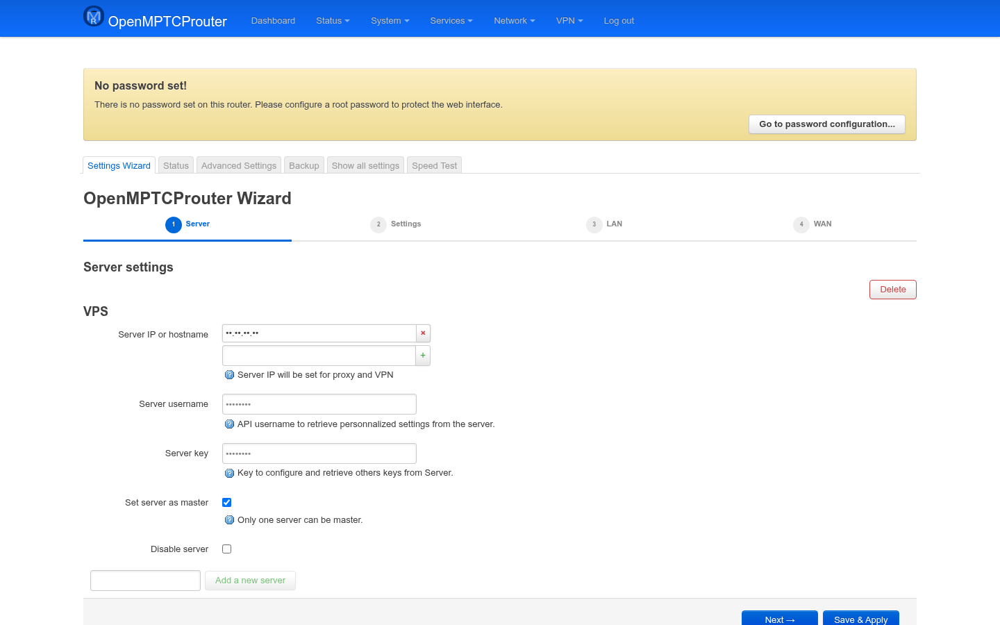

The starting point for a new router: a four-step wizard that walks through
connecting to your server, choosing your proxy/VPN and encryption, and
defining your LAN and WAN interfaces. Each step has Previous/Next
navigation, and a final **Save & Apply** sends everything to the router at
once.

**Step 1 — Server**

| Field | Meaning |
|---|---|
| Server IP or hostname | The address of your VPS. Used for both the proxy and the VPN tunnel. |
| Server username / Server key | Credentials used to fetch your personal settings and further keys automatically from the server's API. |
| Set server as master | Marks this entry as the primary server — exactly one server can hold this role. |
| Disable server | Temporarily turns this server entry off without deleting it. |
| Add a new server | Adds another VPS entry, for multi-server setups. |

**Step 2 — Settings** (General, IPv6, Proxy, VPN, MPTCP over VPN, Country tabs)

Ticking `Show advanced settings` under General reveals the Proxy, VPN,
IPv6 and Country tabs, which are hidden by default to keep first-time
setup simple.

| Field | Meaning |
|---|---|
| Encryption | None, AES-256-GCM, ChaCha20, or other ciphers — shared by Shadowsocks, V2Ray/XRay, Glorytun and OpenVPN. ChaCha20 is recommended if your router's CPU has no AES hardware acceleration. |
| Force retrieve settings | Re-downloads all keys from the server instead of reusing saved ones. |
| Enable IPv6 / IPv6 Prefix / Enable DNS64 | Turn IPv6 off if your server doesn't offer it; set your public IPv6 prefix; turn on DNS64 if your network needs NAT64. |
| Default Proxy | Which technology carries your TCP (and, for some choices, UDP) traffic: Shadowsocks, Shadowsocks-Rust 2022, V2Ray (VLESS/VMESS/Trojan/SOCKS), XRay variants, or none. |
| V2Ray/XRay UDP, XRay Transport | Also route UDP through V2Ray/XRay; choose its transport mode (TCP, gRPC, XHTTP). |
| VPN key/password fields | One per installed VPN engine (Glorytun, DSVPN, MQVPN, MLVPN, UBOND, SoftEther) — normally filled in automatically from the server. |
| Default VPN | Which VPN carries ICMP (and UDP, when Shadowsocks is the proxy): Glorytun TCP/UDP, DSVPN, MQVPN, MLVPN, UBOND, OpenVPN TCP, OpenVPN Bonding, SoftEther, or none. |
| MQVPN scheduler / MQVPN port | Weighted Load Balancing or Minimum RTT; the UDP port of the MQVPN server (useful when other UDP ports are blocked, e.g. 443). |
| VXLAN / VXLAN mode / VXLAN bridge interface | Optionally build a VXLAN tunnel over the VPN — Layer 3 for a routed point-to-point link, or Layer 2 to bridge it straight into your LAN. |
| MPTCP over VPN | Wraps Multipath TCP inside OpenVPN or WireGuard, for ISPs that block MPTCP directly. |
| Country | World / China / Europe / USA / Custom — for China this switches to reachable DNS servers and disables DNSSEC. |

**Step 3 — LAN interfaces**

| Field | Meaning |
|---|---|
| Label | An optional friendly name. |
| Protocol | Static address or DHCP. |
| Physical interface | Which network port/device this LAN uses. |
| IPv4 address / netmask | For static addressing (netmask defaults to 255.255.255.0). |

**Step 4 — WAN interfaces** (click `Add an interface` for each connection to bond in)

| Field | Meaning |
|---|---|
| Type | Normal, MacVLAN, or Bridge. |
| Protocol | Static, DHCP, DHCPv6, ModemManager, NCM, PPPoE, QMI, or Other. |
| Physical interface / VLAN ID | The port/device this WAN uses, and an optional VLAN tag. |
| IPv4/IPv6 address, netmask, gateway | For static addressing. |
| IPv6 | Disabled, or Enabled via SLAAC/DHCPv6 — must also be turned on under Advanced Settings. |
| Device / APN / PIN code | For modem-based WANs: which detected modem, the carrier's APN, and the SIM PIN. |
| Service Type (NCM) | Modem default, prefer LTE, prefer UMTS, LTE, UMTS/GPRS, GPRS only, or auto. |
| Authentication Type (QMI/PPPoE) | NONE / PAP / CHAP / PAP-CHAP, with matching username/password. |
| Multipath TCP | Enabled, Disabled, Master, or Backup — how this link participates in bonding. |
| Force TTL | Often fixes carriers that detect and block tethering; 65 is a common value. |
| MPTCP over VPN (per interface) | Route this link's MPTCP traffic over the VPN tunnel. |
| Enable SQM / Enable QoS | Turns on traffic shaping for this link (shown only if those packages are installed). |
| Calculate speed | Runs an automatic speed test for this connection. |
| Download / Upload speed (Kb/s) | Manually set or corrected line speed, used for shaping. |

> **In practice** — run the wizard once during initial setup, and again
> whenever you add or remove a server or WAN link. Steps 1–2 rarely need
> revisiting after the first pass; steps 3–4 are where you'll come back to
> add a new modem or line.

*Deeper technical detail: [Settings Wizard user guide](../luci-app-openmptcprouter/docs/wizard-guide.md).*

### Status overview

```
https://<router-ip>/cgi-bin/luci/admin/system/openmptcprouter/status
```

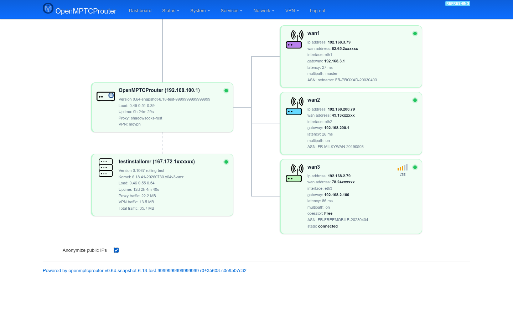

A live network diagram, refreshing every 10 seconds, that draws a line
from your computer through the router, through each active WAN/tunnel
link, out to your server — each with its own health colour and detail.

| Field | Meaning |
|---|---|
| Anonymize public IPs | Masks part of any public address shown on screen — handy before sharing a screenshot (used to prepare the image above). Display-only, per browser. |
| Client node | Your computer's address, and whether the router assigned it. |
| Router node | Hostname, address, firmware version, CPU load/temperature, uptime, active proxy/VPN, and any warnings (DNS trouble, tunnel down). |
| Each WAN/tunnel node | Connection status, IP/gateway, latency, whether MPTCP is active, mobile operator name and signal bars, and specific problems (no IP, gateway down, no reply from server). |
| Server node | Server version, load, uptime, and traffic counters (proxy / VPN / total). |

> **In practice** — this is a read-only page. Check it whenever you want an
> at-a-glance answer to "is everything actually working right now?"

*Deeper technical detail: [Status overview user guide](../luci-app-openmptcprouter/docs/status-guide.md).*

### Dashboard

```
https://<router-ip>/cgi-bin/luci/admin/dashboard
```

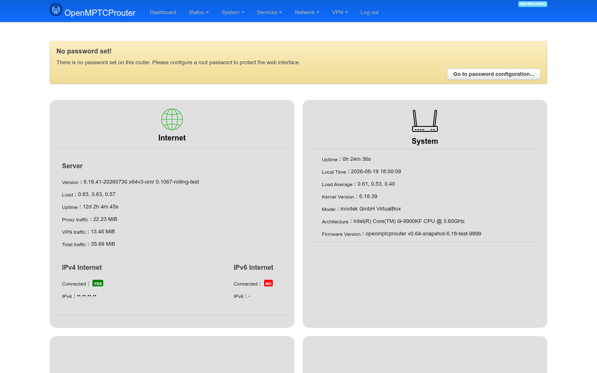

A live home screen made of auto-refreshing widgets, with nothing to
configure.

| Panel | Shows |
|---|---|
| Internet & Server | Server version, load average, uptime, traffic used (proxy / VPN / total); whether IPv4 and IPv6 are up, with their addresses. |
| System | Router uptime, local time, load average, kernel version, hardware model, CPU architecture, firmware version. |
| DHCP Devices | Every device on your LAN, with hostname, IP address and MAC address (shown when a DHCP server is running). |
| Wireless | Per radio: SSID, active state, channel, bitrate, BSSID, encryption, client count — plus a live table of connected Wi-Fi clients with signal and speed. |


---

## Network

The standard OpenWrt network section, with OpenMPTCProuter's link-bonding
controls layered on top.

### Interfaces

```
https://<router-ip>/cgi-bin/luci/admin/network/network
```

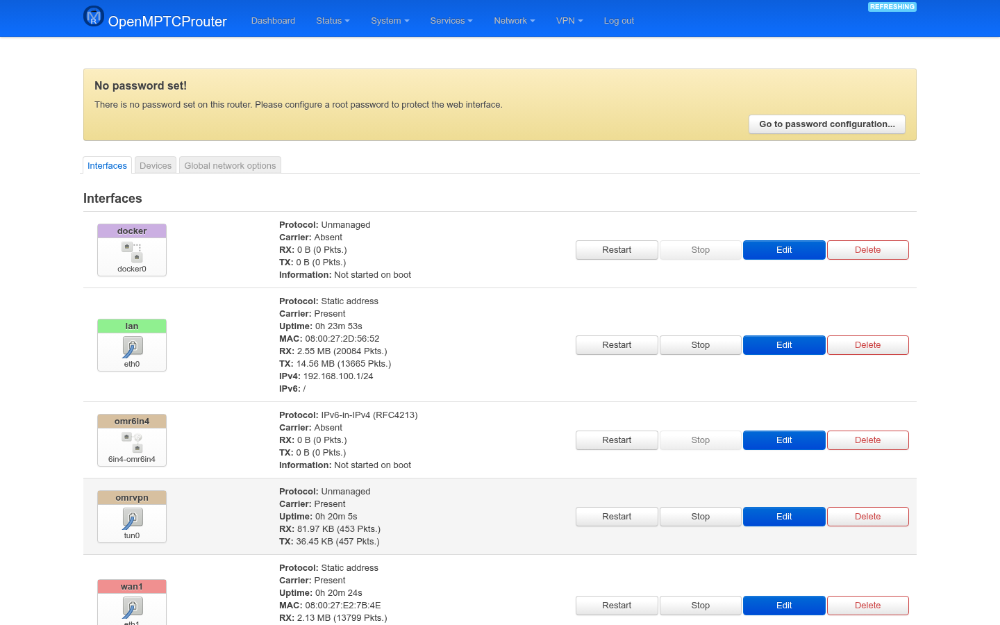

Unchanged from stock OpenWrt for the basics (protocol, IP addressing,
firewall zone, DHCP, bridging, VLANs) — that part is skipped here since
it's identical to any OpenWrt router. What's project-specific is a set of
extra fields on each interface's **Advanced Settings** tab, used for link
bonding:

| Field | Meaning |
|---|---|
| Weight | Makes a link more (above 100) or less (below 100) attractive for traffic distribution, up to 256. |
| Cost | A path cost used when choosing between interfaces — lower is preferred. |
| Multipath setting | Enabled / Disabled / Master / Backup — exactly one interface should be Master. |
| Additional latency | An artificial delay (ms) added to the interface, useful for balancing very asymmetric links. |
| Override IPv4/IPv6 routing table | Pick a specific routing table for this interface instead of the default. |

### MPTCP

```
https://<router-ip>/cgi-bin/luci/admin/network/mptcp/mptcp
```

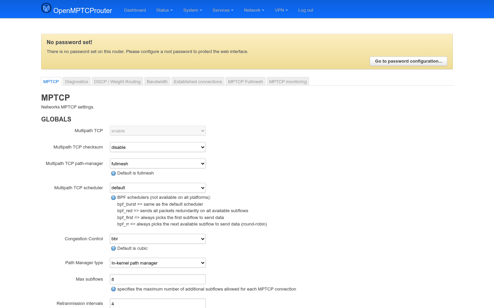

The control centre for Multipath TCP itself — the technology that combines
your WANs into one resilient connection. Seven tabs: MPTCP, Diagnostics,
DSCP / Weight Routing, Bandwidth, Established connections, MPTCP Fullmesh,
and MPTCP monitoring.

**Tab: MPTCP — global settings**

| Field | Meaning |
|---|---|
| Multipath TCP checksum | Adds a checksum to multipath data so corrupted/tampered traffic is detected. Leave on unless you have a specific reason not to. |
| Path-manager | How the router builds extra paths (subflows) to the far end. `fullmesh` (default) connects every WAN to every available remote address; older systems also offer ndiffports, binder, netlink. |
| Scheduler | Decides which WAN carries each piece of data. Depending on your device: BPF schedulers (default-like, duplicate-on-every-WAN, always-first-WAN, round-robin) or, on older systems, round-robin/redundant/BLEST/ECF. |
| Mirror DSCP/weight pins to gateway | Only shown with a DSCP or weighted scheduler selected. Applies your per-traffic-class WAN choice to downloads from the gateway too, not just uploads. |
| Congestion Control | The algorithm managing how fast the router ramps up sending speed (default `cubic`). |
| Path Manager type | Built-in ("in-kernel", default) or external ("userspace"). Leave on default unless you know you need the userspace path manager. |
| Max subflows | Maximum extra paths per session, i.e. how many WANs one connection can use at once. Default 3. |
| Retransmission intervals | Failed retries (with data still queued) before the router gives up on a path. Lower switches away from a bad WAN faster; higher perseveres longer. Default 4. |
| Max add address | How many extra-address announcements are accepted per connection. Default 1. |
| Blackhole timeout | How long (seconds) multipath is temporarily disabled on a connection after something silently swallows multipath traffic. Default 3600. |
| Close timeout | After the last path of a connection drops, how long it's kept "waiting" before fully closing. Default 60. |

<details>
<summary>Userspace path-manager options (only shown when Path Manager type = Userspace)</summary>

Initial MPTCP configuration, Force Multipath configuration, Enable
MPTCPd, MPTCPd path managers/plugins, and address announcement/
notification flags — advanced controls for the external
multipath-management helper. Expert configurations only.
</details>

**Interfaces Settings** (per WAN, on this same page)

| Field | Meaning |
|---|---|
| Multipath TCP | Enabled / Disabled / Master / Backup for that WAN. |
| Weight | Only matters with a weighted scheduler. Above 100 = more traffic, below 100 = less. Default 100, max 256. |

**Tab: Diagnostics**

```
https://<router-ip>/cgi-bin/luci/admin/network/mptcp/mptcp_diagnostics
```

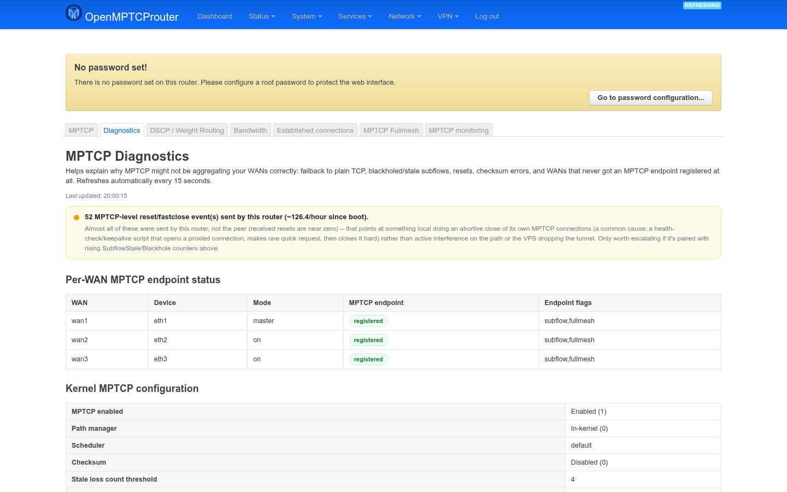

A live, auto-refreshing troubleshooting dashboard, nothing to configure: a
plain-language list of detected issues (falling back to single-path, WAN
paths going silent), a table confirming each MPTCP-enabled WAN actually
has a working endpoint, a summary of current kernel MPTCP settings, and a
detailed protocol-counter table (handshakes, path-joins, retransmissions,
resets) with plain explanations.

**Tab: DSCP / Weight Routing**

Only shows content once a DSCP or weighted scheduler is active. Lets you
pin specific traffic types to specific WANs — e.g. always send voice/video
calls over your low-latency link, and bulk downloads over your cheaper
one.

| Field | Meaning |
|---|---|
| DSCP class pins (table) | Pick a traffic class (Voice, Video, SIP/signaling, Network control, Best effort, and others) and assign an Upload interface and, if gateway sync is on, a Download interface (blank = mirror the upload choice). |
| WAN weight | Only with a weighted scheduler: a Weight per multipath-enabled WAN (default 100, max 256), shared by both directions. |

**Bandwidth · Established connections · MPTCP Fullmesh · MPTCP monitoring**

Four read-only, auto-refreshing views: live per-WAN and combined bandwidth
graphs; the list of multipath sessions currently open; a map of which
address pairs currently have a subflow built between them; and a raw dump
of low-level MPTCP kernel counters for deep troubleshooting.


*Deeper technical detail: [MPTCP user guide](../luci-app-mptcp/docs/mptcp-guide.md).*

### DSCP

```
https://<router-ip>/cgi-bin/luci/admin/network/dscp
```

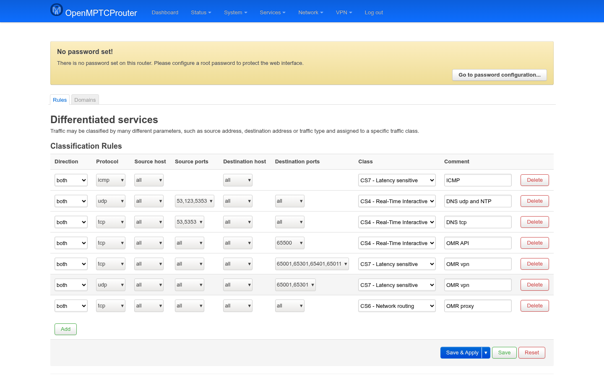

A separate, complementary tool to the MPTCP tab's own DSCP/weight pinning
above: instead of choosing which WAN carries a traffic type, this one tags
your traffic with a priority label (a DSCP class) that the router — and
its traffic-shaping/QoS system — can use to decide what to favour when the
connection is busy.

**Rules page**

| Field | Meaning |
|---|---|
| Direction | Upload, download, or both. |
| Protocol | TCP, UDP, all, or more specialised (IP, ICMP, ESP for VPN tunnels). |
| Source / destination host | Limit the rule to one device or one external address; blank matches everything. |
| Source / destination ports | Limit the rule to a specific port. |
| Class | Normal/Best Effort, Low priority, High priority, SIP, Real-Time Interactive, Broadcast Video, Network routing, Latency sensitive, or Voice (highest). |
| Comment | A free-text note for your own reference. |

**Domains page** — the same idea, matched by typing a domain name instead
of an address.

> **In practice** — reach for this when a specific app or service feels
> sluggish while the rest of the household is online: tag it with a higher
> class such as Voice or Real-Time Interactive so the router favours it
> under load. (The screenshot above shows this bench's own built-in
> default rules for DNS, the OMR API, VPN, and proxy traffic.)

*Deeper technical detail: [DSCP user guide](../luci-app-omr-dscp/docs/dscp-guide.md).*

### SQM QoS

```
https://<router-ip>/cgi-bin/luci/admin/network/sqm
```

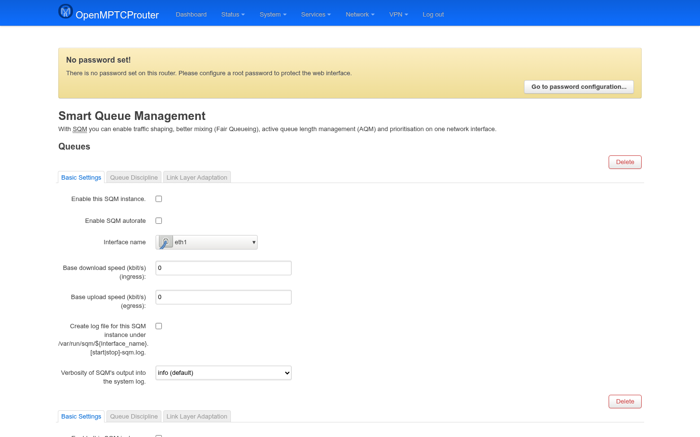

Smart Queue Management — keeps the connection feeling responsive even
while it's fully loaded, fixing the common "someone's downloading and now
everything else lags" problem (bufferbloat).

**Basic Settings**

| Field | Meaning |
|---|---|
| Enable this SQM instance | Turns shaping on for the chosen connection. |
| Enable SQM autorate | Switches from a fixed speed limit to automatic mode: the router continuously measures the line and adjusts the limit itself. |
| Base download / upload speed | Your connection's normal expected speed — the reference point, and the fixed limit if autorate is off. |
| Min/Max download & upload speed | Only with autorate: the bounds the automatic system is allowed to set. |

**Queue Discipline**

| Field | Meaning |
|---|---|
| Queuing discipline | Must be `cake` for autorate to work. A router restart is needed after installing a new one. |
| Queue setup script | A ready-made shaping profile; each option explains itself in the interface. |

<details>
<summary>Advanced &amp; dangerous configuration (expert use only)</summary>

"Show and Use Advanced Configuration" reveals multi-queue support, whether
incoming priority tags are kept or ignored, and congestion-notification
handling. "Show and Use Dangerous Configuration" unlocks queue size
limits, latency targets, and raw option strings — the interface's own text
warns these have no error checking.
</details>

**Link Layer Adaptation** — **Which link layer to account for** lets the
shaper account for connection-specific overhead (e.g. VDSL2-style
"Ethernet with overhead", or ADSL-style "ATM") so the enforced limit
matches your real available bandwidth, plus a matching **Per Packet
Overhead** value.

<details>
<summary>Autorate settings (only relevant with autorate enabled)</summary>

| Field | Meaning |
|---|---|
| Starlink support | A special adjustment mode tuned for satellite connections. |
| Reflector ping interval / Pingers numbers | How often, and against how many reference servers, latency is quietly measured for a reliable reading. |
| Delay threshold (ms) | How much extra delay is tolerated before the system reduces the speed limit. |
| Sleep functionality | Pauses background measuring when the connection is idle, to save resources. |
</details>

> **In practice** — turn this on for any connection where calls or gaming
> feel laggy whenever someone else is downloading. Enabling autorate and
> letting it self-adjust is the right call for most people.

*Deeper technical detail: [SQM QoS user guide](../luci-app-sqm-autorate/docs/sqm-guide.md).*

### Quota

```
https://<router-ip>/cgi-bin/luci/admin/network/quota
```

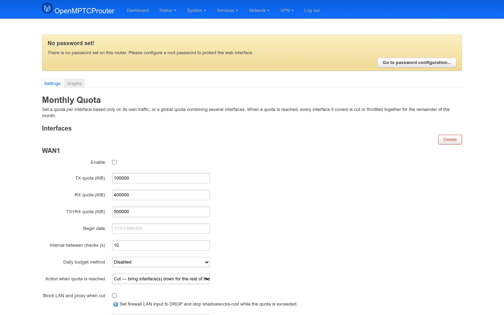

Puts a monthly data cap on one connection (ideal for a metered mobile SIM)
or a combined group of connections, and decides what happens automatically
once that cap is hit.

**Settings — per interface**

| Field | Meaning |
|---|---|
| TX / RX / TX+RX quota | Monthly caps for upload, download, and combined data in kilobytes. 0 = no cap on that measure. |
| Begin / End date | A custom billing-cycle window, for plans that don't reset on the 1st. |
| Daily budget method | Disabled (only the monthly total is tracked); *Block when the interval budget is exceeded* (temporarily cut off if usage runs well ahead of a fair daily pace); or *Limit speed using remaining daily volume* (gradually throttle as the daily allowance is approached). |
| Budget threshold (%) | How much of the calculated budget can be used before pacing kicks in (default 80%). |
| Action when quota is reached | Cut (disconnect for the rest of the month) or Throttle (stay connected, but slower). |
| Block LAN and proxy when cut | While cut, also block LAN devices from that connection and stop the built-in proxy tunnel over it. |
| Download / Upload limit (Mbps) | The speed cap used once Throttle is chosen. |
| Enforcement scope | *This month only* (lifts automatically at the new month) or *All future months* (stays cut/throttled until manually cleared). |
| Reset exceeded state | Manually clears a persistent cut/throttle. |

**Global quota** — group several connections under one named, shared cap;
every listed connection is cut or throttled together once the shared total
is hit.

**Graphs page** — a live dashboard (refreshes every 15 seconds), one card
per connection or group: progress bars for total/download/upload usage
against the cap, and status badges (Disabled, Exceeded, Throttled).

> **In practice** — set this up on a mobile WAN with a limited plan, enter
> the cap, choose Throttle or Cut, then check the Graphs page to watch
> remaining data for the month at a glance.

*Deeper technical detail: [Quota user guide](../luci-app-omr-quota/docs/quota-guide.md).*

### Wireless, Switch, Routing, DHCP, DNS, Diagnostics

Standard OpenWrt network pages, functionally unchanged, so full
field-by-field documentation is skipped here.

| Page | What it's for |
|---|---|
| Wireless | Radio/network configuration — SSID, encryption, channel, associated clients. *Not shown here — the reference bench has no Wi-Fi radio.* |
| Switch | VLAN port assignment for the built-in switch chip. *Not shown here — no manageable switch chip on the reference bench.* |
| [Routing](images/routing.png) | Static IPv4/IPv6 routes and routing rules. |
| [DHCP](images/dhcp.png) | Active leases and DHCP/DNS server configuration, static leases, general server options. |
| [DNS](images/dns.png) | DNS forwarding, custom domain/IP entries, caching, and IP sets used in firewall rules. OpenMPTCProuter hides its own auto-generated entries (named `omr_…`) from these lists. |
| [Diagnostics](images/network-diagnostics.png) | Built-in Ping, Traceroute and Nslookup tools with live output. |

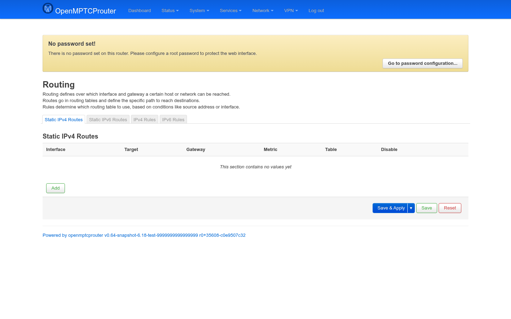

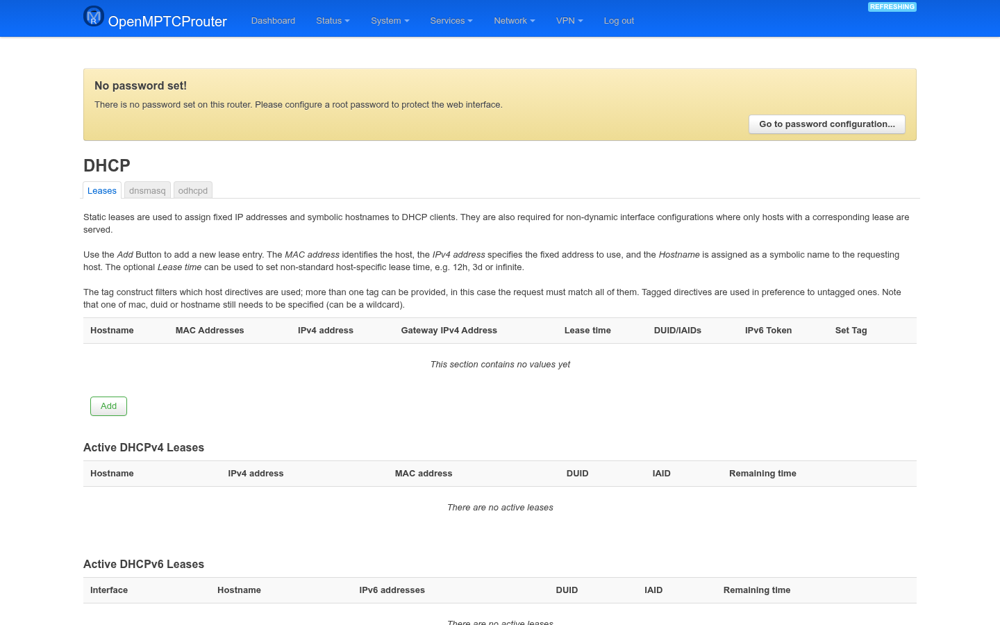

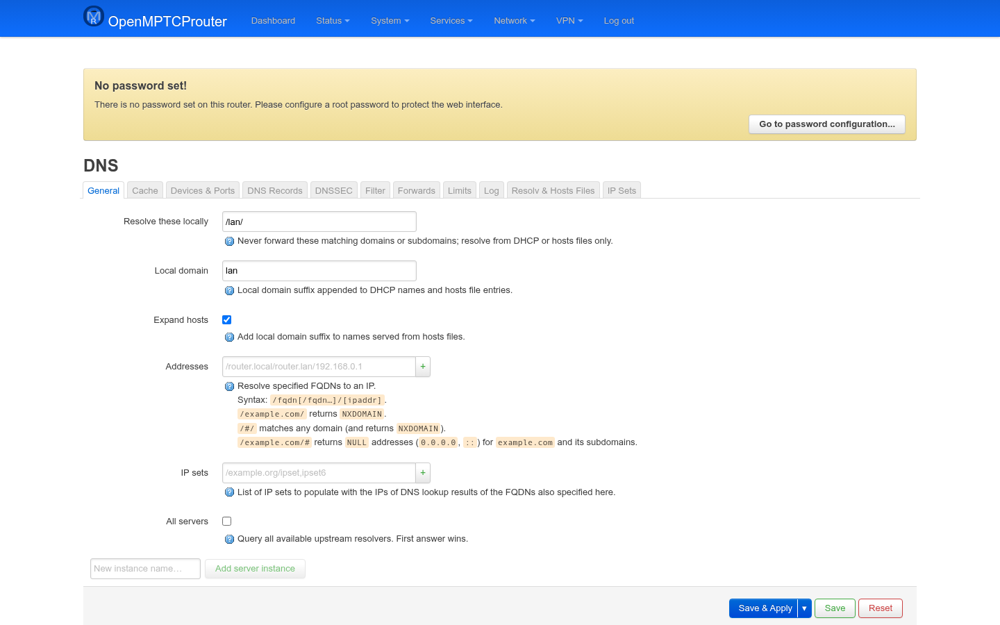

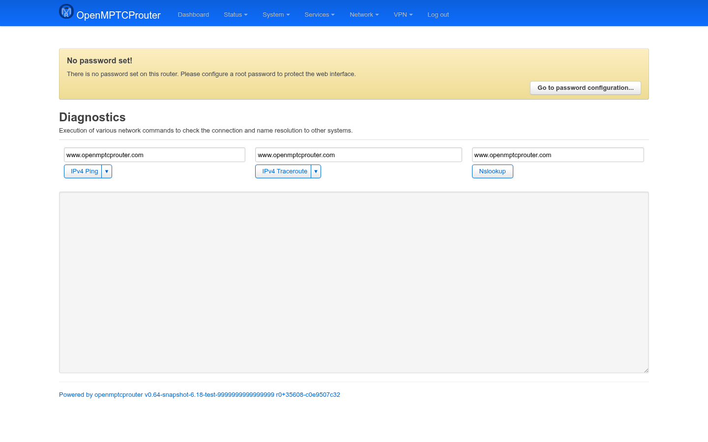

### Cellular modems — MBIM & ModemManager

Neither of these packages adds its own menu entry. Instead, each adds a
new choice to the **Protocol** dropdown when creating or editing a network
interface, turning it into a cellular (mobile broadband) connection. *No
screenshot here — the reference bench has no cellular modem attached; its
three WANs are all Ethernet.*

**MBIM Cellular** (common on USB and mini-PCIe 4G/5G modems)

| Field | Meaning |
|---|---|
| Modem device | Which detected modem to use, when more than one is installed. |
| APN / PIN | Your carrier's access point name, and the SIM's PIN if locked. |
| Authentication Type | PAP/CHAP (either), PAP, CHAP, or none (default). |
| PDP Type | IPv4/IPv6 (default), IPv4 only, or IPv6 only. |
| Modem init timeout | Seconds to wait for the modem to become ready (defaults to 10 if blank). |

**ModemManager** (generally the more full-featured option where supported)

| Field | Meaning |
|---|---|
| Modem device | Shown with manufacturer and model. |
| APN / PIN / PUK | The carrier's APN, SIM PIN, and PUK (to reset a SIM locked out after too many wrong PINs). |
| PLMN | Manually force a specific operator by numeric code. |
| Allowed / Preferred network technology | Restrict the modem to specific generations (2G/3G/4G/5G) or let it choose automatically. |
| IP Type | IPv4/IPv6 (default), IPv4 only, or IPv6 only. |
| Initial EPS Bearer | None (default), Default, or Custom — some carrier/modem combinations require this. |

Status → **Cellular Network** shows a live, read-only overview per
detected modem: Modem Info (manufacturer, model, IMEI, power/connection
state), Network Registration (technology, operator, signal bars), Cell
Location, and SIMs (active slot, operator, ICCID/IMSI).

> **In practice** — pick MBIM or ModemManager as the Protocol when adding
> a cellular modem as a WAN; fill in the APN and PIN at minimum.

---

## Bonded VPN links

Each of these is a tunnel technology the router can use to reach your VPS
— this is the layer that Multipath TCP rides on top of. All five follow a
similar pattern: an **Instances** table (add, remove, enable inline) with
a pop-up for the remaining settings.

### DSVPN

```
https://<router-ip>/cgi-bin/luci/admin/vpn/dsvpn
```


| Field | Meaning |
|---|---|
| Enabled / Label | Switch this tunnel on/off; a free-text name for your own reference. |
| Mode | Client (this router dials out to your VPS — the normal choice) or Server (waits for an incoming connection — normally only used on the VPS side). |
| Host / Port | The address and port of the other end; must match on both sides and be reachable through any firewall/NAT. |
| Key | The shared secret authenticating and encrypting the tunnel — must be identical on both ends. |
| Interface name | The internal name of the virtual adapter this tunnel creates. |
| Local IP / Remote IP | The private tunnel addresses on each end — what's "local" here must be "remote" there, and vice versa. |


### Glorytun TCP

```
https://<router-ip>/cgi-bin/luci/admin/vpn/glorytun-tcp
```


General Settings: Enabled, Label, Mode (Client/Server), Host, Port, Key,
Interface name, Local IP / Remote IP — identical concepts to DSVPN above.

**Advanced Settings**

| Field | Meaning |
|---|---|
| MPTCP | Lets this tunnel's own underlying connection spread across multiple network paths at the TCP level, if supported. |
| chacha (force fallback cipher) | Forces ChaCha20 instead of the default cipher — mainly useful on older/low-power routers lacking hardware-accelerated crypto. |
| Timeout | Milliseconds of inactivity before the tunnel is considered dead and reconnects (default 10000). |
| Multiqueue | Spreads the tunnel's packet processing across CPU cores. |


### Glorytun UDP

```
https://<router-ip>/cgi-bin/luci/admin/vpn/glorytun-udp
```

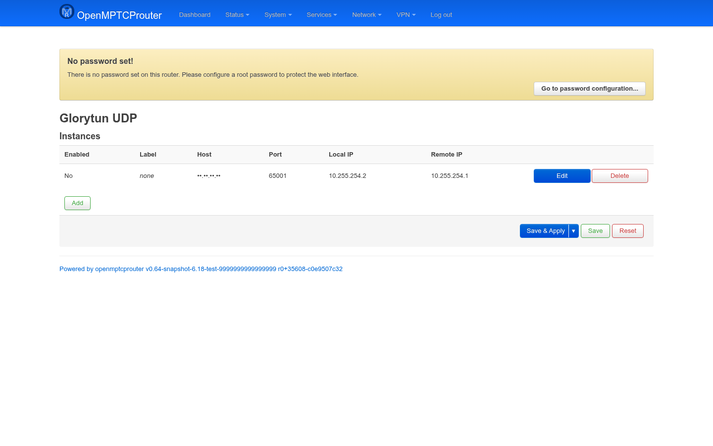

General Settings match Glorytun TCP. **Advanced Settings**:

| Field | Meaning |
|---|---|
| Persist | Keeps the virtual tunnel interface present even through a brief restart, avoiding routes flapping during a short reconnect. |
| chacha (force fallback cipher) | Same as Glorytun TCP — ChaCha20 for lower-power hardware. |
| Key rotation timeout | How often encryption keys are automatically renewed (default 7 days). |
| Clock sync tolerance | How far the two endpoints' clocks may drift before the tunnel flags a problem (default 10 minutes). |
| Keep alive timeout | How often "still alive" packets are sent to detect a dead link (default 25 seconds). |
| Dynamic rate detection | Automatically measures the real available speed and adapts — useful on variable-speed links like cellular. |


### MLVPN

```
https://<router-ip>/cgi-bin/luci/admin/vpn/mlvpn
```

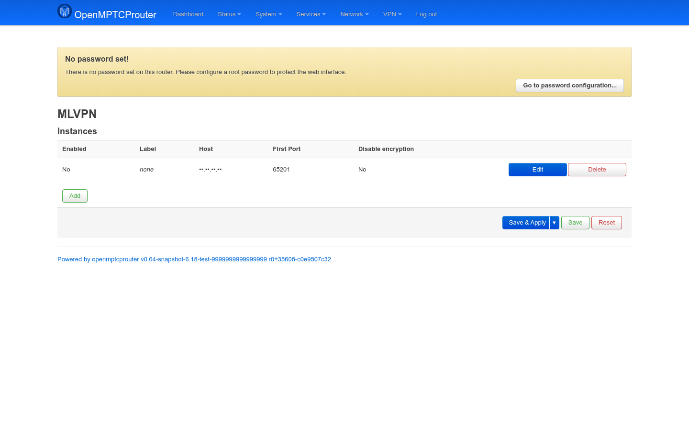

MLVPN's whole purpose is combining several WAN links into one connection
to your server, so most of its settings tune that bonding behaviour
directly.

**General Settings**

| Field | Meaning |
|---|---|
| Mode | Client (dials out) or Server (waits for connections — used on the VPS). |
| Host / First Port | The server address, and the starting port of the small range MLVPN needs to combine several links at once (default 65201). |
| Password | The shared secret; must match on both ends. |
| Interface name | Default `mlvpn0`. |

**Advanced Settings**

| Field | Meaning |
|---|---|
| Timeout (s) | Inactivity before a link is considered dead and MLVPN tries to recover it (default 30). |
| Reorder buffer size | How much data is held to re-sequence packets from bonded links arriving out of order (default 128). |
| Disable encryption | Turns off encryption entirely to save CPU — only if you understand and accept the trade-off. |
| Loss tolerance / Latency tolerance | How much packet loss (default 50) or delay in ms (default 300) an individual bonded link can have before MLVPN treats it as unreliable/degraded. |


### MQVPN

```
https://<router-ip>/cgi-bin/luci/admin/vpn/mqvpn
```

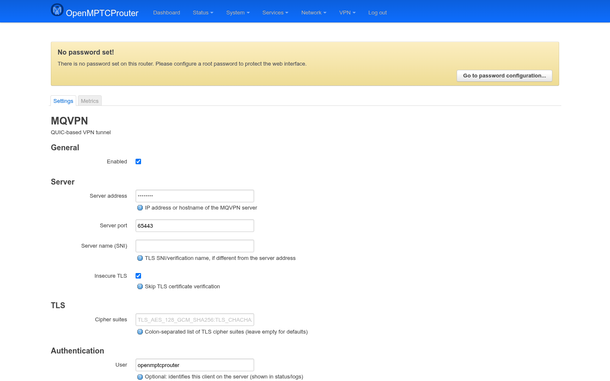

Unlike the others, MQVPN manages a single tunnel as one long settings page
of clearly labelled groups, rather than a table of multiple entries. A
second **Metrics** tab next to **Settings** (visible in the screenshot)
has since been added: a live, auto-refreshing view of tunnel build info,
aggregate byte/datagram counters, and a per-path table (state, RTT,
congestion window, in-flight/sent/lost packets) for every connected
client — not detailed field-by-field here, since it's read-only; see the
user guide linked below for the full breakdown.

**Server & Authentication**

| Field | Meaning |
|---|---|
| Server address / Server port | Your VPS's address (suggested default port 443). |
| Server name (SNI) / Insecure TLS | Only needed if the certificate name differs from the connect address; skipping certificate verification is convenient for testing but weakens the connection's ability to confirm you're really talking to your own server. |
| User / Key | An optional device label for the server's logs, and the required shared credential. |

**Interface**

| Field | Meaning |
|---|---|
| Tunnel name | Default `mqvpn0`. |
| Kill switch | Blocks all outgoing traffic if the tunnel drops, preventing accidental leaks outside the tunnel. |
| Reconnect / Reconnect interval | Automatically retries a failed tunnel (on by default), with a configurable wait between attempts. |
| Route via server / No automatic routes | Adds a route to the server's own address before changing the default route; or skips all automatic routing for full manual control. |
| DNS servers | DNS addresses to use once the tunnel is up. |

**Multipath — the bonding behaviour**

| Field | Meaning |
|---|---|
| Scheduler | Weighted Load Balancing, Weighted Load Balancing with UDP pinning, Minimum RTT, Weighted RTT, Weighted Round Robin, Backup, Backup with FEC, RAP, or Redundant. |
| Congestion control | BBR2 (default), BBR, CUBIC, New Reno, Copa, Unlimited, or None. |
| Auto WAN | On by default: automatically bonds every WAN; turn off to hand-pick Paths vs Backup paths. |
| FEC (Forward Error Correction) | Sends redundant data alongside your traffic so some lost packets can be reconstructed without a resend. |
| FEC scheme | Galois Calculation, Packet Mask, Reed-Solomon (default), or XOR. |
| Sync path labels to server | Shares this device's per-link priority/weight with the server, so it matches your preferences for return traffic too. |

**Reorder**

| Field | Meaning |
|---|---|
| Enable reorder buffer | Buffers and re-sequences out-of-order data (off by default). |
| Max wait / Cap packets | How long to hold data waiting for a missing piece, and the buffer's maximum packet count. |
| Reorder rules | Per protocol/port, apply a ready-made profile: Cellular Bond, Fibre + LTE, QUIC Bulk, Low Latency, or Default UDP. |

<details>
<summary>TLS, Control API &amp; other advanced fields</summary>

| Field | Meaning |
|---|---|
| Cipher suites | An optional allow-list of encryption methods; blank uses sensible defaults. |
| MTU | Optional cap on packet size (1280–9000 bytes); blank lets the system choose. |
| Log level | Debug, Info, Warning, or Error. |
| Control API port / Bind address | An optional local monitoring interface, off by default; bind address defaults to localhost only. |
| Reinjection control / mode | Fine-tunes how the tunnel resends data that may be lost or duplicated across links. |
| Receive rate limit | Client-side only: an optional cap on incoming data, 0 = unlimited. |
</details>

> **In practice** — leave Auto WAN on unless you specifically want to hand-pick
> which links bond. Try FEC and/or the reorder buffer on lossy or
> mismatched links.

*Deeper technical detail: [MQVPN user guide](../luci-app-mqvpn/docs/mqvpn-guide.md), including the Metrics tab.*

---

## Proxy & routing

These services decide *which* traffic gets tunnelled to your VPS at all,
and how it's load-balanced once it gets there.

### Shadowsocks-libev

```
https://<router-ip>/cgi-bin/luci/admin/services/shadowsocks-libev
```

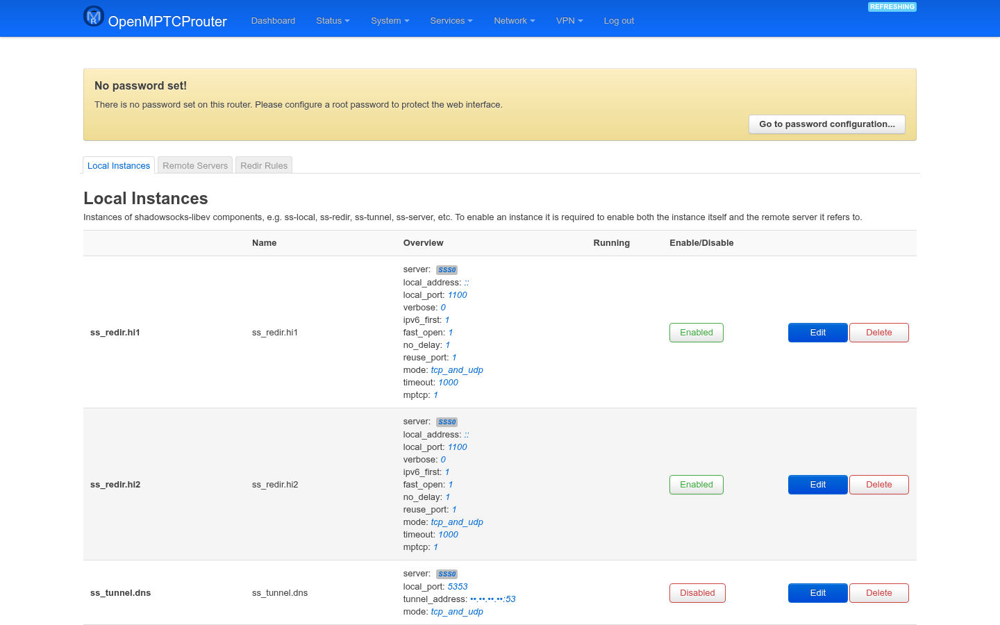

Three tabs: Local Instances, Remote Servers, Redir Rules.

**Local Instances** — each row is a running proxy process (intercepting
redirector, single-connection forwarder, general-purpose local proxy, or
server component), with a live Running status and Enabled/Disabled toggle.

| Field | Meaning |
|---|---|
| Remote server | Which configured server this instance connects to — both the instance and the server it points to must be enabled to actually work. |
| Local address / port | Where this instance listens, for client-type instances. |
| Tunnel address | Only for the single-connection forwarder: the fixed remote address/port to forward to. |
| Mode of operation | TCP only, UDP only, or both. |
| Enable MPTCP | Lets this instance use Multipath TCP internally. |

**Remote Servers**

| Field | Meaning |
|---|---|
| Import Links | Paste one or more `ss://` share-links from your VPS provider; the server details fill in automatically. |
| Method | The encryption cipher — modern AEAD ciphers (AES-GCM, ChaCha20-Poly1305) or legacy ones (RC4, AES-CFB/CTR, Camellia, Salsa20); "none" exists only for testing. |
| Server / Server port / Password / Key (base64) | The connection details, provided by your VPS. |
| Plugin / Plugin Options | An obfuscation plugin to disguise the proxy traffic. |

**Redir Rules** — controls which traffic is actually funnelled into the
transparent-redirect instance. Logic: a packet's source is checked first
(bypass / forward / check-destination lists), and only if the result is
"check destination" is the destination then checked the same way.

| Field | Meaning |
|---|---|
| Source tab | Lists of source addresses/subnets to always bypass or always forward, plus a default action for anything unmatched. |
| Destination tab | The same bypass/forward lists matched against destinations, with an optional file upload for long lists, and a switch to forward destinations that have recently sent several TCP resets. |


### Shadowsocks-Rust

```
https://<router-ip>/cgi-bin/luci/admin/services/shadowsocks-rust
```

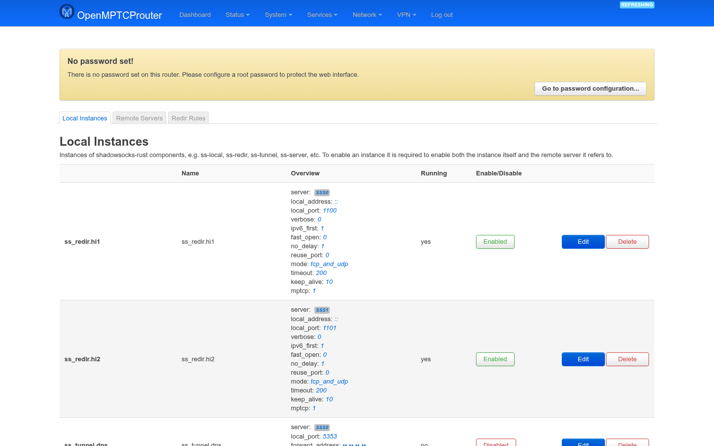

A newer, higher-performance alternative to Shadowsocks-libev, with the
same three-tab structure. Differences worth noting:

| Field | Meaning |
|---|---|
| Keep Alive (sec) | An extra Local Instances setting controlling how long idle connections stay open. |
| Method | Deliberately narrower than libev's list: just "none" (testing) and `2022-blake3-aes-256-gcm` — the modern "2022 edition" Shadowsocks cipher. |
| Password | No separate base64-key field here — just a password field that also accepts base64. |

Redir Rules is identical to Shadowsocks-libev's version above.

> **In practice** — Choose Rust when for its performance.

### OMR-Bypass

```
https://<router-ip>/cgi-bin/luci/admin/services/omr-bypass
```

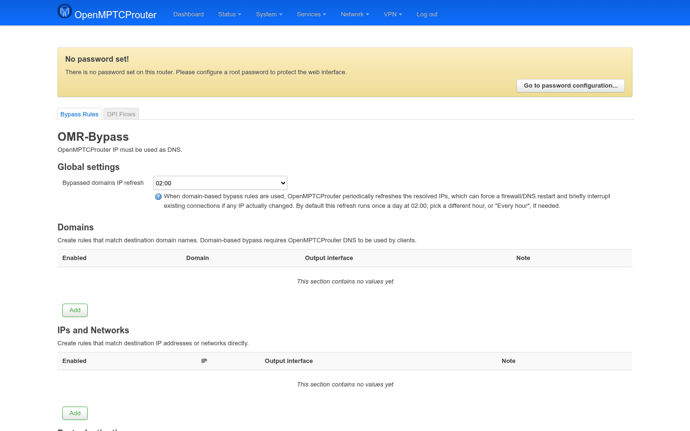

Defines traffic that should skip the router's normal behaviour of
tunnelling everything to the VPS. A small **Global settings** box at the
top controls **Bypassed domains IP refresh**: since domain-based rules
work by resolving each domain to an IP, the router periodically
re-checks whether that IP changed — this picks what hour that runs (or
every hour), since it can briefly interrupt existing connections if an
IP actually changed. Below that are nine independent rule tabs, each
individually enable-able. Domain-based rules only work if client devices
use the router itself as their DNS server.

**What "Output interface" does to matched traffic**

| Option | Effect |
|---|---|
| A specific named interface | The actual bypass — matched traffic goes straight out that one connection instead of through the bonded tunnel. |
| No routing change (DSCP marking only) | Traffic still goes through the usual tunnel; only used to tag its priority. |
| None | Blocks matched traffic entirely. |
| VPN on server | Routes matched traffic through a VPN configured on the remote VPS instead of a physical interface. |
| Failback | If the chosen output interface goes down, automatically switches to an alternate. |
| DSCP marking | Independently tags matched packets with a QoS priority. |

**The eight ways to identify traffic**

| Rule type | Matches by |
|---|---|
| Domains | Destination domain name; depends on the router seeing the DNS lookup. |
| IPs and Networks | Destination IP or subnet directly — no DNS dependency. |
| Ports destination / Ports source | Destination port, or originating source port, and protocol. |
| MAC-Address | All traffic from one client device, by its hardware address. |
| Source LAN IP address or network | Traffic from a specific local device or subnet. |
| ASN | Any destination belonging to a given provider's/cloud service's entire network block. |
| Protocols and services | The actual application detected via deep packet inspection (nDPI). |
| Protocol categories | The same DPI detection, but matching a whole category at once. |

> **In practice** — use this for traffic that should skip the tunnel: a
> streaming domain that performs better direct, a smart-home device that
> should never be tunnelled, or a whole category of DPI-detected traffic.

*Deeper technical detail: [OMR-Bypass user guide](../luci-app-omr-bypass/docs/bypass-guide.md).*

---

## Monitoring & alerts

The tools that watch whether your connections and services are actually
healthy, keep a history of what happened, and let you dig into raw traffic
when something needs troubleshooting.

### OMR-Tracker Manager

```
https://<router-ip>/cgi-bin/luci/admin/services/omr-tracker/interface
```

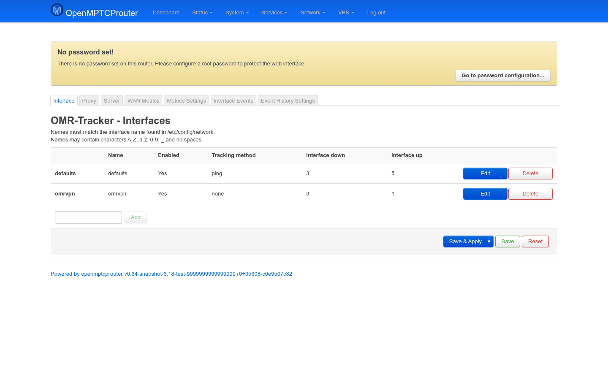

The system that constantly checks whether each connection is *actually*
working — not just switched on — so the router can stop using a
connection the moment it goes bad, and bring it back the moment it
recovers. A single bad result doesn't declare a connection dead: several
failures *in a row* are required before it's marked down, and several
successes in a row before it's trusted again, so a borderline connection
doesn't flap on and off.

**Interface page** (one row per monitored connection)

| Field | Meaning |
|---|---|
| Tracking method | Gateway-only check, standard ping, web-request "ping" (httping), a DNS lookup test, or (for VPN interfaces) checking the tunnel's own health. |
| Server test | Before declaring this connection down, also confirms the central server is unreachable from every other connection too. |
| Check link quality | Goes beyond up/down: watches latency and packet loss so a technically-connected but poor link can be flagged degraded. |
| Failure / Recovery latency & packet loss | Thresholds for marking a link failing, and separately (stricter) thresholds it must beat to be marked healthy again. |
| Interface down / Interface up | How many failed, or successful, checks in a row are needed before the status actually flips. |
| Restart if down | Automatically restarts the connection once marked down. |
| Mail alert | Emails you whenever this connection's status changes. |

**Proxy & Server pages** — the same monitoring concept applied to the
router's built-in proxy service and to the central VPS server, with
automatic fallback to a backup server if configured.

> **In practice** — enable monitoring on each WAN so the router
> automatically detours around a connection the instant it drops, with
> email alerts if wanted.

*Deeper technical detail: [OMR-Tracker Manager user guide](../luci-app-omr-tracker/docs/tracker-guide.md).*

### Interface Events

```
https://<router-ip>/cgi-bin/luci/admin/services/omr-tracker/events
```

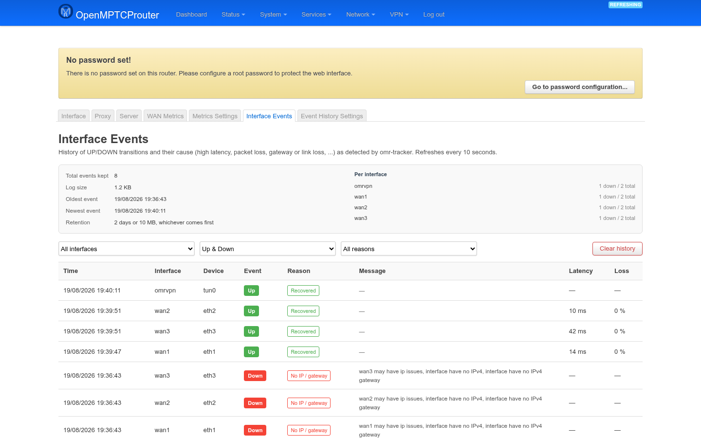

A history log and viewer for everything OMR-Tracker Manager detects —
every time a connection went up or down, and why.

| Field | Meaning |
|---|---|
| Summary panel | Total events kept, log size, oldest/newest event, the current retention rule, and a per-connection down-count breakdown. |
| Filter bar | Narrow by connection, up/down, or a specific reason. |
| Main table | Every recorded event with time, connection, device, up/down, reason, a detail message, and the latency/loss measured at that moment. |
| Clear history | Wipes the entire log after a confirmation dialog. |
| Maximum age / Maximum log size | Automatic cleanup rules (defaults: 2 days, or 10 MB, whichever comes first) — set on the companion **Event History Settings** page. |

> **In practice** — after noticing a connection has been unreliable,
> filter this log down to it and scroll through its recent history.

*Deeper technical detail: [Interface Events user guide](../luci-app-omr-events/docs/events-guide.md).*

### WAN Metrics

```
https://<router-ip>/cgi-bin/luci/admin/services/omr-tracker/metrics
```

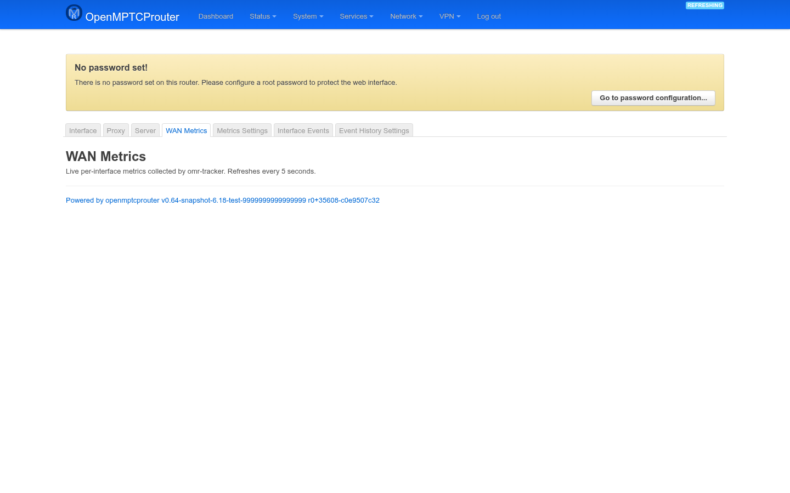

*The screenshot above shows the page's current empty state on the
reference bench (no metrics have been sent/stored yet) — normally it fills
with one live card per connection.*

A live performance dashboard, refreshing every 5 seconds, grouped into
sections per connection:

| Section | Shows |
|---|---|
| Connectivity | Name, device, up/down status with detail, IPv4/IPv6 addresses, gateways. |
| Quality | Current/best/worst latency, jitter, loss percentage, and an overall Congestion score (0–100, colour-coded None → Severe). |
| Bandwidth | Current download/upload speed and totals since last startup. |
| Signal | Wi-Fi (SSID, AP, channel, signal, rate) or cellular (operator, state, signal quality). |
| Traffic Control | Shaping method, sent/dropped packets, queued data. |
| BBR | Estimated max speed, pacing rate, delivery rate, congestion window, minimum RTT, retransmission count. |

Underneath each card, three small live trend graphs track Congestion,
Latency and Loss. A **Forecast panel** shows a trend arrow and a
~5-minute-ahead prediction; a **Decision panel** shows the weight/share and
score currently driving which connection is favoured.

**Metrics Settings** page:

| Field | Meaning |
|---|---|
| Send metrics to VPS / Send interval | Uploads this router's statistics to the central server — needed for the Decision/Forecast panels. |
| Enable weight sync / model-assigned weights | Lets traffic split adjust automatically based on measured quality. |
| Enable prediction / Prediction horizon | Has the server forecast how quality will change, from 1 second up to a full day ahead. |
| Use custom metrics server | Send statistics to your own server instead of the standard one. |

> **In practice** — open this whenever you want to see, in real time,
> which connection is currently best or struggling.

*Deeper technical detail: [WAN Metrics user guide](../luci-app-omr-metrics/docs/metrics-guide.md) and its companion [Metrics Settings guide](../luci-app-omr-metrics/docs/settings-guide.md).*

### iPerf

```
https://<router-ip>/cgi-bin/luci/admin/services/iperf
```

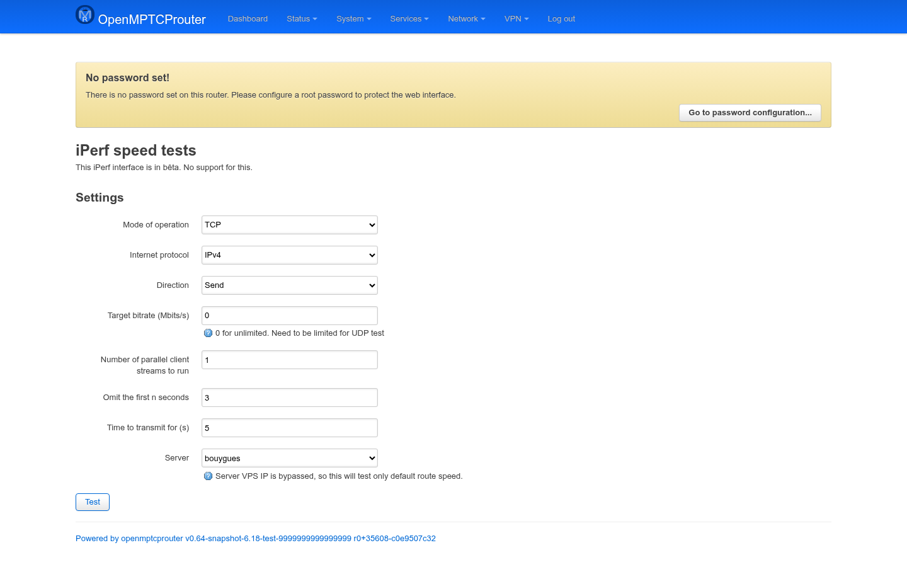

Runs network speed/throughput tests between the router and public test
servers, similar to a speed test. Marked as a beta feature.

| Field | Meaning |
|---|---|
| Mode of operation / Internet protocol | TCP or UDP; IPv4 or IPv6. |
| Target bitrate | 0 = unlimited; UDP tests generally need a limit for meaningful results. |
| Parallel streams / Time to transmit | How many simultaneous test connections, and how long each run lasts. |
| Server | A dropdown of public test servers grouped by region. |
| Test (button) | Runs an upload test followed immediately by a download test. |

> **In practice** — choose a nearby server, leave the rest at defaults,
> and click Test for a quick real-world reading.

### nDPId

```
https://<router-ip>/cgi-bin/luci/admin/services/ndpid
```

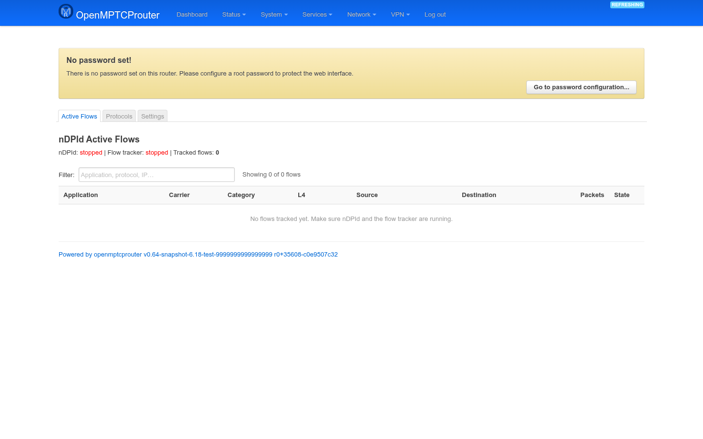

*The screenshot above shows nDPId currently stopped on the reference
bench — start it under the Settings tab to see live flows.*

Deep packet inspection: identifies which application or protocol is
generating traffic, feeding both this page and OMR-Bypass's protocol-based
rules.

| Page | What it shows |
|---|---|
| Active Flows | A live table of current connections: detected Application, underlying Protocol, Category, transport, source/destination, packet count, detection state. Read-only, with a filter box. |
| Protocols | A searchable reference list of every protocol/application the engine can recognise, filterable by category and Protocol vs Application, showing Cleartext vs Encrypted. |
| Settings | Enable nDPId, which interfaces to inspect, and (in an advanced section) deep tuning: per-thread limits, detection-engine internals, certificate/STUN tuning, the internal result-distribution service, Netifyd-compatibility output, and automatic ipset grouping of detected traffic. |

> **In practice** — enable with default settings and pick the interfaces
> to monitor, then check Active Flows to see what's using the network
> right now.

*Deeper technical detail: [nDPId user guide](../luci-app-ndpid/docs/ndpid-guide.md).*

---

## System

Administrative pages: network security, background tuning, alerts, power,
DNS, and firmware.

### Firewall

```
https://<router-ip>/cgi-bin/luci/admin/network/firewall
```

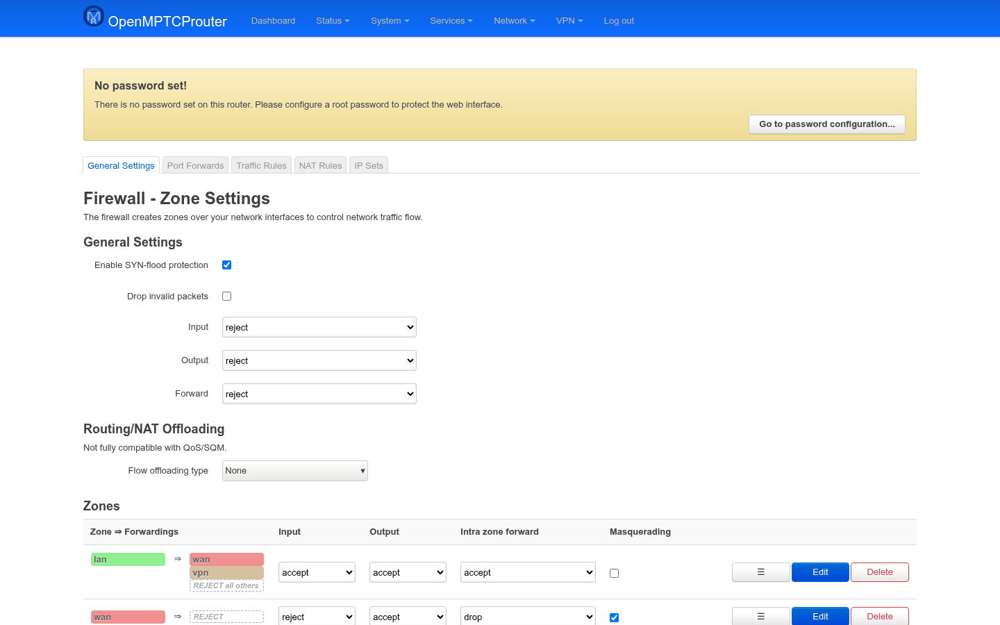

Functionally identical to stock OpenWrt's firewall pages. The one
project-specific behaviour: rules and IP sets the system creates
automatically for its own multipath/DSCP handling are hidden from these
lists, so you only see and manage your own entries.

| Page | What it's for |
|---|---|
| General Settings | Default policies, SYN-flood protection, flow offloading, and firewall Zones. |
| Port Forwards | Expose a LAN device/service to the internet. |
| Traffic Rules | Allow or block specific traffic between zones/hosts/ports. |
| NAT Rules | Control the source address used for outbound/forwarded traffic. |
| IP Sets | Reusable address lists for use in rules. |
| Custom Rules | Raw iptables commands, run after every firewall restart. |

### bpftune

```
https://<router-ip>/cgi-bin/luci/admin/services/bpftune
```

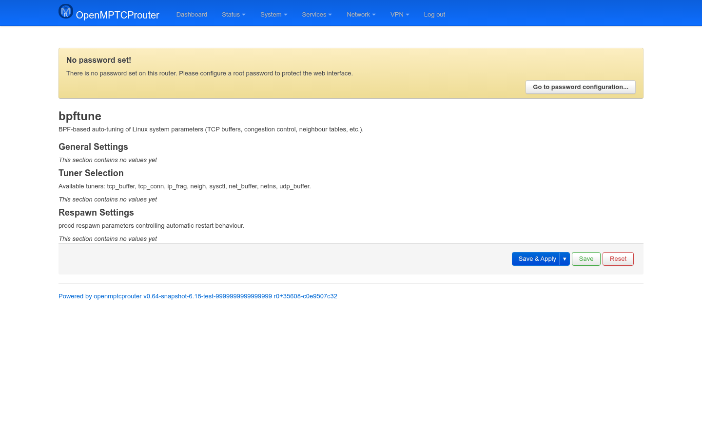

A background service that automatically tunes low-level Linux networking
settings (TCP buffer sizes, congestion control) for better performance.

| Field | Meaning |
|---|---|
| Enable / Daemon mode | Turns the auto-tuning service on and runs it continuously in the background (recommended, on by default). |
| Rollback on stop | Undoes any tuning changes if the service is stopped. |
| Learning rate | How aggressively/frequently it adjusts settings, from very slow to fast. |
| Disabled tuners / Allowed tuners | Turn specific tuning modules off, or restrict to only an explicit allow-list. |

<details>
<summary>Respawn settings</summary>

Threshold, timeout and max retries controlling how the service recovers if
it crashes.
</details>


### E-Mail

```
https://<router-ip>/cgi-bin/luci/admin/services/mail
```

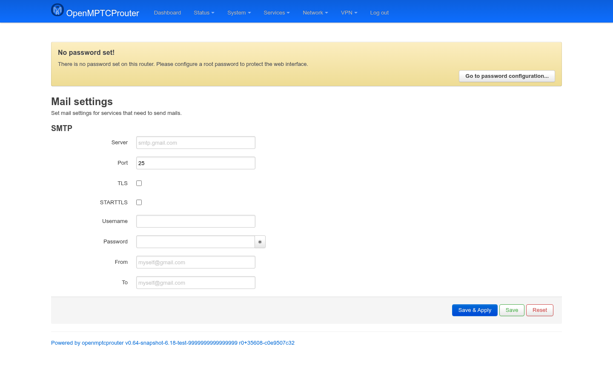

Configures the router to send email alerts through an outgoing mail
server, used by other services on the router that need to notify you.

| Field | Meaning |
|---|---|
| Server / Port | Your outgoing mail server and its port (default 25). |
| TLS / STARTTLS | Whichever secure-connection method your mail provider requires. |
| Username / Password | Your mail account credentials. |
| From / To | The sending address, and the address alerts should be sent to. |

> **In practice** — fill in your provider's server details and a sending
> account, so the router can email you alerts going forward.

### Shutdown

```
https://<router-ip>/cgi-bin/luci/admin/system/shutdown
```

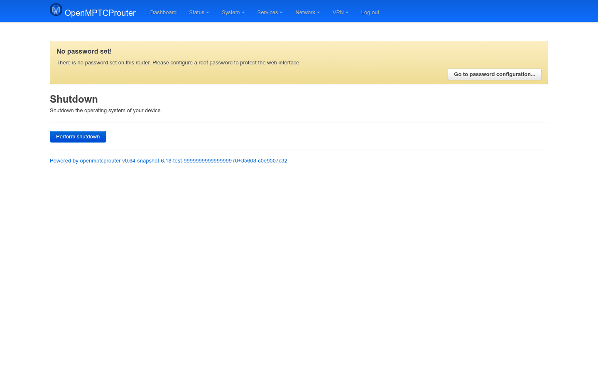

One purpose: powers off the router. A warning appears if there are unsaved
changes elsewhere, since they'll be lost. **Perform shutdown** is the only
control on the page — there's no reboot button here.

### SmartDNS

```
https://<router-ip>/cgi-bin/luci/admin/services/smartdns
```

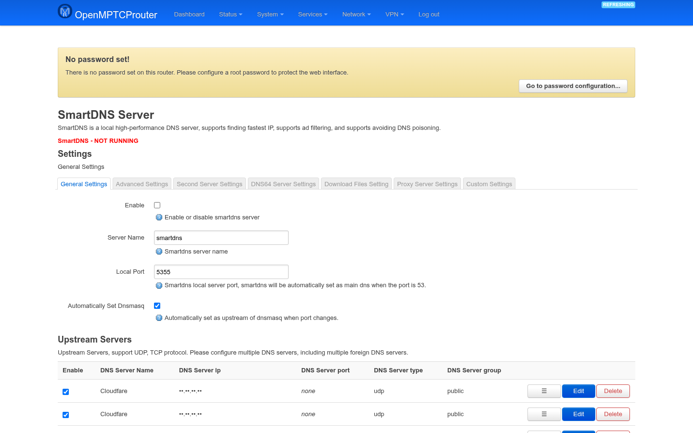

A local, high-performance DNS resolver that speeds up lookups, picks the
fastest-responding server, and helps avoid DNS tampering. A status line
shows RUNNING or NOT RUNNING at all times.

| Field | Meaning |
|---|---|
| Enable / Local Port | Turns SmartDNS on; setting the port to 53 makes it the router's main DNS resolver. |
| Automatically Set Dnsmasq | Keeps the router's main DNS service pointed at SmartDNS automatically whenever the port changes. |
| Speed Check Mode / Response Mode | How SmartDNS measures which candidate server responds fastest, and whether it returns the first, fastest, or fastest-overall reply. |
| Domain prefetch / Serve expired | Proactively refreshes popular domains before they expire; answers instantly from a possibly-stale cache while refreshing in the background. |
| Cache Size / Cache Persist | How many results are kept in memory, and whether the cache survives a reboot. |

<details>
<summary>Second server, DNS64, upstream servers, domain rules &amp; proxying</summary>

An optional secondary DNS listener with its own independent settings; a
DNS64 prefix for helping IPv6-only devices reach IPv4-only destinations; a
managed list of Upstream Servers (each with type, TLS verification, and
grouping); Domain Rules for forwarding or blocking specific domains,
mapping domains directly to fixed addresses, or filtering results against
an IP blacklist; routing SmartDNS's own upstream queries through a
SOCKS5/HTTP proxy; and a Custom Settings tab for raw advanced
configuration.
</details>

> **In practice** — enable it, optionally adjust a couple of upstream
> servers, and click Restart — the many advanced tabs are only for
> specific filtering, privacy, or performance setups.

### Sysupgrade

```
https://<router-ip>/cgi-bin/luci/admin/system/sysupgrade
```

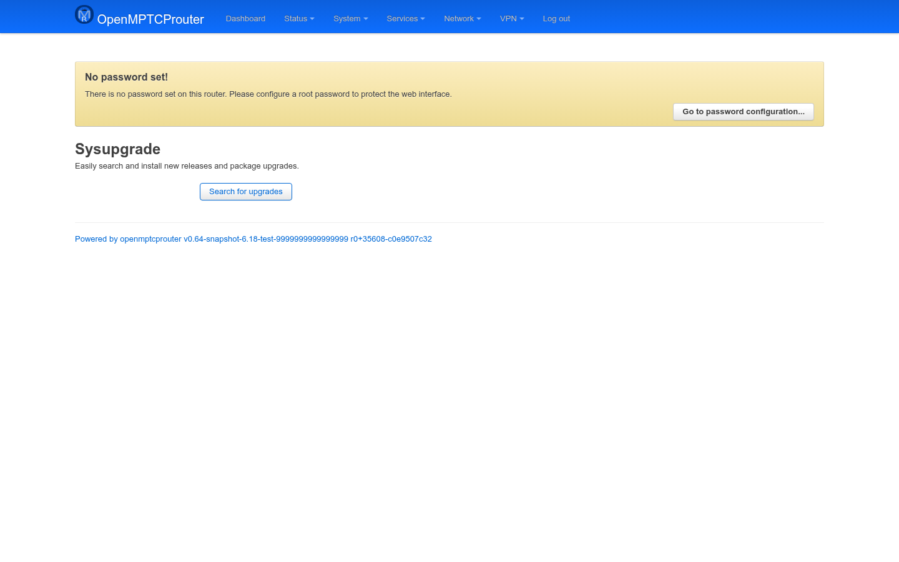

Search for, download, and install a new firmware version — or update
packages — directly from the web interface, with configuration
backup/restore built into the process.

| Field | Meaning |
|---|---|
| Search for upgrades | Checks the update server for a version newer than what's installed. |
| Edit installed packages | Available once an upgrade is found, in advanced mode: add or remove specific packages before the image is built. |
| Keep settings | Preserves your current configuration across the upgrade (default on); unchecked resets to factory defaults. |
| Request firmware / Flash firmware | Asks the server to build a matching image, then downloads and flashes it — don't unpower the device during this step. |

> **In practice** — click Search for upgrades; if one's available, Request
> firmware, decide whether to keep settings, then Flash firmware and wait
> for the page to confirm success.

---

## Appearance

Switched from **System → System → Language and Style**. Purely cosmetic —
changing themes never affects network settings or router behaviour.

### Themes

```
https://<router-ip>/cgi-bin/luci/admin/system/system
```

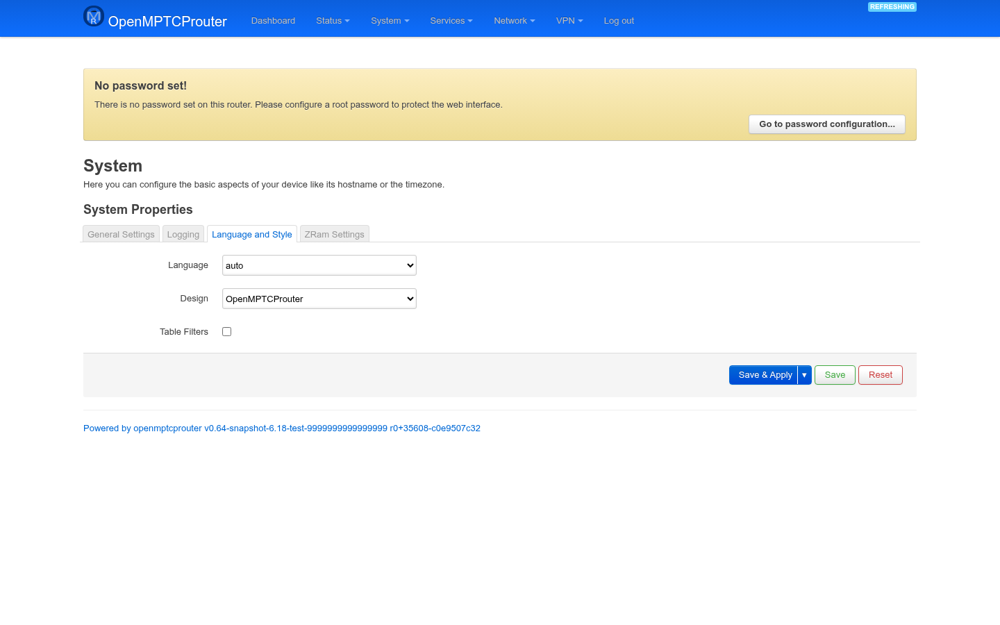

| Theme | Style |
|---|---|
| openmptcprouter (default) | The project's own branded default theme, based on the classic LuCI Bootstrap look, showing the OMR logo and update status in its header. |
| openwrt-2020 | Upstream OpenWrt's own current default — a clean, modern blue/white look. |
| argon | A polished community theme with light/dark mode (automatic or manual) and a customisable login-screen background, including video wallpapers. |
| design | Optimised for mobile, with a bottom navigation bar and an app-like feel for adding the router's UI to a phone's home screen. |
| alpha (beta) | A Bootstrap/Material-inspired theme still in beta, with extra options — background blur, overlay colour, and up to three custom quick-nav shortcut links. |

> **In practice** — pick whichever look you prefer. `openmptcprouter` is
> the recommended default, `openwrt-2020` matches stock OpenWrt, and the
> rest are community themes offering dark mode, a mobile-first layout, or
> extra customisation.

---

## A note on completeness

This manual sticks to plain language and covers every page that's
currently **committed** to `openmptcprouter-feeds` (see the intro at the
top) — it deliberately leaves out the many experimental apps still only
in the working tree, and keeps field descriptions short rather than
exhaustive.

Most of the apps above also carry their own, more technical guide in
their package's own `docs/` folder — written against the actual source
and, in most cases, verified live against a real running router rather
than just the code. Those go deeper than this manual does on purpose:
exact backend `ubus`/rpcd calls, byte-level protocol/config quirks,
conditions under which a section silently hides itself, and specific
gotchas confirmed by live testing. Reach for one of these when this
manual's summary isn't enough:

| Page (in this manual) | User guide |
|---|---|
| [Settings Wizard](#settings-wizard) | [luci-app-openmptcprouter/docs/wizard-guide.md](../luci-app-openmptcprouter/docs/wizard-guide.md) |
| [Status overview](#status-overview) | [luci-app-openmptcprouter/docs/status-guide.md](../luci-app-openmptcprouter/docs/status-guide.md) |
| [MPTCP](#mptcp) | [luci-app-mptcp/docs/mptcp-guide.md](../luci-app-mptcp/docs/mptcp-guide.md) |
| [DSCP](#dscp) | [luci-app-omr-dscp/docs/dscp-guide.md](../luci-app-omr-dscp/docs/dscp-guide.md) |
| [SQM QoS](#sqm-qos) | [luci-app-sqm-autorate/docs/sqm-guide.md](../luci-app-sqm-autorate/docs/sqm-guide.md) |
| [Quota](#quota) | [luci-app-omr-quota/docs/quota-guide.md](../luci-app-omr-quota/docs/quota-guide.md) |
| [MQVPN](#mqvpn) | [luci-app-mqvpn/docs/mqvpn-guide.md](../luci-app-mqvpn/docs/mqvpn-guide.md) |
| [OMR-Bypass](#omr-bypass) | [luci-app-omr-bypass/docs/bypass-guide.md](../luci-app-omr-bypass/docs/bypass-guide.md) |
| [OMR-Tracker Manager](#omr-tracker-manager) | [luci-app-omr-tracker/docs/tracker-guide.md](../luci-app-omr-tracker/docs/tracker-guide.md) |
| [Interface Events](#interface-events) | [luci-app-omr-events/docs/events-guide.md](../luci-app-omr-events/docs/events-guide.md) |
| [WAN Metrics](#wan-metrics) | [luci-app-omr-metrics/docs/metrics-guide.md](../luci-app-omr-metrics/docs/metrics-guide.md) + [settings-guide.md](../luci-app-omr-metrics/docs/settings-guide.md) |
| [nDPId](#ndpid) | [luci-app-ndpid/docs/ndpid-guide.md](../luci-app-ndpid/docs/ndpid-guide.md) |

Three more user guides exist for pages this manual doesn't have a
dedicated section for yet:

- **Advanced Settings** (`admin/system/openmptcprouter/settings`) — TCP/kernel tuning, feature toggles, obfuscation, hardware offload, per-server port redirection: [luci-app-openmptcprouter/docs/settings-guide.md](../luci-app-openmptcprouter/docs/settings-guide.md)
- **Backup** (`admin/system/openmptcprouter/backup`) — full router-config backup/restore against your VPS: [luci-app-openmptcprouter/docs/backup-guide.md](../luci-app-openmptcprouter/docs/backup-guide.md)
- **Show all settings** (`admin/system/openmptcprouter/debug`) — a raw, read-only dump of the entire UCI configuration, for troubleshooting: [luci-app-openmptcprouter/docs/debug-guide.md](../luci-app-openmptcprouter/docs/debug-guide.md)


