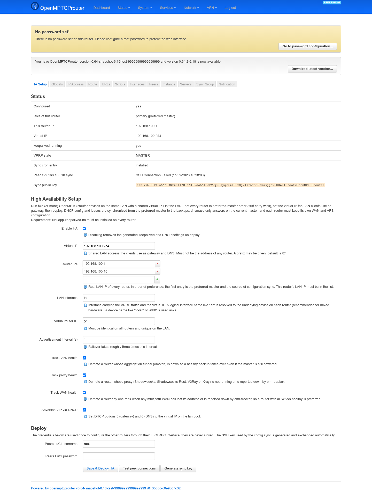
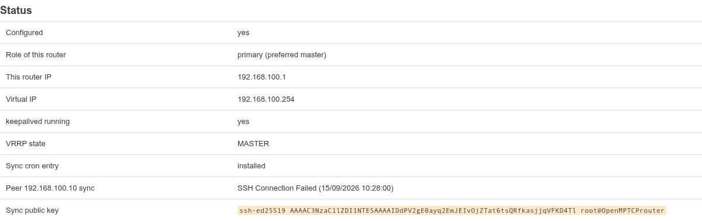
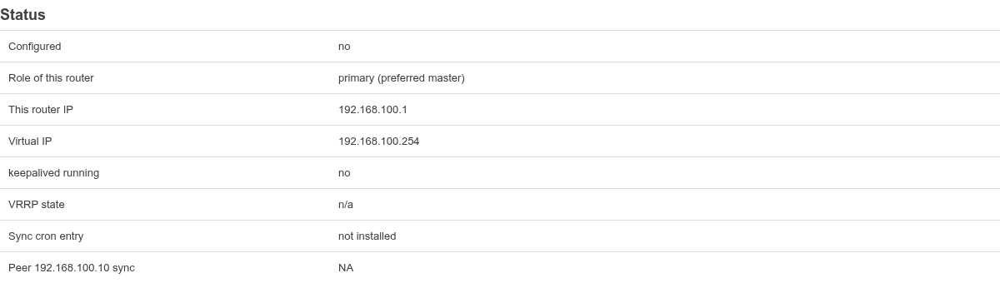
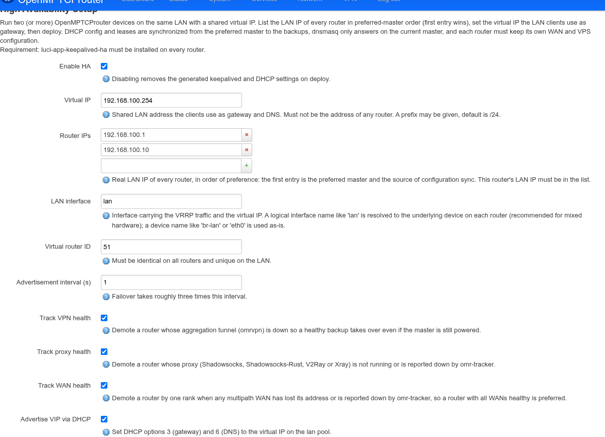
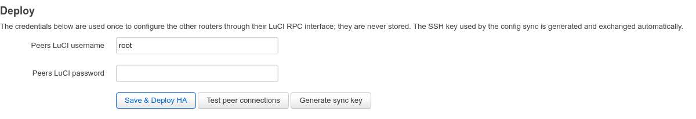
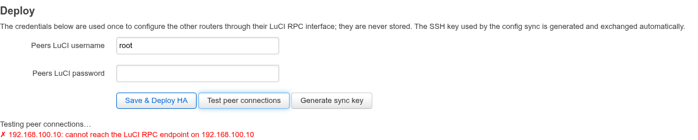

# Keepalived HA Setup — User Guide

`luci-app-keepalived-ha` turns two (or more) OpenMPTCProuter boxes on the
same LAN into a redundant pair: the clients point at one **virtual IP**
that always lives on whichever router is currently healthy, and if that
router dies, loses its aggregation tunnel, or loses its proxy, another one
picks the address up within a few seconds.

It is a one-page front end. You enter the LAN IP of every router, the
shared virtual IP, and the LuCI credentials of the other routers; the page
then generates the whole VRRP setup — keepalived instance, tracking
scripts, config sync, DHCP options — on **every** router, including the
peers, over their LuCI RPC interface.

The page lives at **Services → VRRP → HA Setup**, as the first tab of the
keepalived application:

```
https://<router-ip>/cgi-bin/luci/admin/services/keepalived/ha
```



## Before you start

- **Install the app on every router.** The page configures the peers
  through their own `luci.keepalived-ha` rpcd object; a peer that doesn't
  have the package (or whose `rpcd` wasn't reloaded after installing it)
  is reported as such and skipped.
- **Each router keeps its own WAN and VPS configuration.** Those are
  deliberately never synchronized. Give each router its own VPS user —
  two users on the same VPS keep the same public IP across a failover.
  Never share one VPS user between two routers.
- **Pick a free LAN address for the virtual IP.** It must not be the LAN
  address of any of the routers.

## Status

The top section is read-only and refreshes every 5 seconds.



| Row | Meaning |
|---|---|
| **Configured** | Whether the generated VRRP instance (`keepalived.omr_ha_vi`) exists on this router yet, i.e. whether a deploy has ever run here. |
| **Role of this router** | `primary (preferred master)` when this router's LAN IP is the **first** entry of the router list, `backup` when it is any later entry. `unknown` means none of the listed IPs is actually assigned to this device — usually a typo in the list. |
| **This router IP** | Which entry of the router list matched a local address. |
| **Virtual IP** | The shared address, as configured. |
| **keepalived running** | Whether a `keepalived` process is alive. |
| **VRRP state** | Live state of the `OMR_HA` instance, read from keepalived itself: `MASTER` (this router currently holds the virtual IP), `BACKUP` (standing by), `FAULT`, `INIT`, `STOP`. `n/a` means keepalived isn't answering yet. |
| **Sync cron entry** | Whether the once-a-minute `rsync.sh` line that drives the config sync is installed in the root crontab. |
| **Peer *ip* sync** | Result and timestamp of the last config-sync round with that peer — `Successful`, `Up to Date`, or a failure such as `SSH Connection Failed` (shown above: the peer was switched off). `NA` means no round has run yet. |
| **Sync public key** | The SSH public key this router uses for the config sync. It is generated automatically and pushed to the backups by the deploy; it only appears once a key exists. |

Before the first deploy the same table is mostly empty — this is what a
freshly filled-in, not-yet-deployed page looks like:



## Settings



| Field | Meaning |
|---|---|
| **Enable HA** | On by default. Unticking it and deploying **removes** the generated keepalived sections and the DHCP options again (see [Turning HA off](#turning-ha-off)). |
| **Virtual IP** | The shared LAN address the clients use as gateway and DNS. Must not be any router's own address. A prefix may be appended (`192.168.100.254/24`); without one, `/24` is assumed. |
| **Router IPs** | The real LAN IP of every router, **in order of preference**. The first entry is the preferred master and the source of the configuration sync. This router's own LAN IP must be in the list. At least two entries are required. |
| **LAN interface** | The interface that carries the VRRP traffic and the virtual IP. A logical name such as `lan` is resolved to the underlying device separately on each router, which is what you want for a mixed-hardware pair (on the test router above, `lan` resolved to `eth0`). A device name such as `br-lan` or `eth0` is used as-is on every router. Default: `lan`. |
| **Virtual router ID** | The VRRP group number, 1-255. Must be identical on all routers of the pair and must not collide with another VRRP group on the same LAN. Default: `51`. |
| **Advertisement interval (s)** | How often the master announces itself. A failover takes roughly three times this value. Default: `1`, so about 3 seconds. |
| **Track VPN health** | Demote this router while its `omrvpn` aggregation tunnel is down or no longer carries the default route, so a healthy backup takes over even though the master is still powered and reachable. On by default. |
| **Track proxy health** | Demote this router while its proxy (Shadowsocks, Shadowsocks-Rust, V2Ray or Xray) is not running, or is reported down by omr-tracker. On by default. |
| **Track WAN health** | Demote this router *by one rank* when any multipath WAN has lost its address or is reported down by omr-tracker, so an otherwise equal router with all WANs healthy is preferred. On by default. |
| **Advertise VIP via DHCP** | Set DHCP options 3 (gateway) and 6 (DNS) on the `lan` pool to the virtual IP, so clients use the shared address instead of one specific router. On by default. |

Nothing in this section takes effect on its own — the page has no
Save & Apply. Use **Save & Deploy HA** below.

## Deploy



The username and password here are the **LuCI login of the other
routers**, used once to reach their RPC endpoint. They are never stored.
The SSH key used by the config sync is generated and exchanged for you.

- **Save & Deploy HA** — saves the settings, applies them on this router,
  then configures each other router in the list in turn, logging one line
  per router underneath. The peers receive the same settings, so you only
  ever fill this page in once, on one router.
- **Test peer connections** — a dry run: logs in to every other router in
  the list and reports whether it is reachable, whether the app is
  installed there, and what role it currently holds. Nothing is changed.
- **Generate sync key** — creates the config-sync SSH key on this router
  by hand. Rarely needed; the deploy does it.

The log reports each peer separately, so a pair where one router is
unreachable still gets the reachable ones configured:



The peer push uses HTTPS where available and falls back to plain HTTP on
the LAN.

## What a deploy generates

Everything below is regenerated from scratch on each deploy, on every
router. All generated keepalived sections are named `omr_ha_*`, so they
are easy to tell apart from anything you configured by hand on the other
tabs of the keepalived app.

- **VRRP instance `OMR_HA`** on the resolved LAN device, with unicast
  peering to the other routers (no multicast needed).
- **Priority `245 - 10 × position`** in the router list: 245 for the
  first entry, 235 for the second, and so on, with a floor of 11.
- **State `BACKUP` on every router, preemption left enabled.** Health is
  encoded in the priority by the tracking scripts, so the healthiest
  router always ends up holding the virtual IP — with `nopreempt` a
  demoted backup would keep it even after the master recovered.
- **The virtual IP** as an `ipaddress` section attached to that instance.
- **keepalived itself enabled** (`keepalived.globals.enabled`), with a
  15-second VRRP startup delay if none was set, so a rebooting router
  doesn't claim the virtual IP before its links are up.
- **One `vrrp_script` per enabled tracking option** (interval 5 s, 3
  successes to rise, 2 failures to fall):

  | Script | Weight | Fires when |
  |---|---|---|
  | `omr_ha_check` (VPN) | −200 | `omrvpn` is down, or traffic no longer egresses through it. Skipped entirely when no `omrvpn` exists or it is disabled. |
  | `omr_ha_check_proxy` | −200 | the configured proxy's process is gone, or omr-tracker reports it down. Skipped when no proxy is configured. |
  | `omr_ha_check_wans` | −15 | any multipath WAN (`master`/`on`/`backup`/`handover`, not disabled) has lost its global address or is reported down by omr-tracker. |

- **DHCP options** `3,<vip>` and `6,<vip>` on the `lan` pool, when
  *Advertise VIP via DHCP* is on. dnsmasq is then restarted.
- **The sync cron line** `* * * * * /etc/keepalived/scripts/rsync.sh`.
- **The config-sync SSH key** (ed25519, in the `keepalived` user's home),
  on the preferred master, with the public key pushed to the backups.
- **Peer sections** carrying the sync roles: `send` on the preferred
  master, `receive` plus the master's public key on the backups.

## How the failover decides

The three tracking weights are chosen so that different kinds of failure
sort differently, rather than all collapsing into "demote":

- **A total failure (tunnel or proxy) costs 200 points**, which drops the
  router below *every* healthy router in the list regardless of position.
  A first-entry master at 245 falls to 45 and a healthy second router at
  235 takes over; when the master recovers it climbs back to 245 and, with
  preemption on, takes the virtual IP back.
- **A degraded WAN pool costs 15 points**, a little more than the 10-point
  gap between neighbours. The router slips exactly one rank — just below
  its immediate neighbour, still above everything further down the list.
  If both routers lose the same carrier they are demoted alike and their
  original order is preserved.
- **Both heavy checks failing at once** would score below zero, so
  keepalived clamps the effective priority to its minimum of 1: a router
  that has lost everything sits below any router that still has something.

You can read the live numbers on the router itself:

```
ubus call keepalived dump          # base_priority / effective_priority / state
cat /var/run/keepalived.omr_ha.state   # MASTER, BACKUP or FAULT
ip -4 addr show dev <lan device>   # the VIP appears as a 'secondary' address
```

The state file is written by the `240-omr-ha-state` hotplug script so that
other OpenMPTCProuter services can behave correctly on a backup — dnsmasq
is intentionally stopped there and must not be revived by a watchdog.

## What is synchronized between the routers

The preferred master pushes a fixed set of files to the backups once a
minute. Configuration that must stay per-router is deliberately **not**
in that set — notably `/etc/config/network` and
`/etc/config/openmptcprouter`, so each router keeps its own WANs and its
own VPS.

| Synchronized | Why it matters |
|---|---|
| `/etc/config/dhcp`, `/tmp/dhcp.leases` | DHCP service and current leases, so a client keeps its address across a failover |
| `/etc/config/firewall` | firewall rules |
| `/etc/config/system`, `/etc/config/luci`, `/etc/config/rpcd` | system, UI and RPC settings |
| `/etc/config/dropbear` + host keys | SSH, so the SSH fingerprint doesn't change after a failover |
| `/etc/config/uhttpd`, `/etc/uhttpd.crt`, `/etc/uhttpd.key` | the LuCI web server and its certificate |
| `/etc/passwd`, `/etc/shadow`, `/etc/group` | accounts and passwords |
| `/etc/hosts`, `/etc/inittab`, `/etc/profile`, `/etc/rc.local`, `/etc/shinit`, `/etc/sysctl.conf` | assorted system files |

dnsmasq itself only runs on the current master: the keepalived hotplug
restarts it when a router becomes master and stops it when it becomes
backup, so the two routers never answer DHCP at the same time.

## Turning HA off

Untick **Enable HA** and press **Save & Deploy HA** again. The generated
`omr_ha_*` sections are deleted, DHCP options 3 and 6 are removed from the
`lan` pool (other DHCP options are left alone), dnsmasq is restarted if
*Advertise VIP via DHCP* was on, and keepalived is restarted without the
instance.

Do this on **each** router in turn. Unlike the settings above, the disable
is not propagated: a deploy always configures the peers as enabled, so
disabling on the master alone would switch its own HA off and leave the
backups running.

## Doing it from the command line

The same engine is available as `keepalived-ha`, which is useful for
scripting a fleet or for a router you can only reach over SSH:

```
keepalived-ha apply [my_ip] [pubkey]   # (re)generate this router's HA config
keepalived-ha push <ip> [user] [pass]  # configure a peer over its LuCI RPC
keepalived-ha genkey                   # create the sync key, print the public key
keepalived-ha status                   # the Status table above, as JSON
```

`apply` reads the same `keepalived.ha` UCI section the page writes, so you
can also set the options with `uci` and then apply.

## Limitations

- **Established connections do not survive a failover.** The NAT state
  lives in the failed router's tunnel; new connections work immediately.
- **Inbound port forwards on the VPS** target one user's tunnel and need
  a VPS-side failover mechanism of their own. This package only handles
  the LAN side.
- **The routers must share a LAN segment** — VRRP advertisements and the
  virtual IP are layer-2 local.

## Troubleshooting

| Message | What it means |
|---|---|
| `none of the router IPs is assigned to this device` | No entry in the router list matches a local address. Check for a typo, or that you are editing the right router. |
| `at least two router IPs are required` | HA needs at least a pair. |
| `the virtual IP must not be one of the router IPs` | The virtual IP has to be a free address. |
| `cannot resolve LAN device '<name>'` | The LAN interface field names neither an existing device nor a logical interface. Use `lan`, or a real device such as `br-lan`. |
| `cannot reach the LuCI RPC endpoint on <ip>` | The peer is off, unreachable, or its web interface isn't answering — the case shown in the screenshot above. |
| `authentication failed on <ip>` | Wrong LuCI username or password for that peer. |
| `luci-app-keepalived-ha is not installed (or rpcd was not reloaded) on <ip>` | Install the package there, then `/etc/init.d/rpcd reload`. |
| `<ip> is not in the configured router list` | Deploy was asked to configure a router that isn't in the list; save the list first. |
| Peer sync stays `SSH Connection Failed` | The backup can't be reached over SSH by the sync, or never received the master's public key. Re-run the deploy from the preferred master. |
