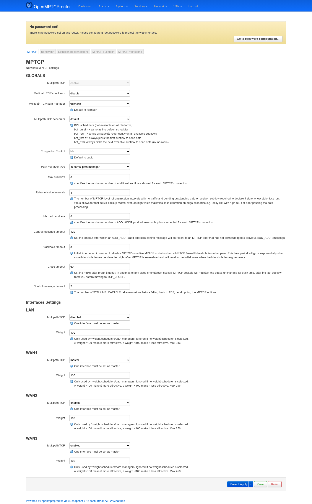
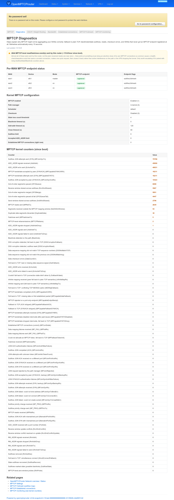
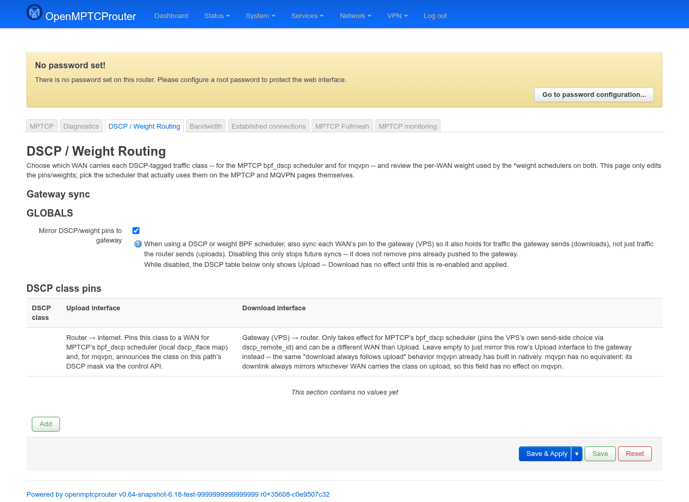
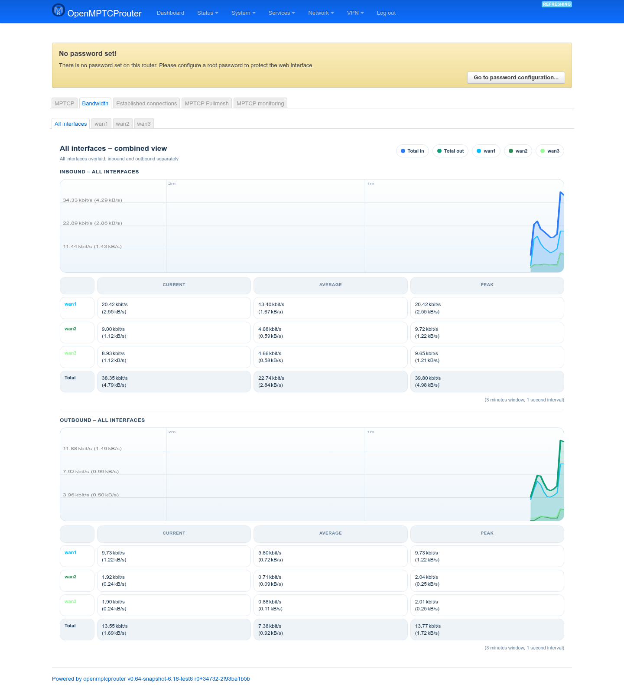
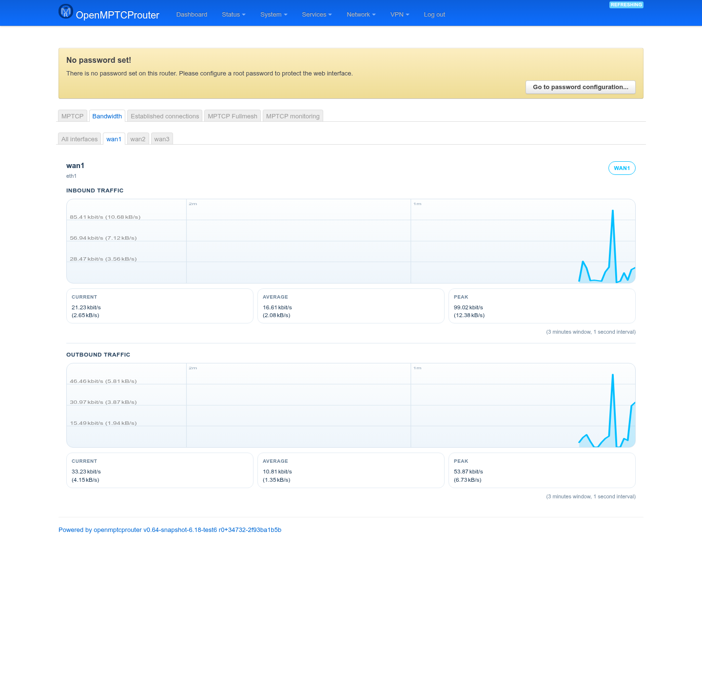
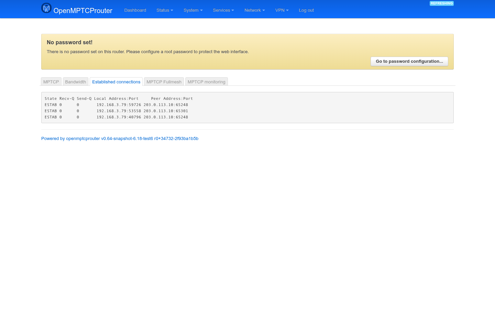
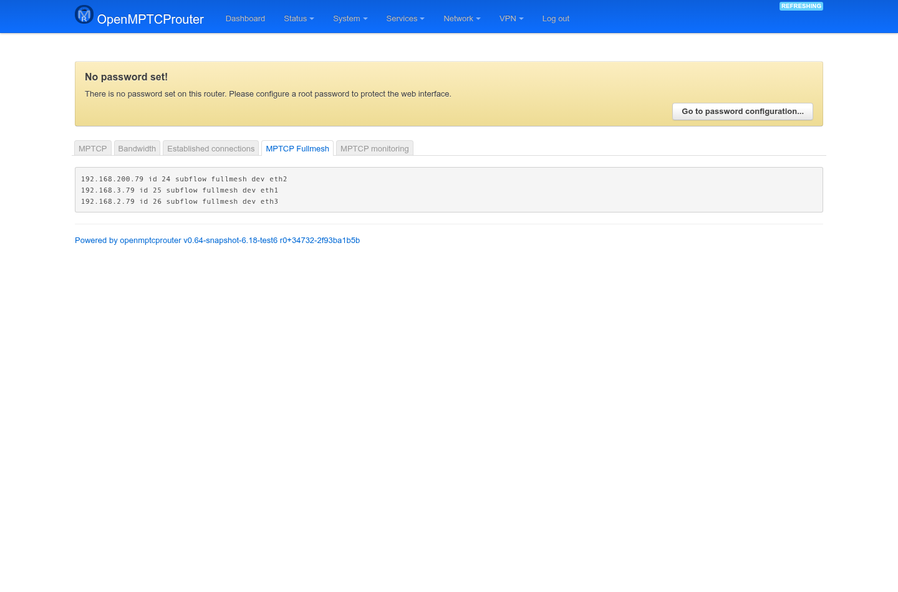
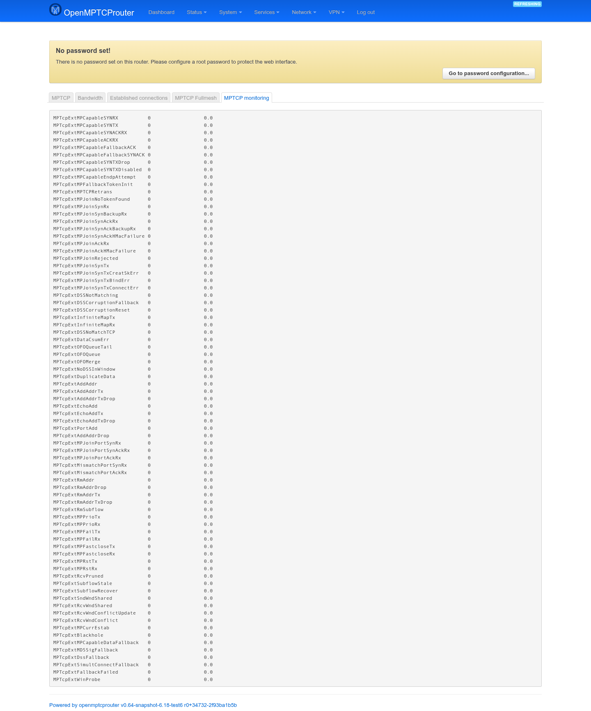

# MPTCP — User Guide

`luci-app-mptcp` is the LuCI front end for the kernel's Multipath TCP stack
— the layer that actually bonds your WAN links together. It has seven pages
under **Network → MPTCP**: **MPTCP** (settings), **Diagnostics**,
**DSCP / Weight Routing**, **Bandwidth**, **Established connections**,
**MPTCP Fullmesh**, and **MPTCP monitoring**.

Screenshots below were taken on a test router (`v0.64-snapshot`, kernel
6.18, 3 WAN links). Peer/remote IPs that would reveal the test VPS were
replaced with a placeholder (`203.0.113.10`) before capture — everything
else is unmodified live output.

## MPTCP (settings)

```
https://<router-ip>/cgi-bin/luci/admin/network/mptcp/mptcp
```



The form's contents adapt to your kernel version — the screenshot is from
a 6.18 kernel, which exposes the modern in-kernel/userspace path-manager
options; older kernels (<6) show a different, longer set of legacy fields
(scheduler-specific tuning like ndiffports/round-robin subflow counts,
`mptcp_version`, etc.) instead.

### GLOBALS

| Field | Meaning |
|---|---|
| **Multipath TCP** | Read-only indicator of whether MPTCP is enabled network-wide. |
| **Multipath TCP checksum** | Enables MPTCP-level checksums (extra integrity check, minor overhead). |
| **Multipath TCP path-manager** | `default` or `fullmesh` (OMR's normal choice — creates subflows between every local/remote address pair). |
| **Multipath TCP scheduler** | Which subflow the kernel picks to send data on. `default`, or a BPF scheduler (`bpf_burst`, `bpf_red`, `bpf_first`, `bpf_rr`, plus any custom `.o` dropped into `/usr/share/bpf/scheduler` — auto-discovered and listed here). On kernels <6, classic in-tree schedulers (round-robin, redundant, BLEST, ECF) are offered instead. |
| **Congestion Control** | Populated live from `sysctl net.ipv4.tcp_available_congestion_control` — pick any congestion control algorithm your kernel has compiled in. Default is `cubic`; this bench uses `bbr`. |
| **Path Manager type** *(kernel ≥6 only)* | In-kernel (simpler, default) vs. userspace (delegates subflow decisions to `mptcpd`). |
| **Max subflows** | Cap on additional subflows per MPTCP connection — usually matches (or exceeds) your WAN count. |
| **Retranmission intervals** | How many MPTCP-level retransmit intervals with no traffic/no ack before a subflow is declared *stale*. Lower = faster active-backup switchover; higher = better utilization on lossy/high-BER links. |
| **Max add address** | Cap on `ADD_ADDR` suboptions accepted per connection. |
| **Control message timeout** | Resend delay for an unacknowledged `ADD_ADDR` message. |
| **Blackhole timeout** *(kernel ≥6.18)* | Initial cooldown before re-enabling MPTCP on a socket after a middlebox appears to be blackholing it; grows exponentially on repeat failures. |
| **Close timeout** *(kernel ≥6.18)* | Make-after-break grace period: how long a socket holds state after its last subflow drops, before moving to `TCP_CLOSE`. |
| **Control message timeout** *(second one, kernel ≥6.18)* | SYN+MP_CAPABLE retransmit count before falling back to plain TCP. |

When the userspace path manager is selected, extra fields appear
(`mptcpd` enable/disable, its plugin and path-manager `.so` lists —
auto-discovered from `/usr/lib/mptcpd` — and address announcement/
notification flags); not shown here since this bench uses the in-kernel
manager.

### Interfaces Settings

One block per real network interface (LAN + every WAN — VPN-internal
interfaces like `omrvpn`/`omr6in4` are filtered out here since they aren't
independent WAN paths):

- **Multipath TCP** — `disabled`, `enabled`, `master`, or `backup`.
  Exactly one interface must be `master` (the interface MPTCP's initial
  subflow uses); the rest are `enabled` (or `backup`, only cut in when
  masters/enabled links fail).
- **Weight** — only used when a `*weight` scheduler/path-manager is
  active; >100 makes a link more attractive, <100 less, up to 256.

## Diagnostics

```
https://<router-ip>/cgi-bin/luci/admin/network/mptcp/mptcp_diagnostics
```

Answers *why isn't MPTCP aggregating my WANs correctly?* without requiring
you to read raw `nstat`/`ip mptcp` output by hand. Combines the kernel's
MPTCP MIB counters, the live endpoint/subflow state, and a per-WAN sanity
check into a plain-English, color-coded issue list (fallback to plain TCP,
blackholed/stale subflows, resets, checksum errors, JOIN handshake
failures, dropped ADD_ADDR/RM_ADDR signalling), refreshed every 15 seconds.



On this bench, the issue list actually fired: an orange banner flagging
*"2644 MPTCP-level reset/fastclose event(s) sent by this router (~119/hour
since boot)"* — with its own plain-English caveat underneath explaining
that a high count sent *by the router itself* (as opposed to received) is
usually just abortive closes from its own health-check/keepalive probes
opening a connection, sending one request, then closing it, and is only
worth escalating if paired with rising Blackhole/SubflowStale counters —
which is exactly the kind of self-diagnosis this page exists to save you
from having to work out by hand.

A **Per-WAN MPTCP endpoint status** table cross-checks every
multipath-enabled interface against `ip mptcp endpoint show`: a WAN can
look perfectly healthy in OpenMPTCProuter's Status page (IP, gateway, ping
all fine) and still never carry a subflow if its endpoint is missing —
this is usually the fastest way to catch that.

A **Live MPTCP subflows** table goes one level deeper than that: a live
read of every established subflow (preferring `omr-sockdiag`, a small tool
that queries the kernel directly over `NETLINK_SOCK_DIAG` — the same
INET_DIAG protocol `ss` uses internally — and falling back to parsing
`ss -tin` text if that tool isn't installed), one row per actual established
subflow, attributed to its WAN by matching the connection's local address
against the endpoint list above. Each row shows the local/remote
address:port, whether the kernel is
currently using it as an active or backup path, congestion window, RTT
(smoothed/variance), retransmissions (current/total), and pacing/delivery
rate — the same live TCP-level numbers `ss -i` would show for that
connection, without needing to run it by hand over SSH. A WAN with a
correctly-registered endpoint but no row here means the path manager
just hasn't opened a subflow on it yet (or it's currently down/unreachable),
which the endpoint table alone can't tell you.

A **Kernel MPTCP
configuration** block shows the live scheduler/path-manager/checksum/
timeout values straight from `/proc/sys/net/mptcp/*`, and a sortable
counters table plus collapsible raw `multipath -k/-f/-c` sections are
available for anyone who wants the unprocessed data (the raw `-k`/`-f`/`-c`
sections mirror **MPTCP monitoring**'s kernel-info line, **MPTCP
Fullmesh**, and **Established connections** below).

The counters table is genuinely cumulative since boot, unlike **MPTCP
monitoring**'s raw `multipath -m` output below: that wraps `nstat -z`,
which (without `-a`) reports the delta since the *previous* `nstat` call by
anyone on the router — confirmed live, two calls a couple seconds apart
came back ~0. A page auto-polling every 15s through that would show
"since last poll" numbers while looking like a lifetime total, and would
race with anything else on the box that also calls `nstat`. Diagnostics
reads the kernel's own procfs SNMP-style counters directly instead
(`/proc/net/netstat`'s `MPTcpExt:` block, or `/proc/net/mptcp_net/snmp` on
older kernels), which has no such history-file/shared-state gotcha.

Backed by a new method on the same `luci.mptcp` rpcd object as the other
pages: `ubus call luci.mptcp diagnose '{}'` (no arguments).

## DSCP / Weight Routing

```
https://<router-ip>/cgi-bin/luci/admin/network/mptcp/mptcp_dscp_routing
```

A per-WAN pin/weight table shared between two independent consumers —
MPTCP's `bpf_dscp`/`bpf_weight*` schedulers (see the MPTCP settings page
above) and `mqvpn`'s equivalent scheduler modes — so both can be
configured from one place instead of duplicating the same WAN list twice.
This page only edits the pins/weights themselves; which scheduler is
actually *active* is still chosen on the MPTCP or MQVPN settings pages.

Its content is entirely conditional: it shows the **DSCP class pins**
table only if MPTCP's scheduler is `bpf_dscp` *or* mqvpn is enabled at
all (mqvpn pushes its DSCP mask unconditionally whenever it's on, unlike
weight below), and the **WAN weight** section only if MPTCP's scheduler
is one of the `bpf_weight`/`bpf_weight_rr`/`bpf_burstweight` family *or*
mqvpn's scheduler is `wrtt`/`wrr`. With neither condition met, the page
just says so and renders nothing else.



On this bench, MPTCP's scheduler is `blest` (neither DSCP nor weight) but
mqvpn is enabled, so only the DSCP half shows:

| Section | Fields |
|---|---|
| **Gateway sync** | **Mirror DSCP/weight pins to gateway** — also push each pin/weight to the VPS so it holds for download traffic too (the gateway's own send direction), not just what the router sends. Disabling it only stops *future* syncs; pins already pushed stay pushed. Its *saved* value (not the live checkbox) decides whether the Download column below even renders — toggling it needs Save & Apply and a reload before that column appears/disappears. |
| **DSCP class pins** | One row per DSCP class → **Upload interface** (router → internet: pins the class to a WAN for `bpf_dscp`'s local map, and for mqvpn announces it on that path's DSCP mask via the control API) and, only while Gateway sync is on, **Download interface** (gateway → router; `bpf_dscp`-only, pins the VPS's own send-side choice — leave empty to just mirror the Upload interface instead). mqvpn has no separate download pin at all — its downlink always mirrors upload. |
| **WAN weight** *(not shown here — no weight scheduler active)* | One row per multipath-enabled WAN, a single **Weight** value (default 100, max 256) used by both upload and download, for both MPTCP's `*weight` schedulers and mqvpn's Weighted RTT/Weighted Round Robin. |

## Bandwidth

```
https://<router-ip>/cgi-bin/luci/admin/network/mptcp/bandwidth
```

Live, polled-every-second SVG traffic graphs. A tab per multipath-enabled
interface, plus an **All interfaces** overview.



The combined view overlays every WAN's inbound (and, separately, outbound)
throughput plus a bold total line, with a live current/average/peak table
underneath per interface and for the total.



Selecting a WAN tab (e.g. `wan1`) narrows this to that link alone —
inbound and outbound charts with their own current/average/peak stats,
useful for judging one link's real-world throughput independent of the
others.

## Established connections

```
https://<router-ip>/cgi-bin/luci/admin/network/mptcp/mptcp_connections
```



Raw, auto-refreshing (every 10s) output of `multipath -c` — every ESTAB
MPTCP connection with local and peer address:port. Useful for confirming
traffic is actually using multiple subflows/paths, or for spotting
connections stuck on a single WAN.

## MPTCP Fullmesh

```
https://<router-ip>/cgi-bin/luci/admin/network/mptcp/mptcp_fullmesh
```



Raw output of `multipath -f`: the fullmesh path-manager's current subflow
map — one line per local address, its subflow ID, and which device it
rides on. This is the direct evidence that the fullmesh path-manager
picked up every WAN address correctly; a WAN missing from this list isn't
being used as an MPTCP subflow.

## MPTCP monitoring

```
https://<router-ip>/cgi-bin/luci/admin/network/mptcp/mptcp_monitor
```



Raw output of `multipath -m`: the kernel's full `MPTcpExt*` counter dump
(from `nstat`/`netstat -s`-style MIB counters) — join attempts/failures,
retransmissions, checksum errors, address add/remove events, fallbacks to
plain TCP, etc. All zero on a healthy, idle test link; non-zero values in
categories like `MPTcpExtMPCapableFallbackSYNACK` or `MPTcpExtMPFailTx`
are what you'd check first when MPTCP negotiation is suspected to be
failing (e.g. a middlebox stripping MPTCP TCP options).

## Not reachable from the menu: MPTCP Support Check

The package also ships `mptcp/mptcp_check.js` — a page that runs a
`tracebox`-based trace toward the configured VPS over a chosen interface,
to show whether MPTCP options survive the path (look for
`TCPOptionMPTCPCapable [...] Sender's Key` in the output: present means
supported, a leading `-` means something on the path is stripping it).
It calls the same `luci.mptcp` rpcd backend as the other pages
(`mptcp_check_trace`, wrapping `tracebox -s omr-mptcp-trace.lua`).

However, `luci-app-mptcp.json` has no menu entry for it, and LuCI's
dispatcher falls back to the MPTCP settings page for its URL
(`admin/network/mptcp/mptcp_check`) rather than routing to it — so as
shipped, this page isn't actually reachable through the web UI. Worth
knowing if you're debugging why MPTCP isn't negotiating: the check logic
exists and works via the same rpcd method, it just currently has no way in
from the menu.
