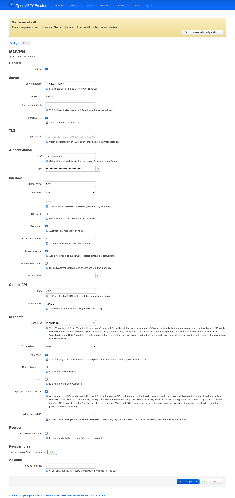
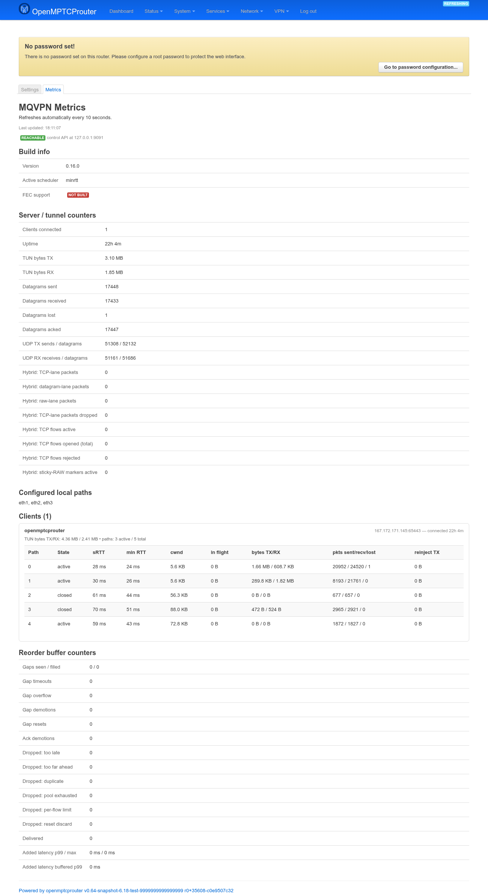

# MQVPN — User Guide

`luci-app-mqvpn` configures and monitors the `mqvpn` package: a
QUIC-based multipath VPN client (always run in client mode on an OMR
router) that bonds several WAN paths into one tunnel to the VPS. It adds
two tabs — **Settings** and **Metrics** — under **VPN → MQVPN**.

Screenshots were taken on a test router (`v0.64-snapshot`) with a live
tunnel to the VPS: mqvpn `0.16.0`, connected for 22h+ over 3 real WAN
interfaces, actively passing traffic.

## Settings

```
https://<router-ip>/cgi-bin/luci/admin/vpn/mqvpn/settings
```



A single long form, one UCI section per group:

| Section | Fields |
|---|---|
| **General** | **Enabled** — master switch for the whole tunnel. |
| **Server** | **Server address** / **Server port** — the VPS endpoint. **Server name (SNI)** — only needed if it differs from the address. **Insecure TLS** — skip certificate verification. |
| **TLS** | **Cipher suites** — optional colon-separated override list; empty uses mqvpn's defaults. |
| **Authentication** | **User** — optional, just an identifying label shown in the server's status/logs (it's what the **Clients** table on the Metrics page groups by). **Key** — the shared auth key, masked. |
| **Interface** | **Tunnel name** (TUN device, default `mqvpn0` — this bench uses `tun0`). **Log level**. **MTU** (1280–9000, blank = auto). **Kill switch** — block all traffic if the tunnel drops. **Reconnect** / **Reconnect interval**. **Route via server** — host-route the server IP before installing the default route (avoids routing the tunnel's own traffic through itself). **No automatic routes** — hand routing off entirely. **DNS servers** — pushed resolvers. |
| **Control API** | **Port** / **Bind address** — the local JSON control API the Metrics page (and external tools) read from; leave the port empty to disable it entirely, which also makes the Metrics tab show "unreachable". |

### Multipath

The scheduler picks how traffic is spread across paths (WAN interfaces
by default, or an explicit list — see below):

| Value | Label |
|---|---|
| `wlb` | Weighted Load Balancing |
| `wlb_udp_pin` | WLB with UDP pinning |
| `minrtt` | Minimum RTT *(used on this bench)* |
| `wrtt` | Weighted RTT |
| `wrr` | Weighted Round Robin |
| `backup` | Backup |
| `backup_fec` | Backup with FEC |
| `rap` | RAP |
| `redundant` | Redundant — broadcasts every packet on every path; loss-critical, low-bitrate traffic only |

With **wrtt**/**wrr**, each path's weight comes from that interface's
**Weight** setting on the Network page (the same value the MPTCP weight
schedulers use) and is pushed to mqvpn automatically — there's no
separate weight field here.

Other fields in this section: **Congestion control** (BBR2/BBR/CUBIC/New
Reno/Copa/Unlimited/None). **Auto WAN** — when on (default), every WAN
interface becomes a path automatically and the **Paths**/**Backup
paths** lists below are hidden; turn it off to pick interfaces
explicitly. **Reinjection control** + **Reinjection mode**
(Default/Deadline/Datagram) — retransmit-on-another-path behavior.
**FEC** + **FEC scheme** (Galois Calculation/Packet Mask/Reed-Solomon/XOR)
— Forward Error Correction, if the mqvpn build supports it (this bench's
build reports **FEC support: not built** on the Metrics page, so
enabling it here wouldn't do anything). **Sync path labels to server** —
announces this path's weight/DSCP mask (set via the control API, from the
Network page's "DSCP / Weight Routing" section — not from this form) so
the server's downlink scheduling adopts the same labels; downlink always
mirrors upload, it can't be pinned independently. **Initial max path ID**
— lower it (e.g. `2`) to deliberately force `PATHS_BLOCKED`, for testing.

### Reorder

Two independent pieces:

- The **Reorder** section itself is a global default: **Enable reorder
  buffer** (off by default — inner-UDP reordering has a latency cost),
  **Max wait (ms)**, **Cap packets** (per-flow buffer size, power of two).
- **Reorder rules** is a separate table (empty on this bench) for
  *per-flow overrides*: match a **Protocol** (TCP/UDP) + **Port** and
  apply a canned **Profile** (`Cellular Bond`, `Fiber + LTE`, `QUIC
  Bulk`, `Low Latency`, or `Default UDP` pass-through) instead of the
  global Reorder settings above — for traffic that needs different
  reorder tuning than the rest of the tunnel.

### Advanced

**Receive rate limit** — client-only cap on the QUIC receive window in
bytes/sec (`0` = no cap).

## Metrics

```
https://<router-ip>/cgi-bin/luci/admin/vpn/mqvpn/metrics
```



The page polls every 10 seconds. Behind it, a single ubus call
(`ubus call mqvpn metrics`) — an rpcd plugin bridge — combines up to six
raw control-API calls (`get_build_info`, `get_stats`, `get_status`,
`get_reorder_stats`, `list_paths`, and `get_all_fec_stats` when the build
reports FEC support) into one response, since the control API itself
caps out at 8 concurrent connections.

The status line at top reflects the bridge's own checks, in order:
**disabled** (the Settings page's master switch is off) → **control API
is disabled** (no port set under Control API) → **no response from
mqvpn control API, is mqvpn running?** (port set but nothing answers) →
**Reachable**, shown as a green badge with the control API's address —
only once reachable does the rest of the page render at all.

| Section | Shows |
|---|---|
| **Build info** | mqvpn **Version**, the currently-active **scheduler**, and whether this build has **FEC support**. |
| **Server / tunnel counters** | Aggregate TUN byte counts, datagram sent/received/lost/acked, uptime, and — when the build uses them — the "Hybrid" TCP/datagram/raw-lane packet counters used by mqvpn's fallback transport modes. |
| **Configured local paths** | The interface list from `list_paths` (client-only) — i.e. what **Auto WAN** or the explicit **Paths** field on Settings resolved to (`eth1, eth2, eth3` here). |
| **Clients** | One card per connected client (grouped by the **User** label from Settings' Authentication section, or `(global)` if none), each with its endpoint, connected duration, aggregate TUN bytes, and active/total path count, followed by a **per-path table**: state (`active`/`closed`/…), sRTT, min RTT, cwnd, in-flight bytes, TX/RX bytes, sent/received/lost packet counts, and reinjected bytes. A client can carry more paths than are actually active — closed/idle spares (e.g. path IDs 2 and 3 in the screenshot) stick around in the table rather than disappearing. |
| **FEC / multipath (per client)** | Only appears when the build has FEC support; entirely absent (not even an "unavailable" message) otherwise — this bench's build doesn't have it, so the section is skipped. |
| **Reorder buffer counters** | Gap/drop/delivery counters for the inner-UDP reorder buffer, even while the feature itself is disabled in Settings (all-zero counters, as in the screenshot, just mean it's never had anything to reorder). If the control API call itself fails, this section shows an **"Unavailable: …"** message instead of silently disappearing. |
