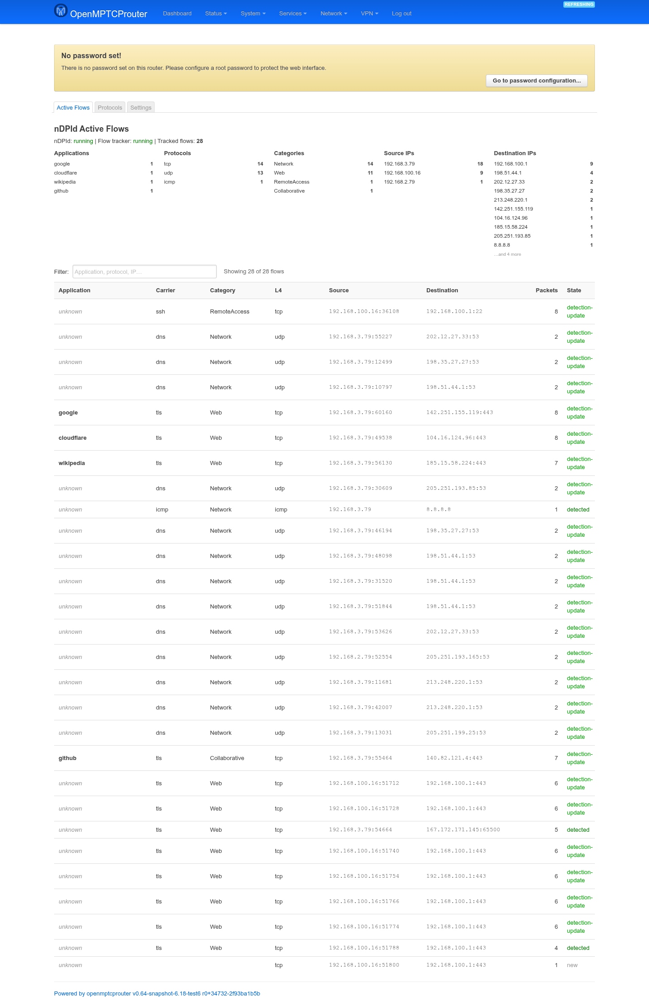
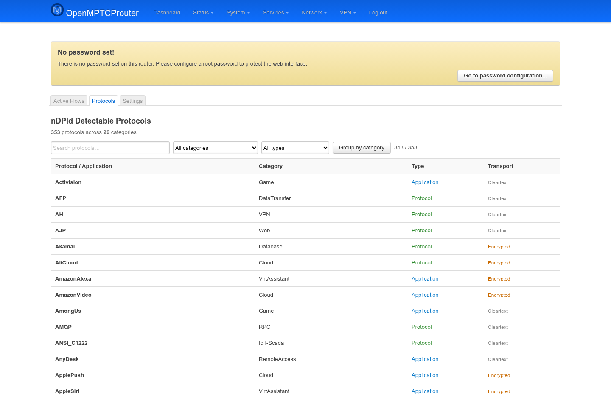
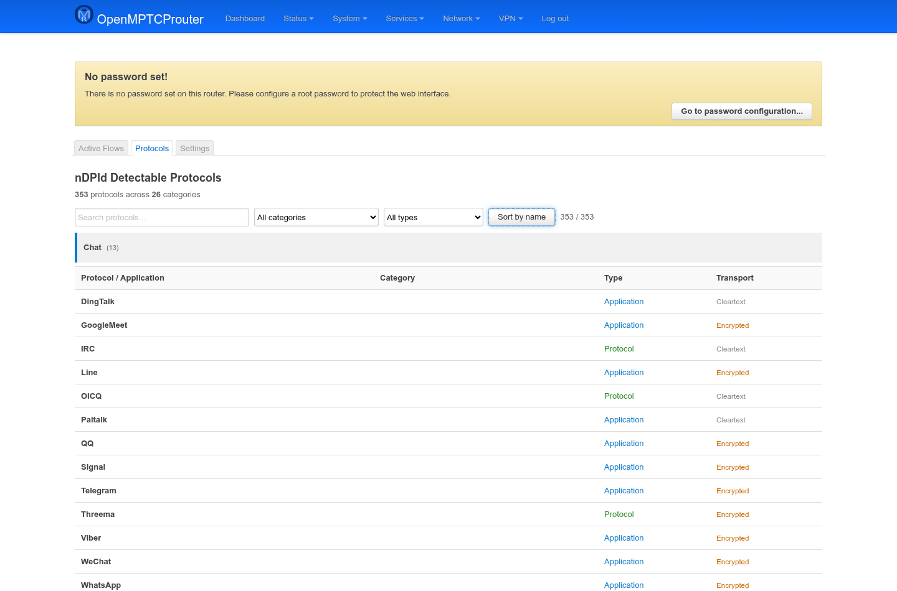
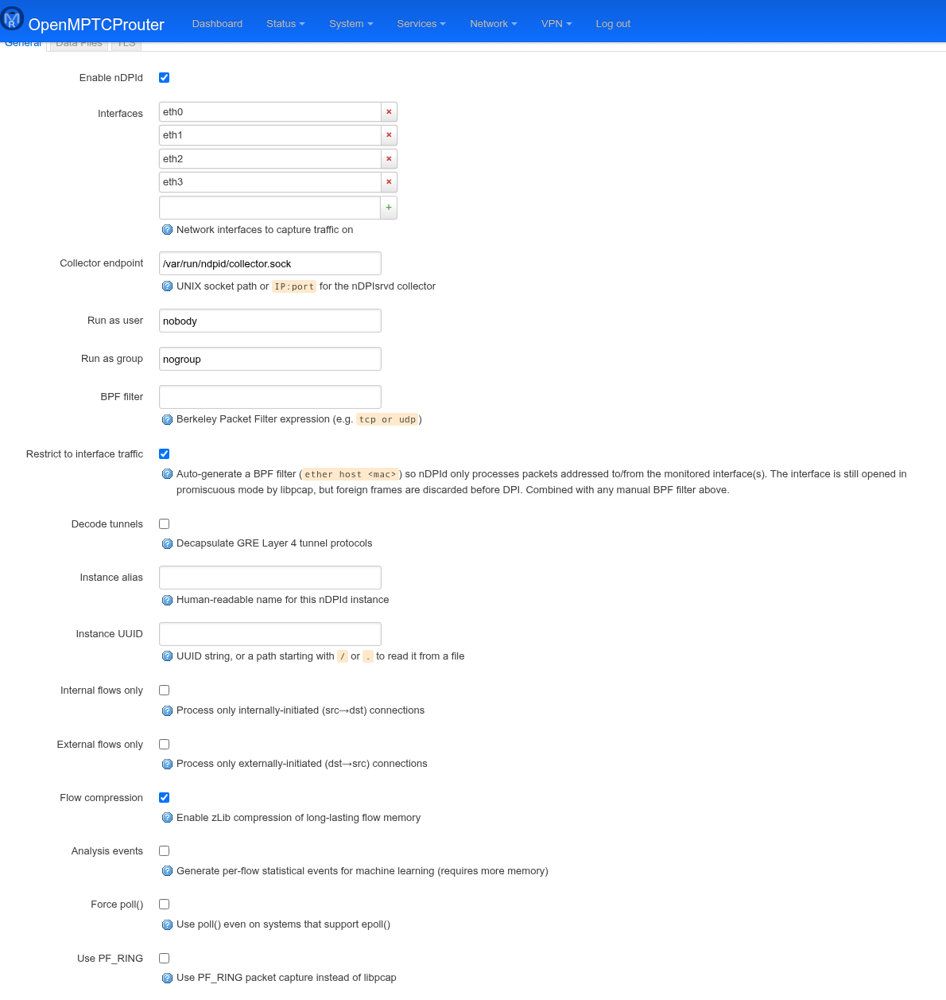
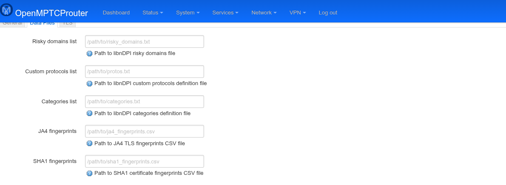

# nDPId — User Guide

`luci-app-ndpid` configures and monitors the `ndpid` package: an
OpenWrt build of [nDPId](https://github.com/utoni/nDPId), the daemon
form of the nDPI deep packet inspection library. It adds three tabs —
**Active Flows**, **Protocols**, and **Settings** — to a **nDPId** page
group under **Services**. Active Flows and Settings both need `ndpid`
(the DPI daemon) and `ndpisrvd` (its event distributor) running;
Protocols only reads a static, build-time-generated list and works
even with the daemon stopped.

Screenshots were taken on a test router (`v0.64-snapshot`) with the
daemon capturing traffic on the LAN and all three WAN interfaces,
after generating a handful of real HTTPS/DNS/SSH/ICMP connections.

## Active Flows

```
https://<router-ip>/cgi-bin/luci/admin/services/ndpid/flows
```



The page polls every 5 seconds. At the top, a status line shows
whether **nDPId** (the capture daemon) and the **Flow tracker** (the
`omr-bypass-ndpid-flows` process that turns nDPIsrvd events into the
per-flow JSON files this page reads from `/tmp/ndpid-flows/`) are each
running, plus the number of currently tracked flows. Below that, five
small summary tables break down the tracked flows by **Applications**,
**Protocols**, **Categories**, **Source IPs**, and **Destination IPs**
(the IP tables cap at 10 entries with a "…and N more" note).

The **Filter** box does a live, case-insensitive substring match against
application, category, source/destination IP, and L4 protocol —
useful since the full flow table below has no server-side pagination.
Each row shows the classified application/protocol (in *italics* and
greyed out as `unknown` until nDPI finishes classifying it), category,
L4 protocol, source/destination `ip:port`, packet count, and an event
**State** — color-coded: grey `new`, orange `guessed`, green
`detected`/`detection-update`.

## Protocols

```
https://<router-ip>/cgi-bin/luci/admin/services/ndpid/protocols
```



This is the static catalog of everything libnDPI can recognize —
353 protocols across 26 categories at the time of writing — read from
`/usr/share/ndpid/protocols.json`. That file is regenerated from the
bundled nDPI source at package build time (see `ndpid`'s
`files/gen-protocols.py`), so its exact contents track whichever nDPI
version the package was built against.

Each row is a **Protocol** (shown in green, e.g. `AFP`, `AH`, `TLS`) or
an **Application** riding on top of one (shown in blue, e.g.
`WhatsApp`, `GoogleMeet`), plus its **Category** and whether it's
typically seen as **Cleartext** or **Encrypted** traffic. The search
box matches name or category; the two dropdowns narrow by category and
by protocol-vs-application. **Group by category** re-renders the same
filtered set into per-category tables instead of one flat
alphabetical list:



## Settings

```
https://<router-ip>/cgi-bin/luci/admin/services/ndpid/settings
```

The **Daemon** section covers the three most commonly touched tabs.



| Field | Meaning |
|---|---|
| **Enable nDPId** | Master switch for the capture daemon. |
| **Interfaces** | Network devices to capture on (e.g. `eth0`, `br-lan`). Multiple entries are all opened by libpcap. |
| **Collector endpoint** | UNIX socket path (or `IP:port`) nDPId connects to for the nDPIsrvd collector — must match the **Listen socket**/**TCP listen** settings in Distributor below. |
| **Run as user** / **Run as group** | Drops privileges after opening the capture socket(s). |
| **BPF filter** | Manual Berkeley Packet Filter expression, combined with the auto-generated one below if both are set. |
| **Restrict to interface traffic** | Auto-generates `ether host <mac>` so only frames to/from the monitored interface's MAC are processed — the interface is still opened promiscuously by libpcap, but foreign frames are discarded before DPI. |
| **Decode tunnels** | Decapsulate GRE L4 tunnels before inspection. |
| **Instance alias** / **Instance UUID** | Identify this nDPId instance to consumers; UUID can be a literal string or a `/`- or `.`-prefixed path to read it from a file. |
| **Internal flows only** / **External flows only** | Restrict processing to only src→dst-initiated or only dst→src-initiated connections, respectively. |
| **Flow compression** | zLib-compresses long-lived flow state in memory. |
| **Analysis events** | Emits extra per-flow statistical events for ML use cases, at a higher memory cost. |
| **Force poll()** | Use `poll()` even on kernels that support `epoll()`. |
| **Use PF_RING** | Capture via PF_RING instead of libpcap, if available. |

The **Data Files** tab points nDPI at optional supplementary data —
all four fields are empty/optional by default and fall back to
libnDPI's built-in lists:



| Field | Meaning |
|---|---|
| **Risky domains list** | Path to a custom libnDPI risky-domains file. |
| **Custom protocols list** | Path to a custom protocol definitions file. |
| **Categories list** | Path to a custom category definitions file. |
| **JA4 fingerprints** | Path to a JA4 TLS-fingerprint CSV for extra TLS client classification. |
| **SHA1 fingerprints** | Path to a SHA1 certificate-fingerprint CSV. |

The **TLS** tab (not pictured — same simple file-path layout as Data
Files) holds **Client certificate PEM**, **Client private key PEM**,
and **CA certificate PEM** paths, used for TLS to the nDPIsrvd
collector when it's listening on `tcp_address`/`tcp_port` rather than a
local UNIX socket. Generate a matching cert/key/CA set with the
`ndpid` package's `scripts/gen-cacerts.sh`.

### Performance Tuning

All fields here are `uinteger`s; the `*_time`/`*_interval` ones are in
**nanoseconds**.

| Field | Meaning |
|---|---|
| **Max flows per thread** / **Max idle flows per thread** | Caps on tracked flows (active / idle) per reader thread before nDPId starts evicting. |
| **Max reader threads** | Number of libpcap reader threads. |
| **Daemon status interval** | How often nDPId emits a daemon-status event. |
| **Flow scan interval** | How often the idle-flow scanner runs. |
| **Generic / ICMP / TCP / UDP max idle time** | Per-protocol idle timeout before a flow is expired. |
| **TCP post-end flow time** | Extra grace period a TCP flow is kept after FIN/RST, in case of retransmits. |
| **Compression scan interval** / **Compression flow inactivity** | How often nDPId checks for compression-eligible flows, and how long a flow must be inactive first (works with **Flow compression** above). |
| **Max packets to send per flow** | Cap on packets forwarded to the collector per flow. |
| **Max packets to process/analyse per flow** | Caps on packets nDPI itself inspects / statistically analyses per flow — higher values improve classification accuracy at a CPU cost. |
| **Error event threshold (count / window)** | An error event fires once this many internal errors happen within the given time window. |

### nDPI Library

| Field | Meaning |
|---|---|
| **Packet limit per flow** | Overall cap on packets libnDPI inspects per flow. |
| **Flow direction detection** | Track which side initiated the flow. |
| **Track payload** | Keep payload data per flow (needed by some heuristics/analysis features). |
| **TCP ACK payload heuristic** | Also use ACK-carried payload for protocol detection. |
| **Fully encrypted heuristic** | Flag traffic that looks fully encrypted (no discernible protocol handshake). |
| **libgcrypt init** | Initialize libgcrypt, required for TLS/QUIC fingerprinting. |
| **Compute entropy** | Compute per-flow payload entropy. |
| **Flow proto confidence (FPC)** | Report a confidence level alongside each protocol classification. |
| **Guess on give-up** | Bitmask for best-guess fallback when DPI can't classify a flow: `0x01` by port, `0x02` by IP, `0x03` both. |
| **Load flow risk lists** | Load libNDPI's built-in flow-risk domain/IP lists (malware, phishing, etc.). |
| **Log level** | libnDPI log verbosity; `0` is silent. |

### Protocol Settings

| Field | Meaning |
|---|---|
| **TLS certificate expiry threshold** | Days-before-expiry at which a seen TLS certificate is flagged as at-risk. |
| **TLS application blocks tracking** | Track TLS application-data blocks for deeper classification. |
| **STUN extra dissection packets** | Extra packets examined to dissect STUN traffic (used for many VoIP/WebRTC apps). |

### Distributor (nDPIsrvd)

The event broker that sits between the `ndpid` capture daemon and
consumers like this LuCI app's own flow tracker.

| Field | Meaning |
|---|---|
| **Enable nDPIsrvd** | Master switch. Both the **Active Flows** page and the flow tracker depend on this being on. |
| **Listen socket** | UNIX socket path consumers connect to — must match nDPId's **Collector endpoint** above. |
| **TCP listen address** / **TCP listen port** | Optional TCP listener for remote consumers (e.g. `netifyd`-compatible tools); leave the address empty or the port `0` to disable. |
| **Max clients** | Maximum simultaneous consumer connections. |

### Netifyd Compatibility

Writes nDPId's flow/status data out in the JSON format
[Netifyd](https://www.netify.ai/) tools expect, for reuse with
existing Netify-based dashboards.

| Field | Meaning |
|---|---|
| **Enable compatibility layer** | Master switch. |
| **Status file** / **Flows file** | Output paths for the Netifyd-compatible status/flow JSON. |
| **Update interval** | Seconds between file updates. |

### Flow Actions

Feeds classified flows into `ipset`s that firewall/QoS rules elsewhere
(e.g. `omr-bypass`) can match on.

| Field | Meaning |
|---|---|
| **Enable flow actions** | Master switch — populates the ipsets below from detected application categories. |
| **BitTorrent / Streaming / Blocked ipset name** | Names of the `ipset`s populated for each category. |
| **BitTorrent / Streaming / Blocked ipset timeout (s)** | Per-entry expiry in each ipset — an IP drops out if it's been quiet this long. |
| **Blocked applications** | Explicit list of application names (as they appear on the Protocols page, e.g. `bittorrent`, `tor`) to route into the blocked ipset regardless of category. |
