# OMR-Bypass — User Guide

`luci-app-omr-bypass` lets you route specific traffic *around* the normal
MPTCP/VPN bonding — straight out a chosen WAN, out the VPS's VPN, or just
DSCP-marked in place — instead of through the default aggregated path.
Typical uses: keep a streaming service off a metered link, force a
latency-sensitive app onto one specific WAN, or send everything from one
device out a dedicated interface.

It has two tabs under **Services → OMR-Bypass**: **Bypass Rules** (this
package's own view) and **DPI Flows** (contributed by the separate
`luci-app-ndpid` package, wired in here because DPI-based rules depend on
it).

Screenshots were taken on a test router (`v0.64-snapshot`) with no bypass
rules configured yet, so the grids show their empty state; the **Add**
modal for each rule type was opened (without saving) to capture its
fields.

## Bypass Rules

```
https://<router-ip>/cgi-bin/luci/admin/services/omr-bypass/rules
```

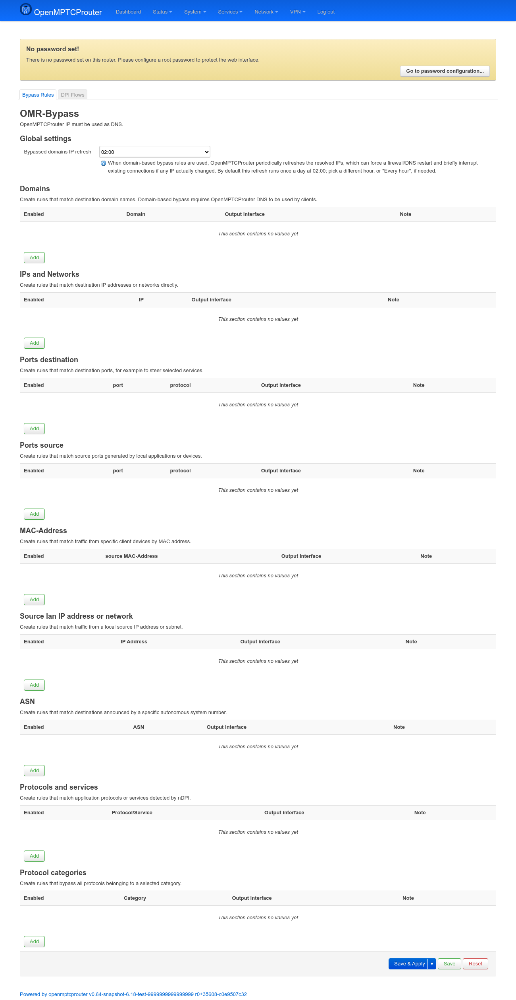

The page requires **OpenMPTCProuter's own DNS resolver** to be used by
clients (stated right under the page title) — domain-based rules only work
because OMR's DNS is what returns the matched IP in the first place, tying
it to the right rule.

Above the rule tables, a small **Global settings** box, then 9
independent rule tables, each matching traffic a different way. All of
the rule tables share a common tail of options — **Output interface**,
**Failback**, **DSCP marking**, **Note** — described once below, then only
each section's distinguishing fields are called out.

### Global settings

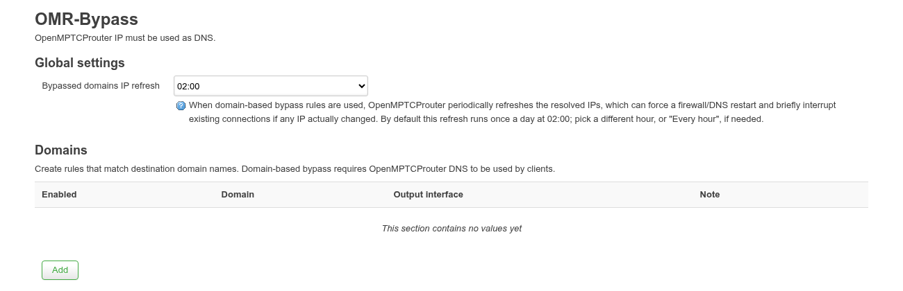

One field, **Bypassed domains IP refresh**: domain-based rules (the
**Domains** table below) work by resolving each domain to an IP and
firewall/DNS-matching on that IP, so OMR periodically re-resolves them in
case the IP changed — which can force a firewall/DNS restart and briefly
interrupt existing connections if it did. This setting picks *when* that
periodic refresh runs: a specific hour (default **02:00**) or **Every
hour**, for domains that change IP more often than once a day.

**Common fields** (present in every rule type):

| Field | Meaning |
|---|---|
| **Enabled** | Toggle the rule on/off without deleting it. |
| **VPN on server** *(where present)* | Route matched traffic over the VPN configured on the VPS instead of a local WAN interface. |
| **Output interface** | Which WAN sends this traffic: `Default` (MPTCP master), a specific WAN, **No routing change (DSCP marking only)** to just tag traffic without rerouting it, or **None** to block it outright. |
| **Failback** | Alternate interface to use if the chosen output interface is down. |
| **DSCP marking** | Optional DSCP class to stamp on matched traffic (CS0–CS7, AF11–AF43, EF, LE) — usable on its own, without changing the route. |
| **Note** | Free-text reminder of why the rule exists. |

### Domains

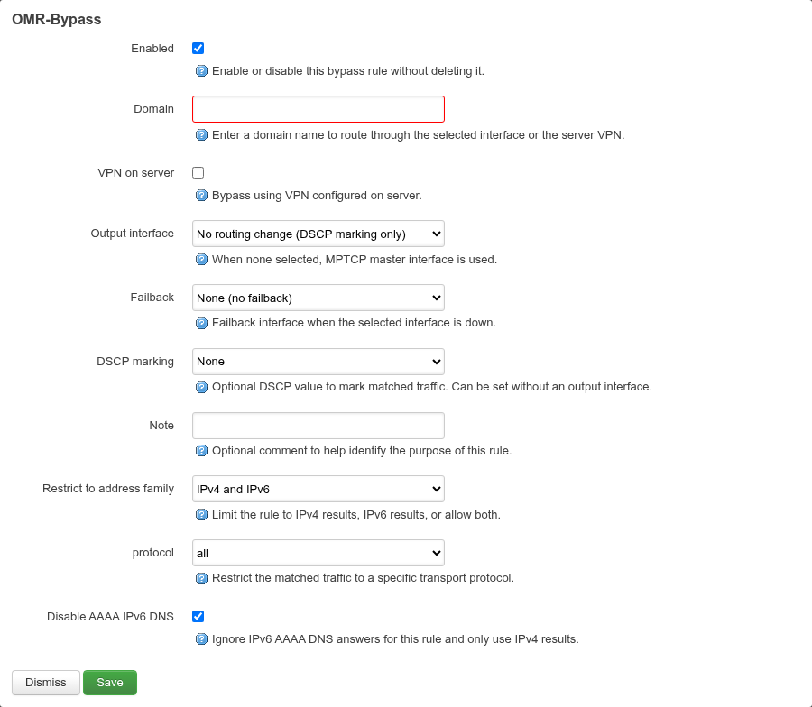

Matches by destination domain name. Adds **Restrict to address family**
(IPv4/IPv6/both) and **protocol** (all/tcp/udp) beyond the common set, plus
**Disable AAAA IPv6 DNS** to make the router ignore IPv6 answers for this
domain and force IPv4-only resolution — useful when a service's IPv6 path
is worse than its IPv4 one.

### IPs and Networks

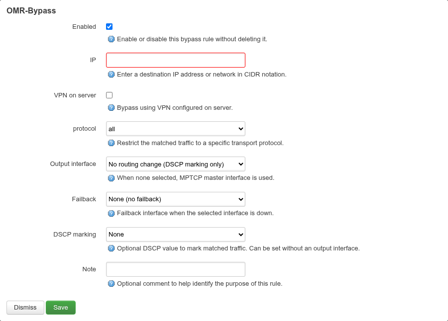

Matches a destination IP or CIDR network directly — for services you'd
rather target by address than by domain (or that don't have a stable
domain name at all).

### Ports destination / Ports source

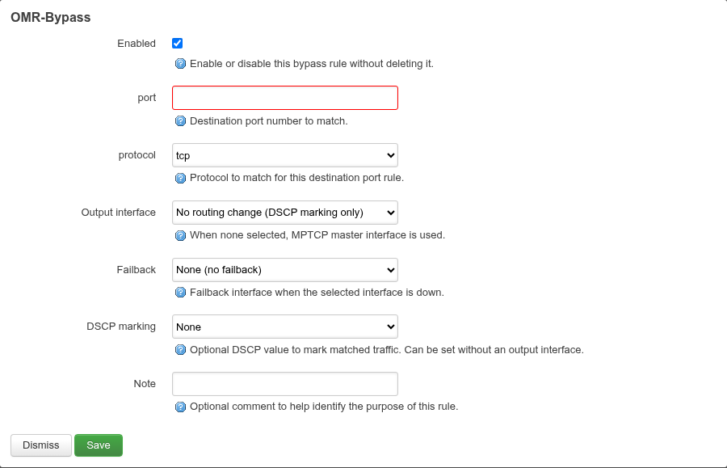

Match by destination port (pictured) or source port — nearly identical
forms, just **port** + **protocol** (tcp/udp/icmp) as the match, no
domain/IP involved. Destination-port rules are the way to steer a specific
*service* (e.g. a game server port) regardless of which domain/IP serves
it; source-port rules instead target traffic *generated* by a specific
local port (e.g. a device or daemon that always sends from a fixed port).

### MAC-Address

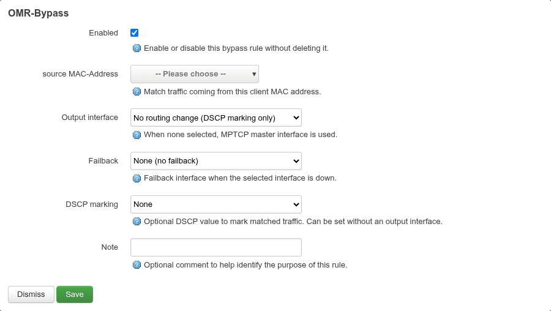

Matches by client device MAC — the dropdown is populated live from LuCI's
host-hints (DHCP leases/ARP table), showing each known device's name next
to its MAC; empty here since no LAN clients were attached during capture.
Use this to route *everything* a specific device sends, regardless of
destination.

### Source lan IP address or network

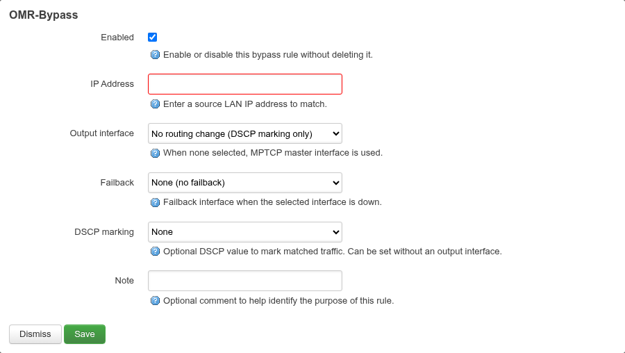

Same idea as MAC-Address but matched by the client's LAN-side IP/subnet
instead — useful for a whole VLAN or IP range rather than one device.

### ASN

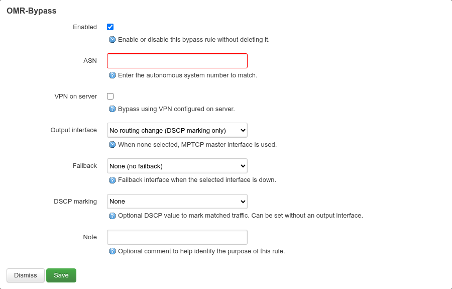

Matches destinations announced by a given Autonomous System Number —
handy for bypassing an entire provider (e.g. a CDN or cloud provider's ASN)
without tracking their individual IP ranges by hand.

### Protocols and services

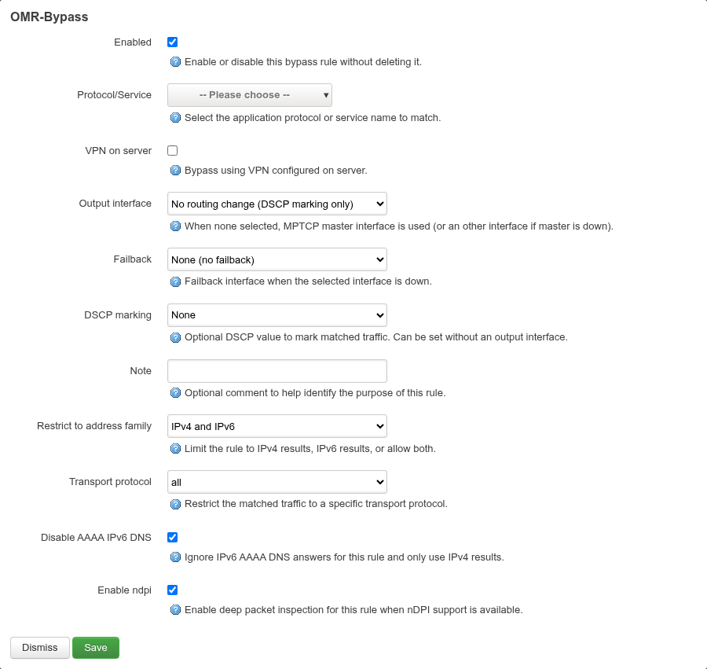

Matches by application protocol/service as identified by **nDPI** deep
packet inspection — the **Protocol/Service** dropdown is populated from
`/usr/share/omr-bypass/omr-bypass-proto.json` plus whatever's active in
`/proc/net/xt_ndpi/proto` and `host_proto`. Adds **Restrict to address
family**, **Transport protocol**, **Disable AAAA IPv6 DNS**, and — when
nDPI support is detected on the router — **Enable ndpi** to actually turn
on packet inspection for this rule (vs. matching only by the DNS-derived
hostname the other rule types use).

### Protocol categories

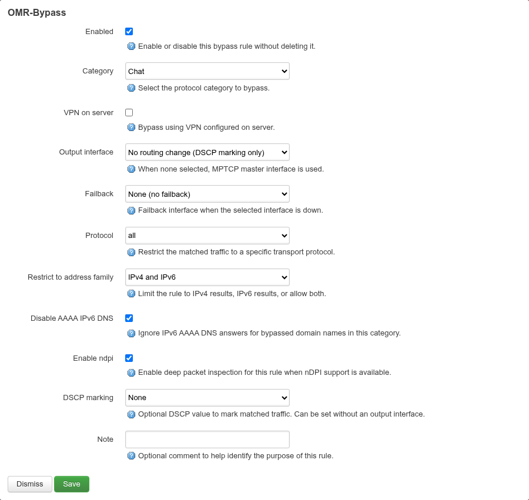

Same nDPI-backed matching as above, but bypasses an entire **Category**
at once (e.g. *Chat*, *Streaming*, *Social*) instead of picking individual
protocols — the categories are pulled from the same proto JSON file, so
whatever the router lists as a category shows up here automatically.

## DPI Flows

```
https://<router-ip>/cgi-bin/luci/admin/services/omr-bypass/flows
```

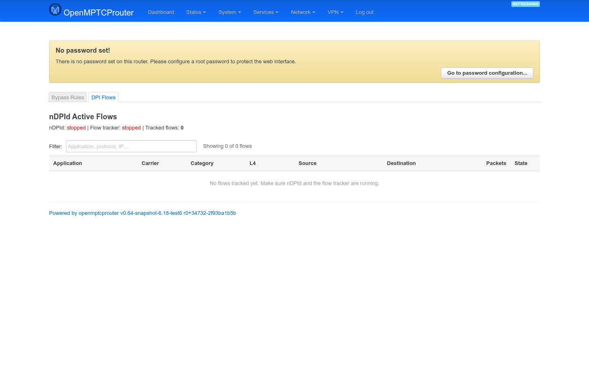

A live (5s-refresh) table of nDPI-identified flows: application, carrier,
category, L4 protocol, source/destination, packet count, and state — lets
you confirm DPI is actually classifying the traffic you expect before
relying on it in a **Protocols and services** or **Protocol categories**
rule.

This page belongs to `luci-app-ndpid`, not this package — but
`luci-app-omr-bypass`'s own menu wires it in as a second tab since the two
are meant to be used together. It needs `ndpid`/`ndpisrvd` actually
running to show anything; on this bench both show **stopped** and the
table is empty, because nothing currently triggers them. In practice OMR
starts them automatically as soon as at least one enabled **Protocols and
services** or **Protocol categories** rule exists — there's no separate
manual start step, just add a DPI-based bypass rule and this page should
populate.
