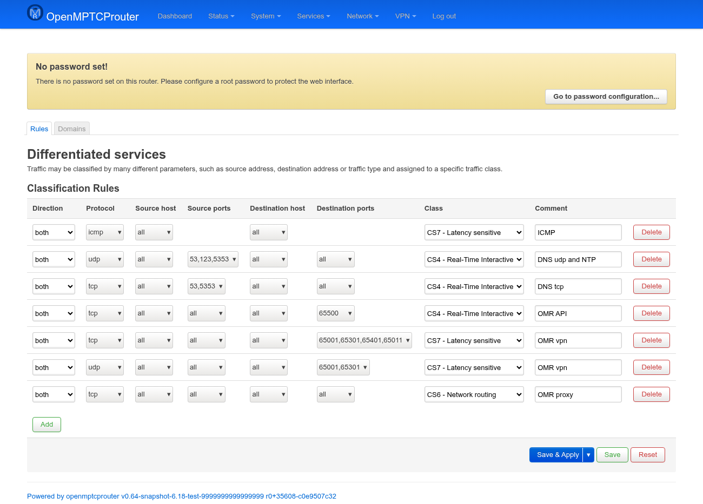
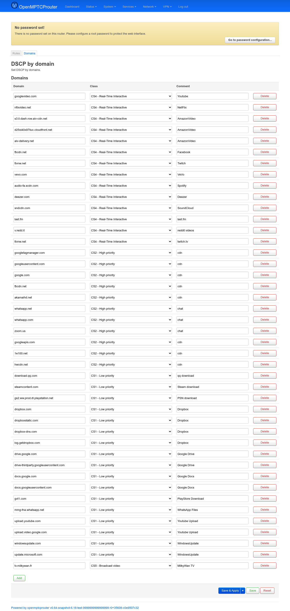

# DSCP — User Guide

`luci-app-omr-dscp` is a plain CBI configuration front-end for the
`omr-dscp` package: it lets you mark your own traffic with a DSCP class
(used by `mptcp-bpf-dscp` and by downstream shaping/prioritization) either
by traffic pattern (protocol/host/port) or by destination domain name. It
adds two tabs — **Rules** and **Domains** — under **Network › DSCP**.
Unlike `luci-app-omr-metrics`/`luci-app-omr-events`, these pages are
static configuration tables (no live polling) — every change needs
**Save & Apply** to take effect.

Both pages edit the same `dscp` UCI config, in two different section
types (`classify` for Rules, `domains` for Domains). Applying either one
is the `omr-dscp-nft` init script's job: on start/reload it rebuilds a set
of `fw4`/nftables `DSCP` rules (and, for domains, `dnsmasq` ipsets keyed
by class) from scratch. It's registered as a reload trigger on the `dscp`
config, so clicking **Save & Apply** (not just **Save**, which only
writes the UCI change without applying it) reloads it and regenerates the
firewall rules — no manual service restart needed.

Screenshots were taken on a test router (`v0.64-snapshot`) with the
package's shipped default rule set — 7 classification rules and 43 domain
entries — so both tables below show real, representative data rather than
an empty form.

## Rules

```
https://<router-ip>/cgi-bin/luci/admin/network/dscp/rules
```



One row per `classify` section, evaluated independently (there's no
ordering/priority between rows — they all become separate firewall
rules):

| Column | Meaning |
|---|---|
| **Direction** | `upload` matches LAN→WAN traffic (`src=lan`), `download` matches WAN→LAN (`dest=lan`), `both` matches everywhere (`src=*`/`dest=*`) **and** adds a second, router-own-traffic rule in the `OUTPUT` chain — needed because a plain `src=*`/`dest=*` rule only ever compiles into `mangle_forward`, which never sees packets the router itself originates (e.g. its own proxy/VPN tunnel connection). All the shipped "OMR vpn"/"OMR proxy" rows use `both` for exactly this reason. |
| **Protocol** | `tcp`, `udp`, `all` (expands to tcp **+** udp only — not icmp/ip/esp), `ip`, `icmp`, `esp`. |
| **Source host** / **Destination host** | Optional host/CIDR to match; blank (`all`) matches everything. **Destination host** is only shown for `upload`/`both` — it's hidden on `download` rows. |
| **Source ports** / **Destination ports** | Comma-separated port list or range; only shown when Protocol is `tcp` or `udp`. |
| **Class** | The DSCP class to apply — see the table below. |
| **Comment** | Free-text label, cosmetic only. |

**DSCP classes** (identical choices on both pages):

| Value | Label |
|---|---|
| `cs0` | CS0 - Normal/Best Effort |
| `cs1` | CS1 - Low priority |
| `cs2` | CS2 - High priority |
| `cs3` | CS3 - SIP |
| `cs4` | CS4 - Real-Time Interactive |
| `cs5` | CS5 - Broadcast Video |
| `cs6` | CS6 - Network routing |
| `cs7` | CS7 - Latency sensitive |
| `ef`  | EF - Voice |

### A field that doesn't show up in this form

The shipped **"OMR proxy"** rule (last row in the screenshot above) isn't
a static rule at all: in `/etc/config/dscp` it carries
`option auto_dest_port 'proxy'` instead of a `dest_port`. At apply time,
`omr-dscp-nft` resolves that to whichever proxy is currently active
(`shadowsocks`/`shadowsocks-rust`/`v2ray`/`xray`) and its real,
possibly-dynamic server port — a hardcoded port would silently stop
matching the moment you switch proxy or it picks a different port. This
form has no widget for `auto_dest_port`, so that row's **Destination
ports** column just renders blank/`all`; editing the row's other fields
through the UI leaves the underlying option alone, but there's no way to
create a new `auto_dest_port` rule from this page — only by editing
`/etc/config/dscp` directly.

## Domains

```
https://<router-ip>/cgi-bin/luci/admin/network/dscp/domains
```



One row per `domains` section:

| Column | Meaning |
|---|---|
| **Domain** | A hostname (validated as `hostname`, e.g. `googlevideo.com`) — matches that name and its subdomains as resolved by dnsmasq. |
| **Class** | Same DSCP class list as Rules, above. |
| **Comment** | Free-text label, cosmetic only. |

Under the hood this works differently from Rules: for every class in use,
`omr-dscp-nft` maintains one `dnsmasq` ipset per class
(`omr_dscp_<class>_4`/`_6`) and adds each configured domain to the ipset
matching its class; a companion `fw4` `DSCP` rule then marks anything
landing in that ipset. Practically that means:

- Domains resolve to IPs **as dnsmasq sees them** — a CDN-fronted domain
  is only marked while the same IP is still cached/in use by a live
  connection through this router's own resolver.
- IPv6 (`_6`) ipsets/entries are only created when
  `openmptcprouter.settings.disable_ipv6` is exactly `0` — unset/empty
  counts as skip too, same as `1`. On the bench used for the screenshot
  above (`disable_ipv6='1'`), only the IPv4 ipsets exist.
- **A domain added here is silently ignored if
  `dhcp.dnsmasq1.filter_aaaa` is `1`** — the hook that appends the domain
  to its class's ipset explicitly requires AAAA filtering to be off. If
  entries you add don't seem to take effect, check that setting first.

### Not on this page: video-chat traffic

A separate, independent mechanism — installed once by a `uci-defaults`
script, not editable from either tab here — DSCP-marks generic
video-chat traffic (`AF41`) via a nightly-refreshed IP-range list
(`videochatipv4.list`/`videochatipv6.list` from
`files-update.openmptcprouter.com`), matched by destination network **and
port**, not by domain name. It runs alongside whatever you configure on
the Domains page above (which already includes a domain-based `zoom.us`
entry too — the two aren't mutually exclusive).
