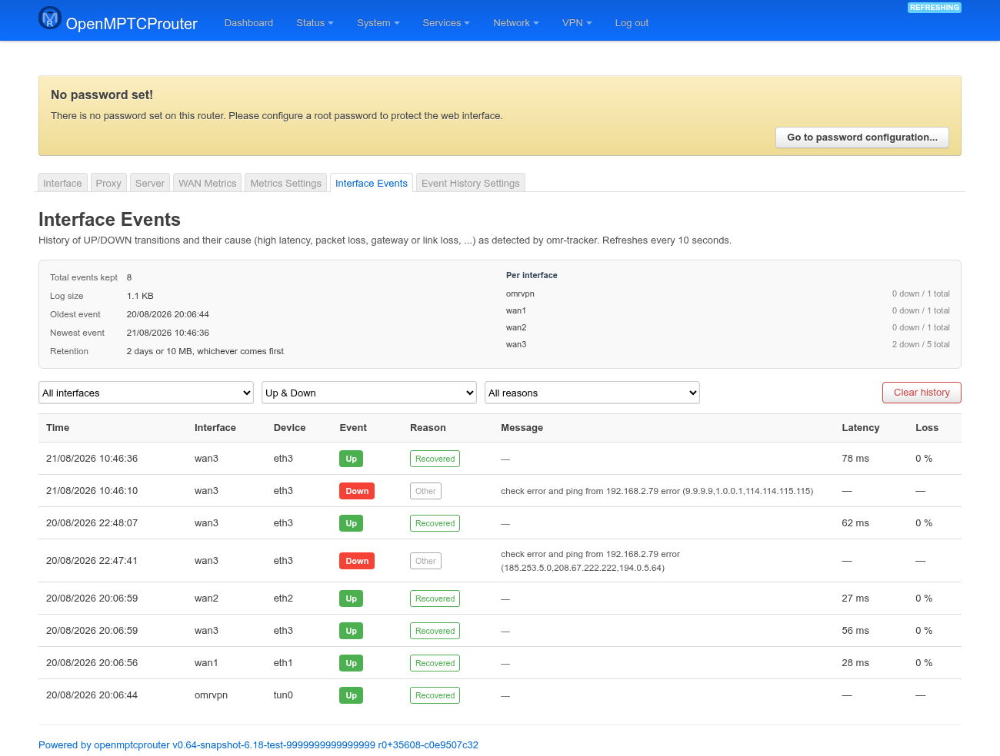
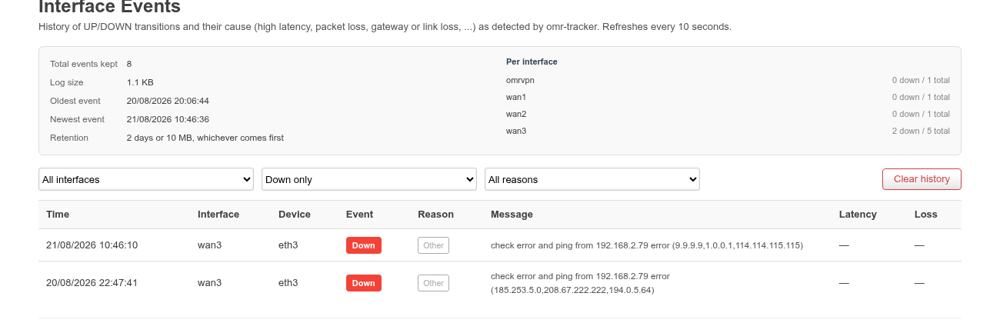
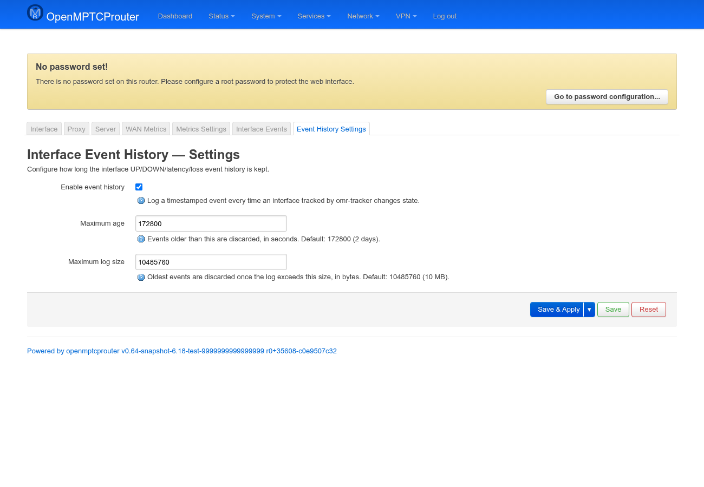

# Interface Events — User Guide

`luci-app-omr-events` gives you a searchable history of every UP/DOWN
transition `omr-tracker` has seen on your WAN interfaces, with the cause
attached (high latency, packet loss, gateway loss, link loss, ...). It
adds two tabs — **Interface Events** and **Event History Settings** — to
the **OMR-Tracker Manager** page group under **Services**, alongside
that package's own Interface/Proxy/Server tabs and `luci-app-omr-metrics`'s
WAN Metrics/Metrics Settings tabs.

The backend is the `omr-events` package: a post-tracking hook
(`050-events`) that appends one JSON line per state change to
`/tmp/omr-events/events.log` (tmpfs, to avoid flash wear) and prunes it by
age and/or size, plus a small `rpcd` plugin exposing that log over ubus as
the `events` object (`get_events`, `get_summary`, `clear`) — which is all
this LuCI app talks to.

Screenshots were taken on a test router (`v0.64-snapshot`) with 3 WAN
interfaces and 8 real events already logged (mostly recovery events, plus
two genuine `wan3` outages), so the tables and counts below are live data,
not mockups.

## Interface Events

```
https://<router-ip>/cgi-bin/luci/admin/services/omr-tracker/events
```



The page polls every 10 seconds and needs no interaction — everything
updates in place. It's built from two ubus calls to the `events` object:
`get_summary` for the panel at the top, `get_events` for the table below.

**Summary panel** (top): total events currently kept, the log's size on
disk, oldest/newest event timestamps, the active retention policy in
plain English, and a **Per interface** breakdown of down-count vs.
total-count for every interface that has ever logged an event.

**Event table** (newest first), one row per state change:

| Column | Meaning |
|---|---|
| **Time** | When the transition happened, in the browser's local time. |
| **Interface** / **Device** | The tracked interface name (e.g. `wan3`) and its underlying device (e.g. `eth3`). |
| **Event** | Green **Up** or red **Down** badge. |
| **Reason** | A short machine-classified cause — see the table below. |
| **Message** | The raw `OMR_TRACKER_STATUS_MSG` the tracker attached, when there was one (blank on recovery events). |
| **Latency** / **Loss** | The tracker's measurement at the moment of the transition, when available. |

The **Reason** column is a coarse classification of the tracker's
free-form message, done by pattern-matching in the post-tracking hook
itself (not by the tracker) — useful for filtering/coloring without
parsing `Message` yourself:

| Reason | Matched from | Color |
|---|---|---|
| **Recovered** | Event is `up` and there was no message | Green |
| **Link down** | `"link down"` in the message | Red |
| **Gateway down** | `"gateway down"` in the message | Red |
| **No answer from server** | `"No answer from server"` / `"No access to server API"` | Red |
| **No IP / gateway** | `"No IP"` / `"ip issues"` | Red |
| **High latency** | `"Latency is"` | Orange |
| **Packet loss** | `"Packet loss is"` | Orange |
| **VPN path** | `"Glorytun-UDP path"` | Purple |
| **Other** | Any other non-empty message (e.g. the *"check error and ping from ..."* messages in the screenshot above) | Gray |
| **Unknown** | Event is `down` and there was no message | Gray |

**Filters and clearing** — three dropdowns above the table (interface,
Up/Down/both, reason) narrow the table down to a specific matching
`get_events` call; they combine with AND. **Clear history** wipes the log
file entirely after a confirmation modal — there's no undo.



## Event History Settings

```
https://<router-ip>/cgi-bin/luci/admin/services/omr-tracker/events-settings
```



| Field | Meaning |
|---|---|
| **Enable event history** | Master switch for the `050-events` post-tracking hook. Off means no new events are logged at all (existing history is left alone, just no longer growing); the two fields below are hidden while off. |
| **Maximum age** | Events older than this (seconds) are dropped on every write. Default `172800` (2 days). |
| **Maximum log size** | Once the log file exceeds this size (bytes), the oldest events are dropped until it's back under the cap. Default `10485760` (10 MB). |

Age and size are both enforced on every logged transition, whichever
limit is hit first — so with bursty flapping the size cap can prune
well before 2 days have passed.

### A gap worth knowing about

The hook only fires on an actual status transition
(`OMR_TRACKER_PREV_STATUS` vs. `OMR_TRACKER_STATUS`) reported by
`omr-tracker`'s post-tracking chain, so it inherits whatever that chain
already classifies as up/down — it doesn't add any detection of its own.
If an interface's outage is too short to survive `omr-tracker`'s own
polling interval/threshold, it never reaches this log either.
