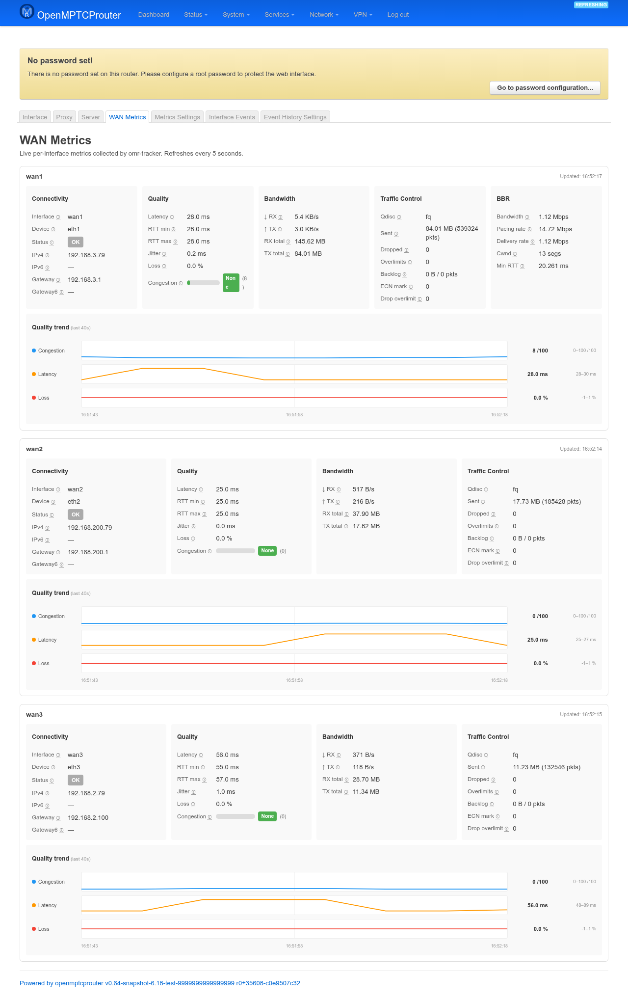

# WAN Metrics — User Guide

`luci-app-omr-metrics` is a live, auto-refreshing dashboard of per-interface
quality metrics collected by `omr-tracker`. It adds two tabs — **WAN
Metrics** and **Metrics Settings** — to the **OMR-Tracker Manager** page
group under **Services**, alongside that package's own Interface/Proxy/
Server tabs. This guide covers the **WAN Metrics** dashboard tab; see
[settings-guide.md](settings-guide.md) for **Metrics Settings**, which
controls whether/how those metrics get sent to your VPS (and, optionally,
used to have the VPS assign MPTCP scheduler weights automatically).

Screenshots were taken on a test router (`v0.64-snapshot`) with 3 tracked
WAN interfaces and live traffic. This bench's VPS wasn't returning any
account/forecast/decision data at capture time, so the **VPS Metrics —
User Info**, **Forecast**, and **Decision** sections below are described
from source rather than shown — everything else on the page (the six
per-card sections and the Quality trend graphs) is live.

## WAN Metrics

```
https://<router-ip>/cgi-bin/luci/admin/services/omr-tracker/metrics
```



The page polls every 5 seconds and needs no interaction — everything
updates in place.

**VPS Metrics — User Info** (top panel, only shown once the VPS has data
for your account): your VPS account username, how many metric entries
it holds for you, first/last-seen timestamps, and which interfaces it has
data for.

Below that, one card per tracked interface (VPN-internal interfaces like
`omrvpn`/`OWVPN` are filtered out), each with up to six sections —
sections only appear when there's data to show, so e.g. **Signal** is
absent on wired WANs and **BBR** is absent unless BBR congestion control
is active:

| Section | Fields |
|---|---|
| **Connectivity** | Interface/device names, up/down status (and a status message when relevant — e.g. *"IPv4 gateway down"*), IPv4/IPv6 address and gateway. |
| **Quality** | Latency, RTT min/max, jitter, loss, and a composite **Congestion** score (0–100, with a level from None to Severe) computed from latency/loss/jitter/queue-depth/signal quality together. |
| **Bandwidth** | Current RX/TX rate and cumulative RX/TX bytes since boot. |
| **Signal** *(WiFi or cellular WANs only)* | WiFi: SSID, BSSID, channel, mode, signal/noise in dBm, bit rate, link quality. Cellular: operator, modem state, signal quality, RSSI/RSRP/RSRQ/SINR. |
| **Traffic Control** | The active qdisc (e.g. `fq`, `cake`) and its counters — sent bytes/packets, drops, overlimits, backlog, ECN marks, throttled flows. |
| **BBR** | Estimated bottleneck bandwidth, pacing rate, delivery rate, congestion window, min RTT, and retransmissions — only populated when the interface's TCP connections are using BBR. |

**Quality trend** is a rolling graph of Congestion/Latency/Loss under each
card, always shown once there's enough history — unlike every other
section, it needs no VPS feature at all:

- It's built entirely client-side: the browser keeps its own rolling
  buffer of up to 60 samples per interface (5 minutes at the 5-second poll
  rate), fed from each poll's **Quality** numbers. There's no history
  endpoint on the router itself — `get_all` only ever reflects the current
  snapshot — so the graph starts empty on every page load/reload and
  needs a second poll (5s) before the first two-point line can draw; the
  window label above the chart (e.g. *"last 40s"*) grows accordingly until
  it caps out at 5 minutes.
- Three sparklines per card: **Congestion** (fixed 0–100 scale, matching
  the Quality section's score), **Latency** and **Loss** (auto-scaled to
  whatever range was actually observed, padded ±15% — the visible min–max
  is printed to the right of each line since the scale isn't fixed).
- Hovering (or touching, on mobile) anywhere along a chart shows the exact
  value and clock time under the cursor; a shared timeline row under the
  three charts marks the start/middle/end timestamps once, since all three
  share the same time axis.

Two more sections appear per card when the corresponding VPS features are
in use:

- **Forecast** — where the VPS model thinks Congestion/Loss/Jitter are
  headed: current value, 5-minute-ahead prediction, trend arrow, an ETA to
  the next severity threshold, and a confidence level.
- **Decision** — the model-assigned routing **Weight** for this interface
  (with its share of the total across all interfaces) and a 0–100
  **Score**. This is what feeds `bpf_weight`/`bpf_weight_rr` when
  **Enable model-assigned weights** is on (see Settings below).

## Metrics Settings

See [settings-guide.md](settings-guide.md) for the **Metrics Settings**
tab — sending metrics to the VPS or a custom server, weight sync, and
model-assigned weights/prediction.
