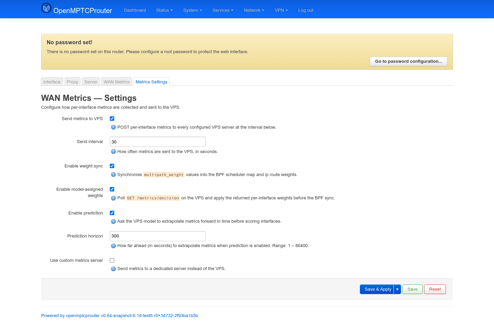
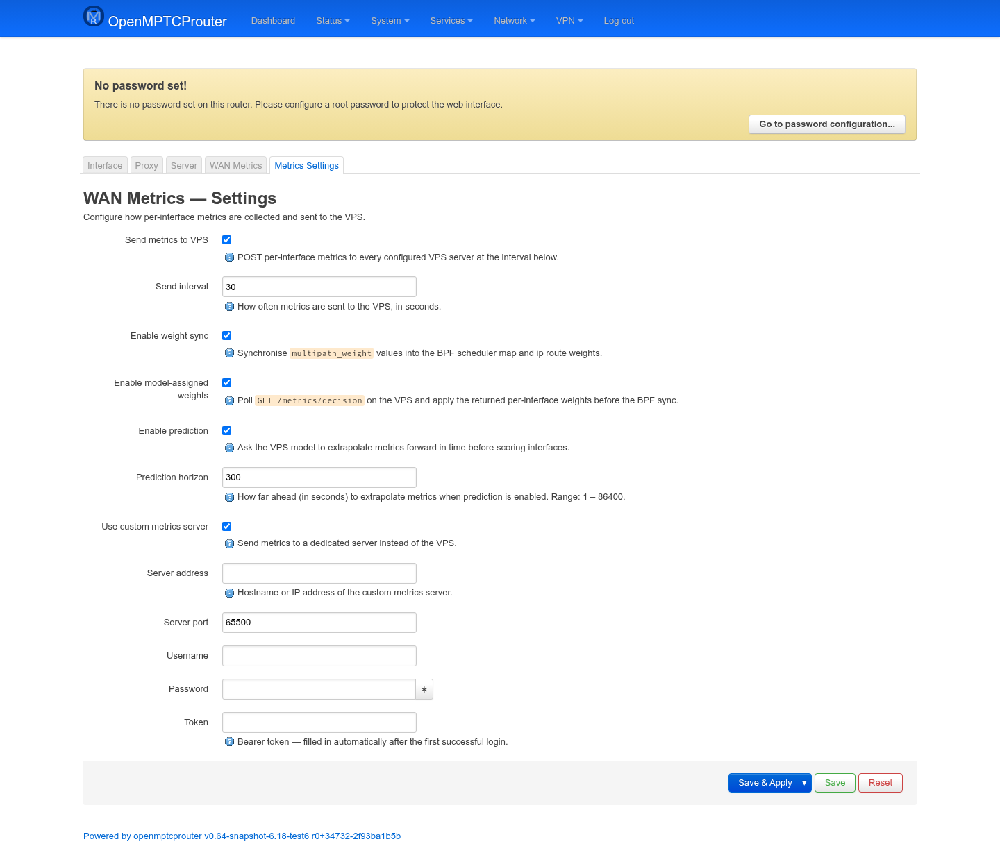

# Metrics Settings — User Guide

`luci-app-omr-metrics`'s **Metrics Settings** tab controls whether/how
the per-interface metrics collected by `omr-tracker` get sent to your VPS
(and, optionally, used to have the VPS assign MPTCP scheduler weights
automatically). It's the second of the two tabs this package adds to the
**OMR-Tracker Manager** page group under **Services** — see
[metrics-guide.md](metrics-guide.md) for the live **WAN Metrics**
dashboard tab alongside it.

Screenshots were taken on the same test router (`v0.64-snapshot`) as the
WAN Metrics guide.

## Metrics Settings

```
https://<router-ip>/cgi-bin/luci/admin/services/omr-tracker/metrics-settings
```



| Field | Meaning |
|---|---|
| **Send metrics to VPS** | Master switch — POSTs per-interface metrics to every configured VPS server on the interval below. Everything else on this page is meaningless with this off. |
| **Send interval** | How often metrics are sent, in seconds. |
| **Enable weight sync** | Runs `omr-weight-sync`, which pushes each interface's `multipath_weight` UCI value into the BPF scheduler's `endpoint_weights` map and into `ip route` weights — same underlying map `mptcp-bpf-weight`/`mptcp-bpf-weight-rr` read from. |
| **Enable model-assigned weights** | Before doing the BPF sync above, first `GET /metrics/decision` from the VPS and use *its* per-interface weights instead of (or as an override for) the locally configured ones — this is what populates each card's **Decision** section on the WAN Metrics tab. |
| **Enable prediction** | Has the VPS extrapolate metrics forward in time before scoring interfaces for the decision endpoint — this is what populates each card's **Forecast** section on the WAN Metrics tab. |
| **Prediction horizon** | How far ahead (seconds, 1–86400) to extrapolate when prediction is on. |
| **Use custom metrics server** | Send metrics to a dedicated server instead of the VPS — reveals the fields below. |

Turning on **Use custom metrics server** reveals connection fields for
that server:



| Field | Meaning |
|---|---|
| **Server address** / **Server port** | Hostname/IP and port of the dedicated metrics server. |
| **Username** / **Password** | Login credentials for that server's API. |
| **Token** | Bearer token — you don't fill this in; it's written automatically after the first successful login and reused until it expires. |

## A gap worth knowing about if you use a BPF weight scheduler

Both **Enable weight sync**'s `omr-weight-sync` daemon and the separate
`mptcp-weight-manager` package's post-tracking hook decide whether to push
weights based on the currently selected `network.globals.mptcp_scheduler`
value — and in both places, that check currently matches
`bpf_weight`/`bpf_burstweight`/`mptcp_bpf_weight.o`/`mptcp_bpf_burstweight.o`
but **not** `bpf_weight_rr`/`mptcp_bpf_weight_rr.o`. So if you've selected
the weighted-round-robin scheduler (`mptcp-bpf-weight-rr`), neither this
package's weight sync nor the wizard's per-interface **Weight** field will
currently reach it automatically — including VPS model-assigned weights
from **Enable model-assigned weights**. Set weights for that scheduler
manually with `mptcp-scheduler-weight.sh set <iface> <weight>` instead
(see `mptcp-bpf-weight-rr`'s own README for details).
