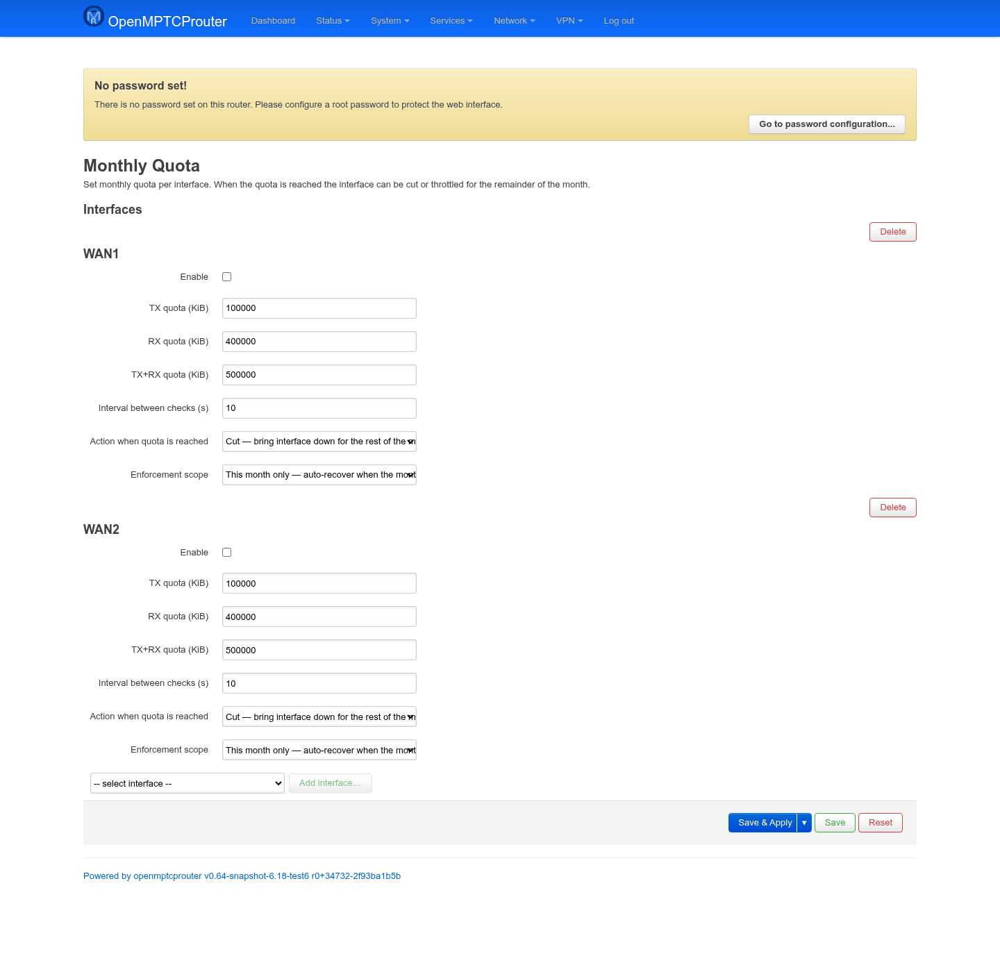
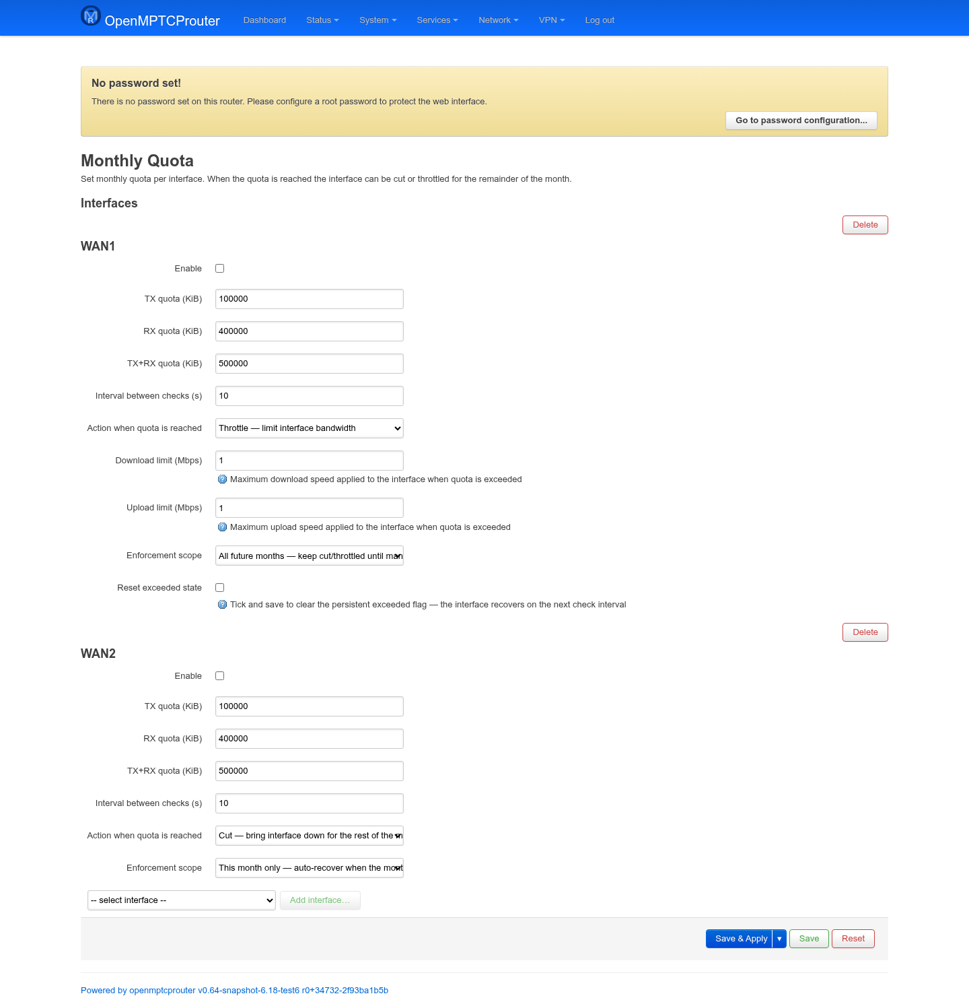

# Monthly Quota — User Guide

`luci-app-omr-quota` caps how much data a WAN interface can use per
calendar month — useful for a metered 4G/5G/satellite link where going
over risks extra charges or a speed cap from the carrier. When the quota
is hit, the interface is either cut off or throttled for the rest of the
month.

It lives under **Network → Quota**, split into two tabs: **Settings**
(configuration, described below) and **Graphs** (live usage bars and
remaining data per interface, refreshed every 15 seconds via the backend's
`get_status` ubus call).

Screenshots were taken on a test router (`v0.64-snapshot`) with two WAN
interfaces already configured (values are just test placeholders).

## Opening the page

```
https://<router-ip>/cgi-bin/luci/admin/network/quota
```



Each configured interface gets its own block. Use the dropdown +
**Add interface…** at the bottom to add a WAN (only real, non-loopback
interfaces are offered); each block's **Delete** button removes that
interface's quota entirely.

## Fields

| Field | Meaning |
|---|---|
| **Enable** | Turns quota tracking on/off for this interface without deleting its configuration. |
| **TX quota (KiB)** | Upload cap for the month. `0`/blank disables this particular check. |
| **RX quota (KiB)** | Download cap for the month. |
| **TX+RX quota (KiB)** | Combined cap — checked independently of the two above, so you can use any combination (e.g. only a combined cap, or a combined cap *and* a tighter upload-only cap). |
| **Metered interfaces** | Optional list of interfaces whose vnstat usage is summed for this quota. If left empty, only this block's interface is counted. |
| **Downstream limit interfaces** | Optional list of interfaces shaped by the daily-budget speed-limit method. |
| **Begin date / End date** | Optional date range for non-monthly quota periods. Setting a begin date makes usage come from `vnstat -b <date>` totals; the end date is used for daily-budget calculations. |
| **Interval between checks (s)** | How often the traffic counters are polled. |
| **Daily budget method** | Optional extra guard once combined usage passes the threshold: either block when the current interval spends too much of the remaining daily allowance, or rate-limit downstream interfaces based on the remaining daily volume. |
| **Budget threshold (%)** | Percentage of the combined quota after which daily-budget enforcement starts. |
| **Budget calculation interval (s)** | How often the interval budget is recalculated for the blocking daily-budget method. |
| **Block LAN and proxy when cut** | When using the cut action, also sets LAN input to `DROP` and stops `shadowsocks-rust`; both are restored when the quota clears. |
| **Action when quota is reached** | **Cut** — bring the interface down (`ifdown`) for the rest of the month; or **Throttle** — leave it up but rate-limit it. |
| **Enforcement scope** | **This month only** — the cut/throttle clears automatically once the new month's counter starts; or **All future months** — once triggered, the interface stays cut/throttled at every future month rollover until you explicitly reset it below. |

Selecting **Throttle** reveals two more fields; selecting **All future
months** reveals a reset control:



| Field | Meaning |
|---|---|
| **Download limit (Mbps)** | Applied via `tc`/`tbf` on an `ifb` device once throttled — the max download speed while over quota. |
| **Upload limit (Mbps)** | Same, for upload. |
| **Reset exceeded state** | Only shown when scope is **All future months**. Tick and save to clear the persistent "exceeded" flag for this interface — it recovers on the next check interval instead of staying cut/throttled forever. |

## How enforcement actually works

Each enabled interface runs its own `/bin/omr-quota <interface>` daemon
(started by `/etc/init.d/omr-quota`), polling `vnstat`'s monthly
rx/tx counters for that interface every **Interval** seconds and comparing
them against whichever of TX/RX/TX+RX quotas are set:

- **Cut** just runs `ifdown`/`ifup` on the interface as the quota is
  crossed/not crossed.
- **Throttle** shapes the interface with `tc qdisc ... tbf` — upload
  directly on the WAN device, download via a paired `ifb-<device>`
  interface that egress traffic is redirected through — removing the
  shaping automatically once no longer exceeded.
- With **This month only** scope, "exceeded" is purely derived from the
  current month's vnstat counters, so it naturally clears when the month
  rolls over and the counter resets.
- With **All future months** scope, the first time the quota is crossed
  the daemon drops a marker file
  (`/etc/omr-quota/state/<interface>.exceeded`) that forces `exceeded`
  true from then on, independent of the counters — that's what makes it
  survive the monthly counter reset. **Reset exceeded state** deletes that
  marker file; this only actually happens when the `omr-quota` service
  (re)starts, so tick it and then **Save & Apply** (not just save the
  form) for the reset to take effect.
