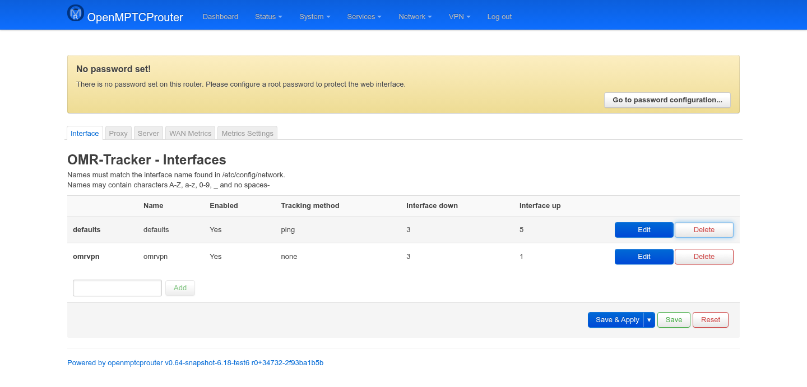
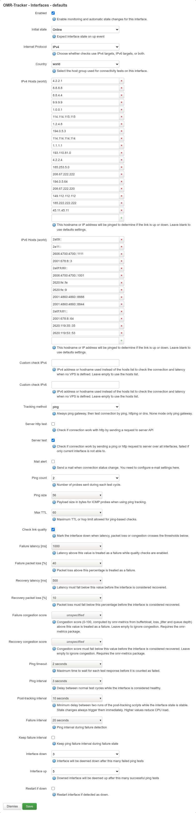
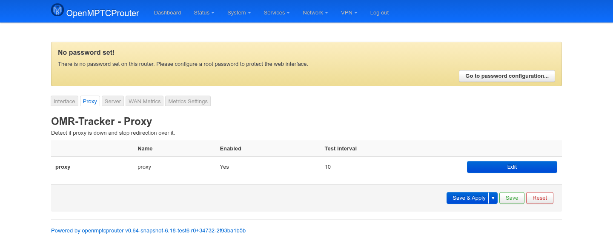
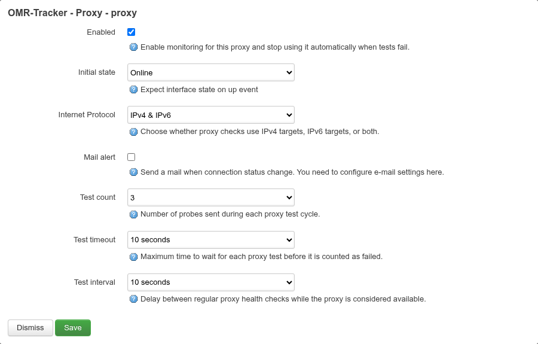
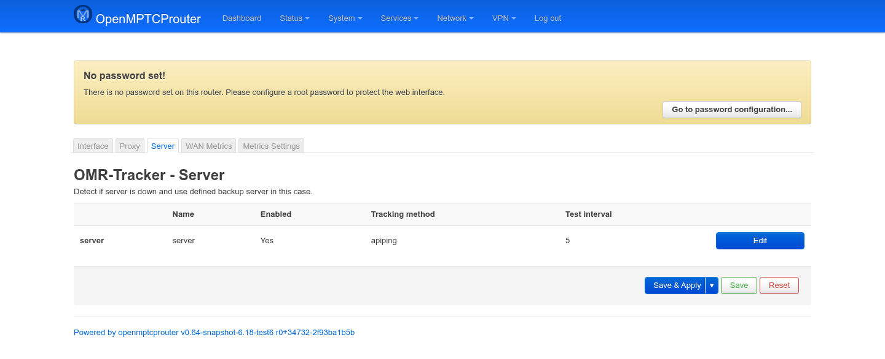
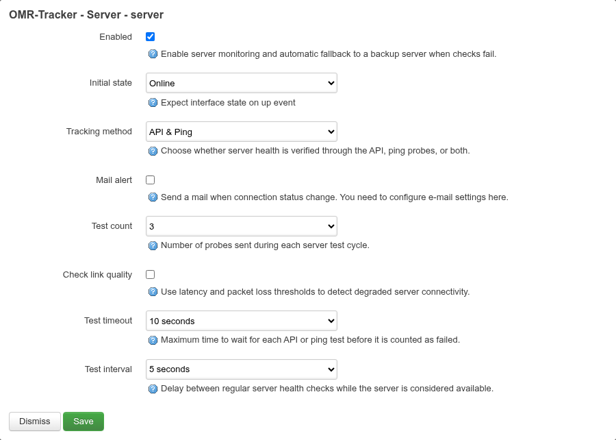

# OMR-Tracker Manager — User Guide

`luci-app-omr-tracker` is the LuCI front end for `omr-tracker`, the daemon
that watches every WAN interface, the VPS server(s), and the local proxy,
and drives OpenMPTCProuter's failover behavior. It has three pages of its
own — **Interface**, **Proxy**, **Server** — reachable from **Services →
OMR-Tracker Manager**.

Screenshots below were taken on a test router (`v0.64-snapshot`); values
shown (the default DNS resolver hosts list, timers, etc.) are examples.

> The tab bar also shows **WAN Metrics** and **Metrics Settings** — those
> belong to the separate `luci-app-omr-metrics` package, not covered here.

Each page follows the same pattern: a **grid** listing configured entries
(one row per tracked interface/proxy/server), and an **Edit** modal per row
with the actual settings — most fields are modal-only and don't clutter the
grid. Nothing is written to the router until you click **Save** (in the
modal, to close it and stage the change) and then **Save & Apply** (on the
page, to commit).

## Interface page

```
https://<router-ip>/cgi-bin/luci/admin/services/omr-tracker/interface
```



Tracks each WAN link's up/down state — this is the core of OMR's failover.
Row names must match an interface name from `/etc/config/network`
(letters, digits, `_`, no spaces). A **defaults** row sets the fallback
values every other interface inherits; add one row per WAN
(`wan1`, `wan2`, …) only where you need to override a default. Use **Add**
at the bottom of the grid to create a new per-interface override, **Edit**
to change one, **Delete** to remove an override (falls back to defaults).



Only **Enabled** and the **Test** basics (ping count/timeout/interval) show by
default. Flip **Show advanced settings** at the top of the modal to reveal
everything else below — custom hosts, quality checks, and the interface
state thresholds; it's a UI-only toggle and writes nothing to uci itself.

Key fields in the edit modal:

| Field | Meaning |
|---|---|
| **Enabled** | Turns monitoring and automatic failover on/off for this interface. |
| **Show advanced settings** | Reveals the rest of the fields below (everything from **Initial state** down). Purely a modal display toggle, not a saved setting. |
| **Initial state** | What state to assume right when the interface comes up, before the first test completes. |
| **Internet Protocol** | Test over IPv4, IPv6, or both. |
| **Country** | Selects which built-in host list (below) to ping — lets you pick geographically closer targets. |
| **IPv4/IPv6 Hosts (*country*)** | The actual ping targets for the selected country — a list of well-known, highly-available IPs (public DNS resolvers etc.) chosen so a single one being down doesn't false-positive the link as down. Leave blank to inherit the defaults row's list. |
| **Custom check IPv4 / IPv6** | Override with a single specific host/IP instead of the country list — used when no VPS is configured (see below). |
| **Tracking method** | `none` (gateway ping only), `ping`, `httping`, `dns`, or `glorytun-udp` (path-state-aware, only offered when that binary is present) — how the actual "is the internet reachable" test is done, after the gateway-reachability check always performed first. |
| **Server http test** / **Server test** | Cross-check connectivity against the VPS's own API/ping rather than (or in addition to) the generic host list. |
| **Mail alert** | Emails on every state change (requires e-mail configured elsewhere in LuCI). |
| **Ping count / size / Max TTL** | Probe parameters for `ping`-based tracking. |
| **Check link quality** | Only offered when Tracking method is `ping`. Turns on latency/packet-loss/congestion thresholds (shown once enabled) that can mark a technically "up" link down if it's degraded — useful for flaky mobile/satellite links. |
| **Failure/Recovery latency [ms]**, **Failure/Recovery packet loss [%]** | The thresholds behind **Check link quality**: cross the failure value and the link is marked down; it has to fall back below the (lower) recovery value before being marked up again — separate thresholds avoid flapping right at the boundary. |
| **Failure/Recovery congestion score** | Same failure/recovery pair, but against omr-metrics' 0–100 congestion score (bufferbloat + loss + jitter + queue depth) instead of raw latency/loss. Left blank by default — congestion is ignored until you set both, and only works at all if `luci-app-omr-metrics` is installed. |
| **Ping timeout / interval** | How long to wait per probe, and how often to probe while healthy. |
| **Post-tracking interval** | Minimum spacing between runs of the post-tracking scripts (the hooks that actually flip MPTCP endpoints, restart tunnels, etc.) while state is stable — state changes always fire them immediately regardless of this value; raising it reduces CPU load on busy routers. |
| **Post-tracking interval (down)** | Same, but applied while the interface is down. Leave blank to use 6× the (up) post-tracking interval above. |
| **Failure interval** | Separate, usually shorter, probe interval used while actively trying to detect/confirm a failure. |
| **Keep failure interval** | Keeps using the failure-mode interval even after the link is confirmed down, instead of reverting to the normal interval. |
| **Interface down / up** | Consecutive failed/successful probes required before flipping state — higher values avoid flapping on marginal links at the cost of slower failover. |
| **Restart if down** | Actually restarts the network interface once it's declared down, instead of just marking it backup/inactive. |

> A note on **Custom check IPv4/IPv6**: per the connectivity-check design,
> the actual priority is VPS IP first, then this custom IP, then the
> country host list — the custom fields only matter when no VPS is
> configured for that interface.

## Proxy page

```
https://<router-ip>/cgi-bin/luci/admin/services/omr-tracker/proxy
```



Tracks the local proxy (Shadowsocks/V2Ray/XRay) itself — if the proxy
process stops answering, OMR stops redirecting traffic into it rather than
blackholing connections. There's a single fixed **proxy** row (no add/remove
here).



Same shape as the Interface modal but trimmed down: **Enabled**, **Initial
state**, **Internet Protocol**, **Country** (its own separate host list,
distinct from the Interface page's), **IPv4/IPv6 Hosts**, **Mail alert**,
**Test count**, **Test timeout**, **Test interval**. No advanced-settings
toggle and no quality thresholds here — the proxy check is a fixed, simpler
up/down probe.

## Server page

```
https://<router-ip>/cgi-bin/luci/admin/services/omr-tracker/server
```



Tracks the VPS itself, independent of any single WAN link — if the active
server goes fully unreachable, this is what lets OMR fail over to a backup
server (when more than one is configured in the wizard). Also a single
fixed **server** row.



| Field | Meaning |
|---|---|
| **Enabled** | Turns server monitoring/fallback on or off. |
| **Initial state** | Same as elsewhere — assumed state before the first check completes. |
| **Tracking method** | `API & Ping`, `API` only, `Ping` only, or `None` — whether server health is verified through the VPS's own API, plain ping, or both. |
| **Mail alert** | Same e-mail notification toggle as the other pages. |
| **Test count** | Probes per test cycle. |
| **Check link quality** | Same latency/packet-loss degraded-link detection as the Interface page, available when tracking method includes ping. |
| **Test timeout / interval** | Per-probe timeout and steady-state probe spacing. |

## Saving

Each page's changes go through the same two-step LuCI pattern: **Save** in
the edit modal only stages the value locally; you still need **Save &
Apply** (or plain **Save**, to commit without the usual apply/rollback
countdown) on the underlying grid page to actually write `/etc/config/omr-tracker`
and restart `omr-tracker` with the new settings.
