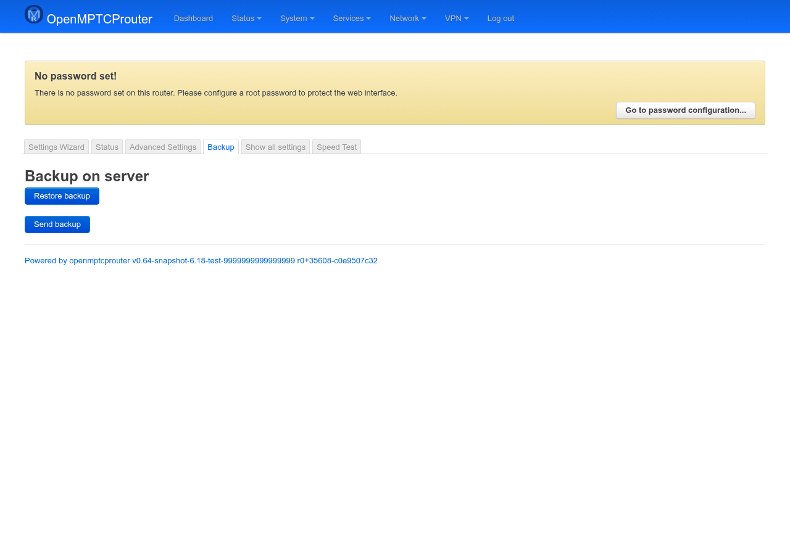

# OpenMPTCProuter Backup — User Guide

The **Backup** page manages full router-configuration backups stored on
your VPS (not locally): sending the router's current config to the server,
and restoring the router from a copy already stored there. It has no
Save/Save & Apply — each button acts immediately.

Screenshot below was taken on a test router (`v0.64-snapshot`) that has a
server configured but no backup on it yet — see [No backup available yet](#no-backup-available-yet)
below for what that state looks like, and what a populated one would show
instead.

## Opening the page

In LuCI, go to **System → OpenMPTCProuter → Backup**, or browse directly
to:

```
https://<router-ip>/cgi-bin/luci/admin/system/openmptcprouter/backup
```

## Backup on server



One block per server you configured in the Settings Wizard's Server step,
followed by two buttons that apply across all configured servers at once:

- **Send backup** — packages the router's current full configuration
  (the same archive `sysupgrade` would produce) and uploads it to every
  configured server, replacing whatever backup was stored there before.
  Shows a "Backup sent successfully" notification, or an error naming
  what failed.
- **Restore backup** — downloads and applies a backup:
  - if you picked a specific date from a **Backup available on server**
    dropdown (see below) on one or more server blocks, it restores that
    exact backup from each of those servers;
  - if you didn't pick anything on any block, it restores whichever
    single server's backup is most recent across all configured servers.

  Restoring calls `sysupgrade -r` on the downloaded archive — it rewrites
  the router's UCI configuration and reboots the affected services (not a
  full firmware reflash). There's no undo beyond sending a fresh backup
  or having another one to restore instead.

### No backup available yet

If a server has never received a backup, its block shows only:

> No available backup on server.

as in the screenshot above. This is normal for a server you just added —
click **Send backup** at least once first.

### With one or more backups on the server

Once at least one backup exists, the block instead shows a **Backup
available on server** dropdown, one entry per stored backup labelled with
its date/time (most recent first, from the server's own timestamps — not
the router's clock). Leaving it on the blank first entry and clicking
**Restore backup** falls back to "most recent", as described above;
picking a specific date restores that one instead.

If the router has *at least one* backup date cached but hasn't refreshed
that list this session, the block instead shows a single **Last available
backup on server** line with that date, and no dropdown.

## Notes

- This page only talks to the VPS(es) already configured in the Settings
  Wizard — there's nothing to configure here about *where* backups go.
- Restoring pulls in whatever WAN/LAN/VPN/proxy settings were saved in
  that backup, including server credentials — expect a brief reconnect
  gap while services restart with the restored config.
