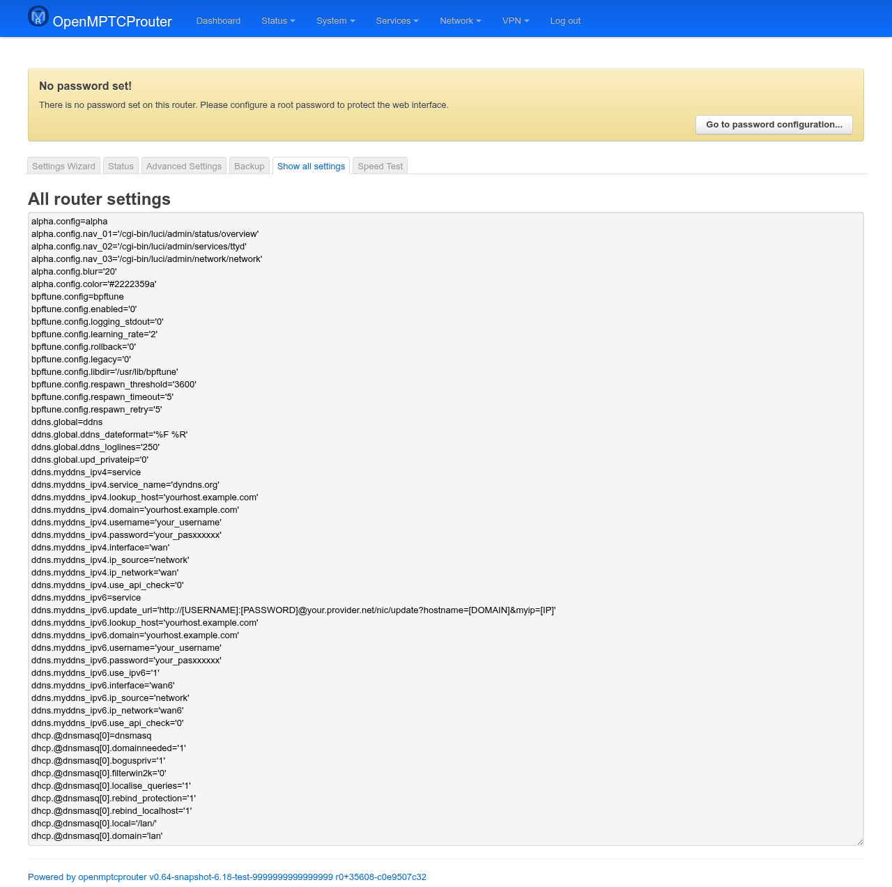

# OpenMPTCProuter Show All Settings — User Guide

**Show all settings** (internally the `debug` page) is a read-only dump of
the router's entire UCI configuration — every package, every section,
every option — in one scrollable text box. It exists for troubleshooting:
pasting its output (or attaching a screenshot of it) into a bug report or
forum post gives a maintainer the router's full config in one go, without
you having to SSH in and run `uci show` yourself.

Screenshot below was taken on a test router (`v0.64-snapshot`).

## Opening the page

In LuCI, go to **System → OpenMPTCProuter → Show all settings**, or browse
directly to:

```
https://<router-ip>/cgi-bin/luci/admin/system/openmptcprouter/debug
```

## The dump



The box is exactly the output of `uci show`, one `package.section.option='value'`
line per row — the same format `uci show` prints at a shell — piped
through a fixed anonymization filter before it ever reaches the browser.
Loading the page re-runs that filter, so it always reflects the router's
*current* configuration, not a cached snapshot.

### What gets redacted

The filter (`/bin/anonymous_config.sh`) blanks the last several characters
of any option whose *name* matches a fixed list of sensitive patterns —
`password`, `key`, `token`, `.host`, `.ip`, `user_id`, and a handful of
protocol-specific fields (Shadowsocks server/key, VMess/VLESS/Trojan
addresses, WireGuard keys, the IPv6 ULA prefix, detected public
IPv4/IPv6, …) — replacing it with a trailing `xxxxxx`. It's a fixed
list of field-name patterns, not a smart secret-detector: an option that
holds sensitive data under a name not on that list is shown in full.
Treat any values not obviously already redacted as visible to whoever you
share the page (or a copy of its output) with, and check before pasting
it somewhere public.

### Reading it

There's no search box — use your browser's own page search
(Ctrl/Cmd+F) inside the text box, or select-all and paste elsewhere to
grep through it. Entries are grouped by config file (`package.section`)
but otherwise in `uci show`'s own order, not alphabetical.

## No configuration here

Like the Status page, this is read-only — the text box itself is marked
non-editable, and there's no Save/Save & Apply button. To change any
setting you see here, use the **Settings Wizard** or **Advanced Settings**
pages instead.
