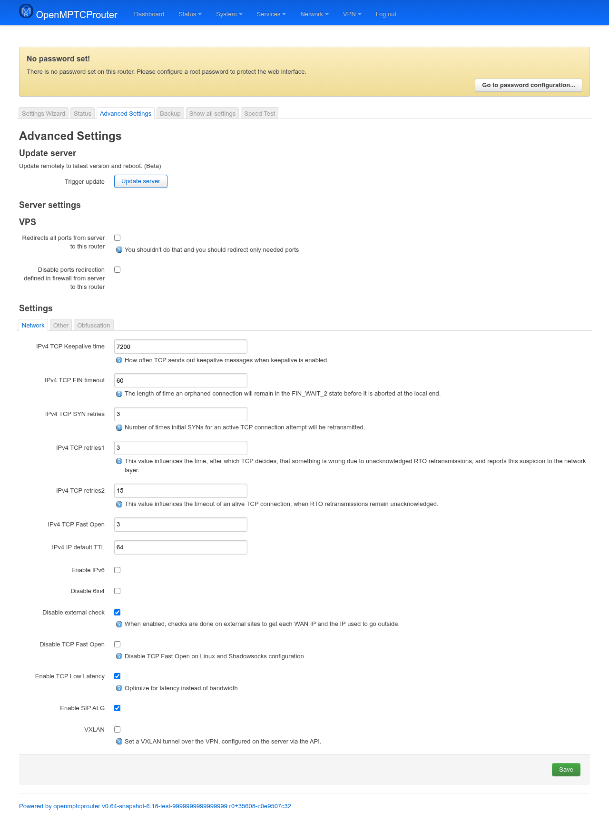
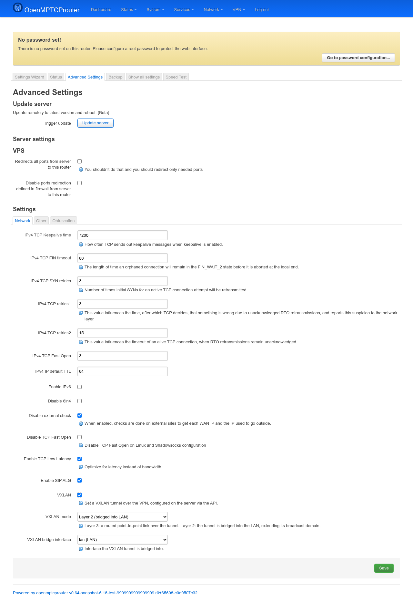
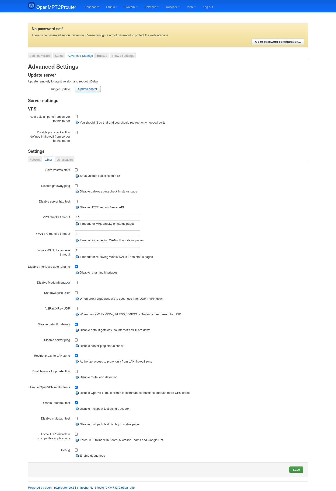
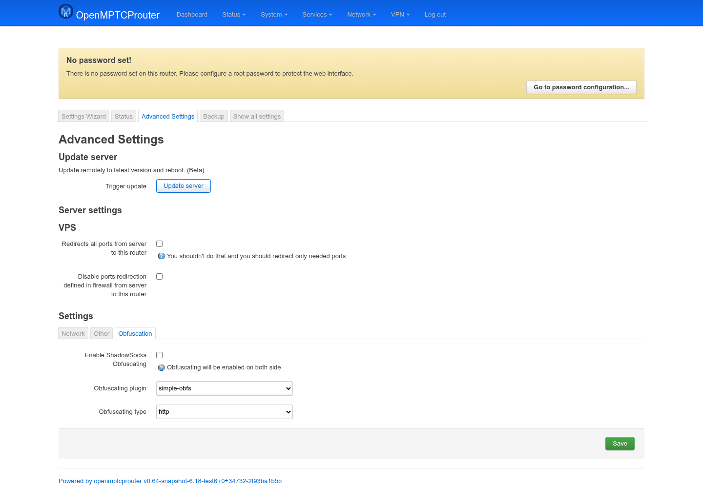

# OpenMPTCProuter Advanced Settings — User Guide

The **Advanced Settings** page is where the knobs that don't fit the
Settings Wizard live: TCP/kernel tuning, feature toggles, obfuscation,
hardware offload, and per-server port-redirection behavior. Unlike the
wizard, this is a single page with tabs — there is no multi-step flow, and
there's one **Save** button that applies immediately.

Screenshots below were taken on a test router (`v0.64-snapshot`); the
**Obfuscation**, **Qualcomm SFE**, and **System** tabs only appear when the
router has the matching feature installed (see each section below).

## Opening the page

In LuCI, go to **System → OpenMPTCProuter → Advanced Settings**, or browse
directly to:

```
https://<router-ip>/cgi-bin/luci/admin/system/openmptcprouter/settings
```

## Update server *(shown only when relevant)*



This block only appears if a configured VPS is running an older
`openmptcprouter` version than the latest one the router knows about (the
screenshot above was taken on a bench where that was the case).
**Trigger update** tells that VPS to update itself remotely and reboot
(marked **Beta** — expect a short connectivity gap while it restarts). If
all your servers are already current, this section is hidden entirely.

## Server settings (VPS)

One block per VPS you configured in the wizard's Server step:

- **Redirects all ports from server to this router** — forwards *every*
  port from the VPS to the router. The description warns against this on
  purpose: it defeats the point of only exposing what you need, and
  increases the router's exposed surface. Prefer redirecting individual
  ports through the normal firewall port-forward UI.
- **Disable ports redirection defined in firewall from server to this
  router** — turns off whatever port forwards the server pushed down via
  its firewall config, without touching forwards you set up yourself
  locally.

## Settings tabs

### Network


Kernel/TCP tuning, read live from `/proc/sys/net/ipv4/*` and written back
through the same path:

| Field | Meaning |
|---|---|
| **IPv4 TCP Keepalive time** | Seconds of idleness before the kernel starts sending TCP keepalive probes. |
| **IPv4 TCP FIN timeout** | How long a connection stays in `FIN_WAIT_2` before being torn down. |
| **IPv4 TCP SYN retries** | How many times an outgoing SYN is retransmitted before giving up. |
| **IPv4 TCP retries1 / retries2** | Lower-level retransmit thresholds that control when the kernel decides a connection path is broken vs. just slow. |
| **IPv4 TCP Fast Open** | Kernel TFO mode (bitmask: client/server/both). |
| **IPv4 IP default TTL** | Default TTL stamped on outgoing packets. |
| **Enable IPv6** | Off by default; matches the Settings Wizard's IPv6 toggle. |
| **Disable 6in4** | Turns off the 6in4 IPv6-over-IPv4 tunnel handling (`omr-6in4`). |
| **Disable external check** | Stops the router from calling external sites to learn each WAN's public IP and the IP actually used outbound. Turn this off (i.e. leave external checks enabled) unless you have a specific privacy/offline reason to disable it — it's what several status-page checks rely on. |
| **Disable TCP Fast Open** | Turns off TFO both in the kernel and in the Shadowsocks config. |
| **Enable TCP Low Latency** | Tunes for latency over throughput. |
| **Enable SIP ALG** | Turns on the firewall's SIP application-layer gateway, needed by some VoIP setups. |
| **VXLAN** | Off by default; turns on a VXLAN tunnel carried over the VPN, configured server-side via the API. Reveals two more fields once enabled (see below). |
| **VXLAN mode** *(shown only if VXLAN is enabled)* | **Layer 3** (default): a routed point-to-point link over the tunnel. **Layer 2**: the tunnel is bridged into an interface on this router instead, extending that interface's broadcast domain over the tunnel. |
| **VXLAN bridge interface** *(shown only in Layer 2 mode)* | Which local interface — LAN, or any other configured interface that isn't part of the tunnel itself — the VXLAN tunnel is bridged into. |



### Other



Feature toggles and status-page behavior:

| Field | Meaning |
|---|---|
| **Save vnstats stats** | Persists vnstat traffic history to disk so it survives a reboot. |
| **Disable gateway ping** | Skips the gateway-reachability ping shown on the Status page. |
| **Disable server http test** | Skips the HTTP reachability test against the Server API. |
| **VPS checks timeout / WAN IPs retrieve timeout / Whois WAN IPs retrieve timeout** | Per-check timeouts (seconds) used by the Status page — raise these on slow links if checks are timing out prematurely. |
| **Disable interfaces auto rename** | Stops OMR from renaming WAN/LAN interfaces automatically. |
| **Disable ModemManager** | Turns off ModemManager integration for cellular modems. |
| **Shadowsocks UDP** | Falls back to Shadowsocks for UDP traffic if the VPN tunnel is down. |
| **V2Ray/XRay UDP** | Same idea, for VLESS/VMess/Trojan proxies. |
| **Disable default gateway** | Removes the router's default route entirely if all VPS links are down — no internet at all rather than falling back to an unbonded link. Off by default for a reason; only enable if a full internet outage is preferable to leaking traffic outside the tunnel. |
| **Disable server ping** | Skips the VPS ping status check. |
| **Restrict proxy to LAN zone** | Only allows the LAN firewall zone to use the local proxy — blocks other zones (e.g. guest Wi-Fi) from routing through it. |
| **Disable route loop detection** | Turns off the check that watches for routing loops. |
| **Disable OpenVPN multi clients** | Runs a single OpenVPN client instead of spreading connections across multiple client processes/cores. |
| **Disable tracebox test** | Skips the tracebox-based multipath capability test. |
| **Disable multipath test** | Hides the multipath test results from the Status page (independent of whether the test itself runs). |
| **Force TCP failback in compatible applications** | Forces apps like Zoom/Microsoft Teams/Google Meet that prefer UDP to fall back to TCP — useful when UDP through the tunnel is unreliable. |
| **Debug** | Enables verbose debug logging across OMR's scripts. |

### Obfuscation *(shown only if Shadowsocks-obfs or V2Ray/XRay is installed)*



- **Enable ShadowSocks Obfuscating** — wraps Shadowsocks traffic to look
  like ordinary HTTP/TLS; must be turned on both on the router and the
  matching VPS side (the wizard/server API keeps them in sync).
- **Obfuscating plugin** — `v2ray` (if XRay/V2Ray is installed) or
  `simple-obfs`.
- **Obfuscating type** — `http` or `tls` framing for the obfuscated
  traffic.

### Qualcomm SFE *(shown only on SoCs with the shortcut-fe kernel module)*

Two flags, not shown here since this bench router's kernel doesn't ship
the module:

- **Enable Fast Path offloading for connections** — hands steady-state
  connections to the Qualcomm Shortcut-FE fastpath instead of the normal
  Linux forwarding path, reducing CPU load on supported SoCs.
- **Enable Bridge Acceleration** — extends that offload to bridged
  (LAN-side) traffic.

### System *(shown only if the router exposes CPU frequency scaling)*

Also not present on this bench (no `scaling_min_freq` under
`/sys/devices/system/cpu/cpufreq/policy0/`):

- **Minimum/Maximum scaling CPU frequency** — clamps the CPU governor's
  range.
- **Scaling governor** — picks from whatever governors the kernel reports
  as available (`performance`, `ondemand`, `powersave`, etc.).

## Saving

There's one **Save** button, always visible at the bottom of whichever tab
you're on — it applies to the whole page, not just the active tab. Clicking
it parses every tab's values, bundles the per-server port-redirection
flags, and sends everything in a single `settingsadd` call; you'll get a
"Settings saved and applied successfully" notification (or an error
notification naming what failed) without a page reload.
