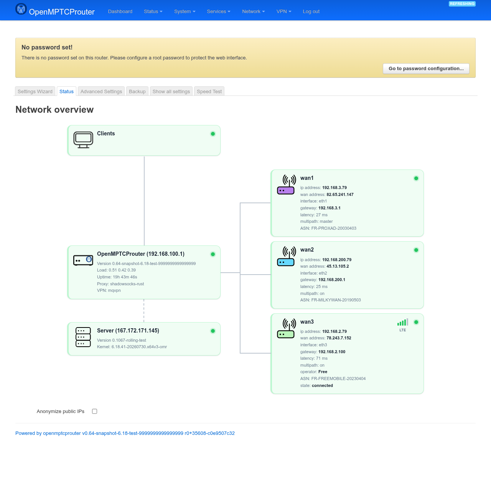

# OpenMPTCProuter Status — User Guide

The **Status** page (labelled **Network overview** on the page itself) is a
live diagram of the whole bonded connection: your client, this router, every
bonded WAN/tunnel, and the VPS on the other end — each shown as a node with
a green/amber/red dot for its health. Unlike the Wizard and Advanced
Settings pages, there's nothing to configure or save here; it just polls
and redraws itself every 10 seconds.

Screenshot below was taken on a test router (`v0.64-snapshot`) with three
bonded WANs and MQVPN as the VPN.

## Opening the page

In LuCI, go to **System → OpenMPTCProuter → Status**, or browse directly
to:

```
https://<router-ip>/cgi-bin/luci/admin/system/openmptcprouter/status
```

## The diagram



The diagram always has three columns:

- **Left — Clients.** "You", identified by the address you're browsing
  from. Turns amber with *"Your IP was not leased by this router"* if your
  IP didn't come from this router's own DHCP (e.g. you're on a different
  subnet or behind another NAT).
- **Middle — the router, and the server below it.**
  - The router node shows its hostname/LAN IP, OMR version, load average,
    CPU temperature (if available), uptime, and the active Proxy/VPN
    protocol. It turns amber if DNS resolution is failing, or if the
    VPN/IPv6 tunnel is down.
  - The server node shows the VPS hostname/IP, OMR version, kernel, ASN,
    load, uptime, and traffic counters (proxy / VPN / total, when the VPS
    reports them). It turns amber if no server is configured, or the
    router can't ping it. Clicking it jumps to the Settings Wizard's
    Server step.
  - If **Direct Output** is in use (traffic that bypasses the tunnel
    entirely), a third node appears between router and server showing
    that path's own public IP and ASN.
- **Right — one node per bonded WAN/tunnel.** Only interfaces with
  Multipath TCP set to something other than *off* show up here (matches
  the Wizard WAN step's **Multipath TCP** field). Each node shows:
  - its private/public IP, physical interface name, gateway, and
    round-trip latency;
  - **multipath:** master/on/backup, matching what you set in the Wizard;
  - for cellular WANs: signal strength (as bars), network type (e.g. LTE),
    carrier/operator, and modem state;
  - warnings inline: no IP/gateway defined, gateway or server unreachable,
    or the interface not actually being in the WAN firewall zone.

## Anonymize public IPs

The checkbox under the diagram masks the last 6 characters of every public
IP/hostname shown (client, WAN, gateway, server) with `x`, for
screen-sharing or bug reports without leaking your addresses. Private
(RFC1918) addresses are never masked, since they aren't sensitive the same
way. The setting is remembered in a cookie, per browser, and takes effect
immediately without a page reload.

## No configuration here

This page has no Save/Save & Apply — it's read-only. To change any of the
WAN, VPN, or server settings reflected here, use the **Settings Wizard**
or **Advanced Settings** pages instead.
