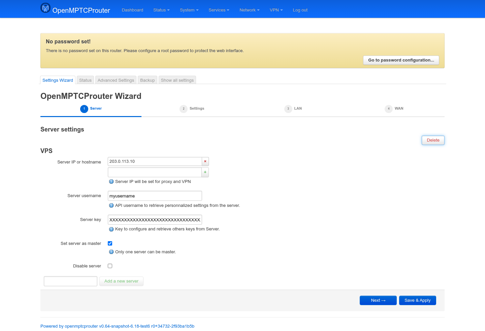
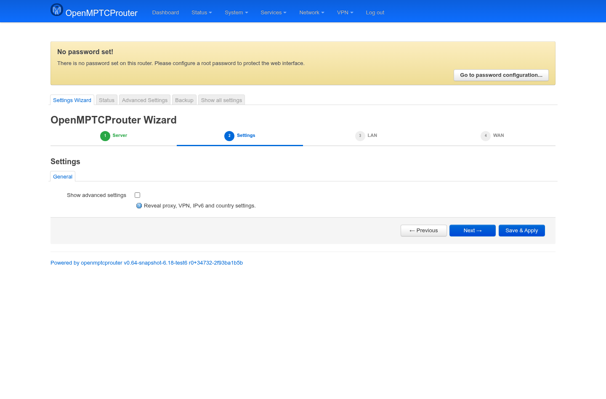
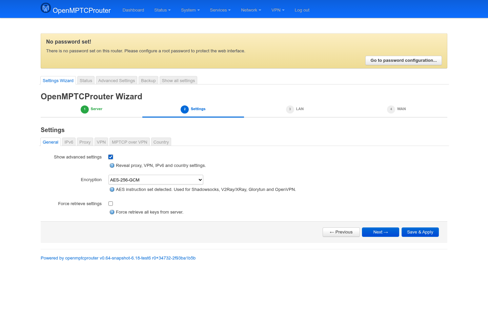
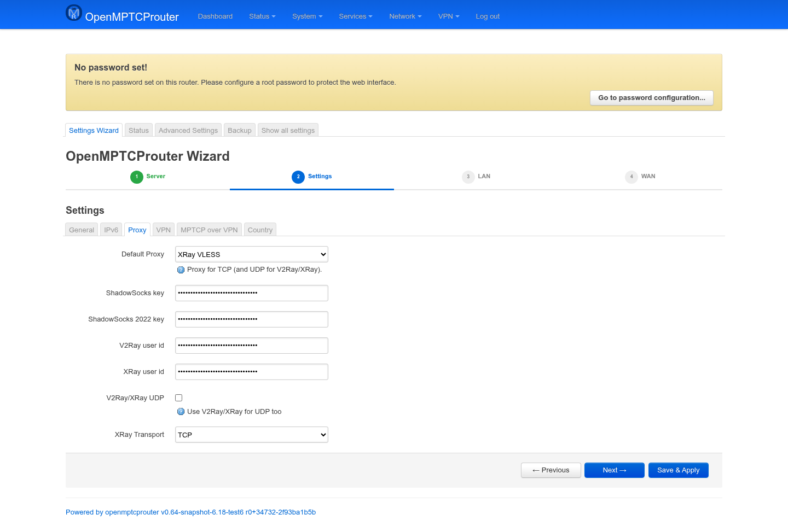
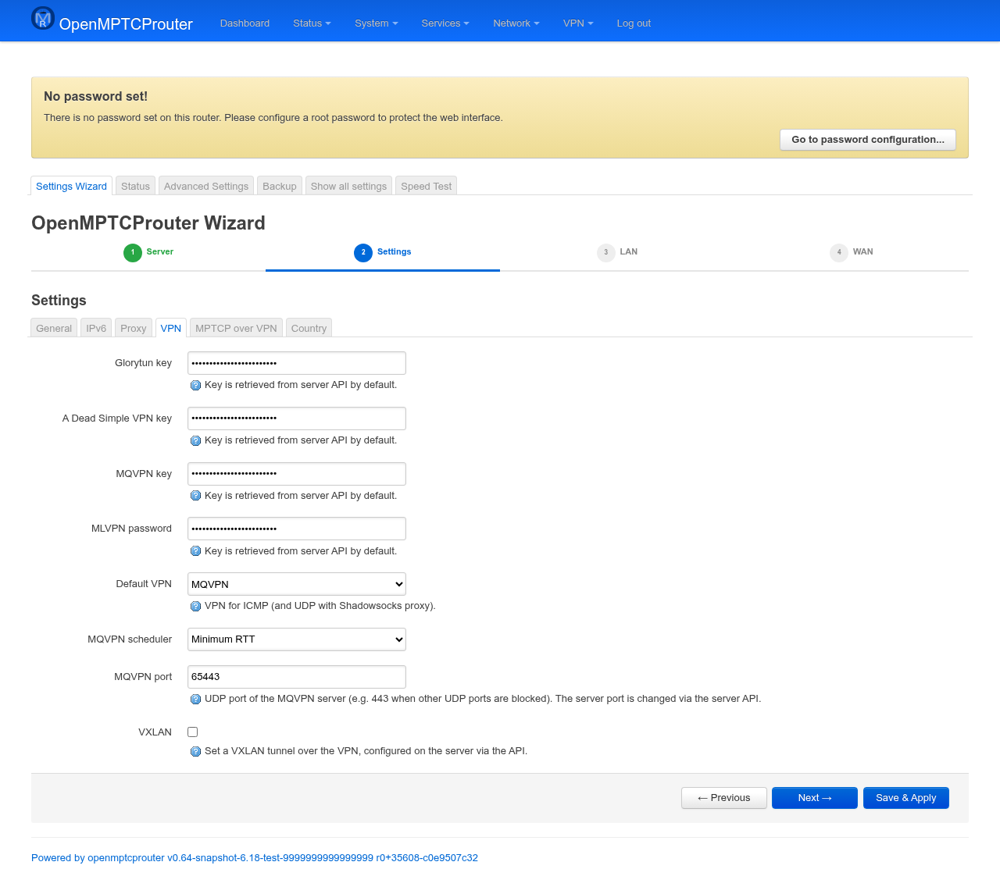
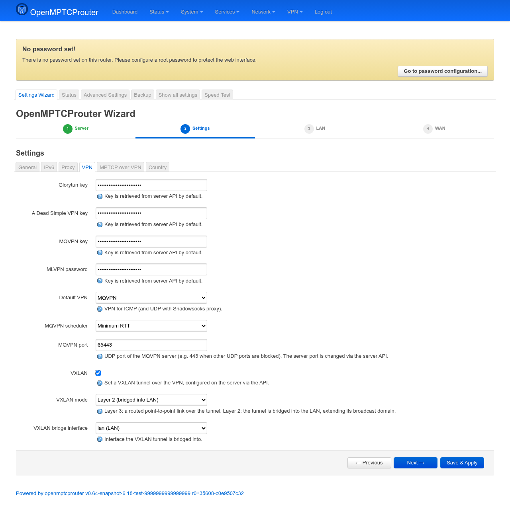
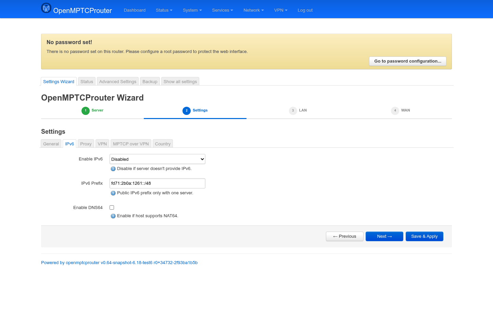
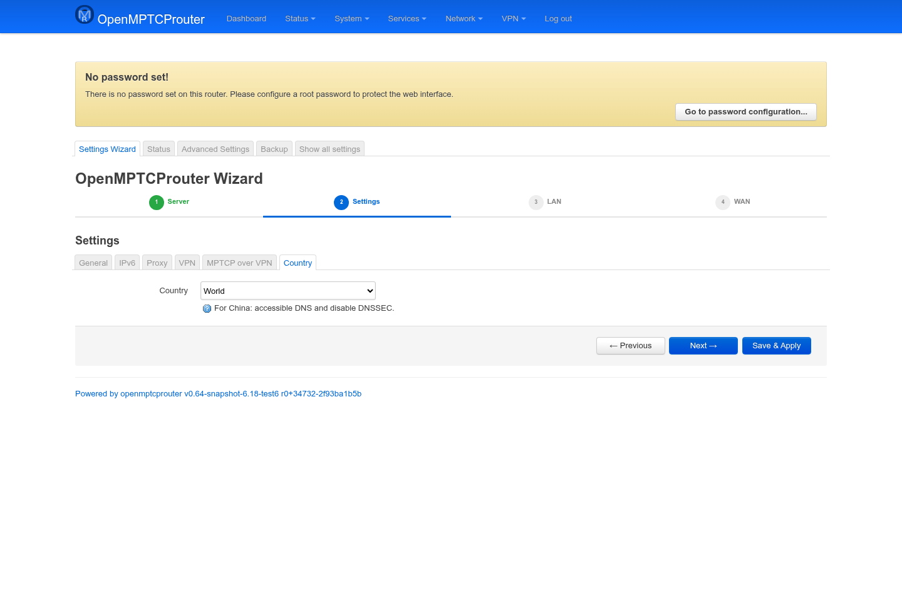
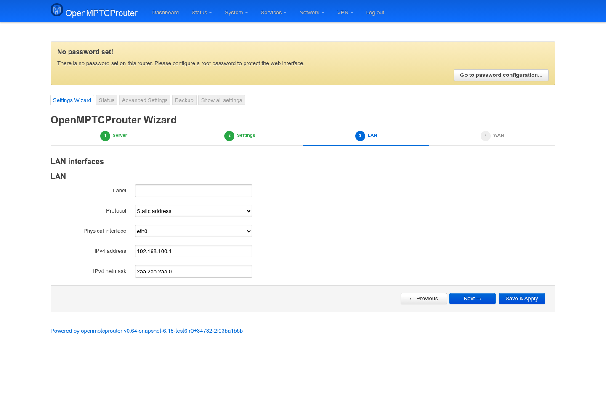
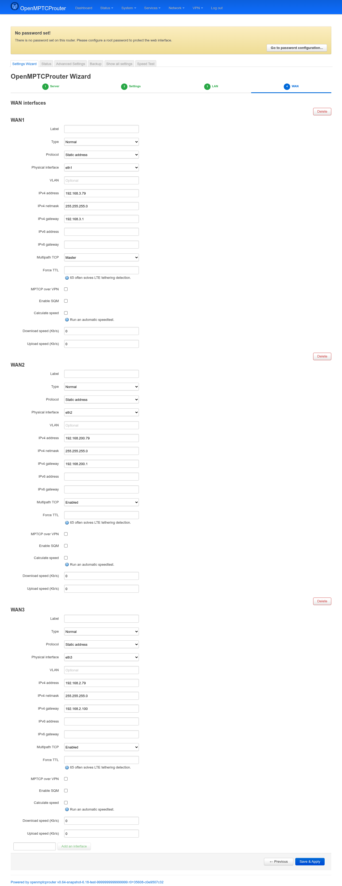

# OpenMPTCProuter Settings Wizard — User Guide

The Settings Wizard is the main way to configure OpenMPTCProuter: which VPS
to bond your WAN links to, how each WAN and LAN interface is set up, and
which VPN/proxy protocol carries the traffic to the VPS. This guide walks
through every screen.

Screenshots below were taken on a test router (`v0.64-snapshot`); menu
wording is the same on stable releases, values shown are examples.

## Opening the wizard

In LuCI, go to **System → OpenMPTCProuter**, or browse directly to:

```
https://<router-ip>/cgi-bin/luci/admin/system/openmptcprouter/wizard
```

On a freshly flashed router with no root password set yet, LuCI shows a
yellow **"No password set!"** banner at the top of every page. You can still
use the wizard with it showing, but you should set a password (via the
banner's link, or **System → Administration**) before exposing the router
to anything other than your own LAN.

The wizard itself has four steps, shown as a numbered bar under the page
title: **Server → Settings → LAN → WAN**. Moving between steps with
**Next**/**Previous** only changes what's shown on screen — nothing is
written to the router until you click **Save & Apply** on the last step you
visit. You can jump back at any time; nothing is lost.

## Step 1 — Server



This is where you tell the router which VPS to bond to.

| Field | Meaning |
|---|---|
| **Server IP or hostname** | The VPS's public IP or DNS name. You can add a second entry (the `+` row) if your VPS is reachable on more than one address. |
| **Server username** | The API account used to pull the rest of the configuration (keys, proxy settings) from the VPS automatically. |
| **Server key** | The API key that authorizes the router to talk to that VPS. Both are provided when you rent/set up an OMR-compatible VPS. |
| **Set server as master** | Only relevant if you configure more than one server; exactly one must be master. |
| **Disable server** | Temporarily takes this server out of use without deleting its configuration. |

**Add a new server** at the bottom lets you configure a second VPS (useful
for testing a migration, or multi-VPS setups) — most users only need one.

Once the IP/username/key are filled in and you move to the next step, the
wizard fetches the rest of the server-side settings (encryption keys for
Shadowsocks/V2Ray/XRay/Glorytun/etc.) automatically — you normally don't
need to type those in by hand.

## Step 2 — Settings



By default this step only shows one toggle:

- **Show advanced settings** — reveals five extra tabs (Encryption, IPv6,
  Proxy, VPN, MPTCP over VPN, Country). Leave it off if you just want the
  values pulled from the server; turn it on to review or override them.

### Advanced: General



- **Encryption** — cipher used for Shadowsocks/V2Ray/XRay/Glorytun/OpenVPN.
  The wizard pre-selects the best one your router's CPU supports (e.g.
  AES-256-GCM if AES-NI/crypto instructions are detected).
- **Force retrieve settings** — re-pulls every key from the VPS even if the
  router already has values cached locally. Use this if you regenerated
  keys on the server side and the router hasn't picked them up.

### Advanced: Proxy



- **Default Proxy** — which protocol carries ordinary TCP (and, optionally,
  UDP) traffic to the VPS: Shadowsocks, V2Ray, XRay (VMess/VLESS/Reality),
  etc.
- The key/ID fields below it (Shadowsocks key, Shadowsocks 2022 key, V2Ray
  user id, XRay user id) are normally filled in automatically from the
  server and rarely need manual editing.
- **XRay Transport** — underlying transport for XRay (TCP, WebSocket,
  gRPC, …), only relevant if you picked XRay as the default proxy.

### Advanced: VPN



- **Default VPN** — which tunnel carries ICMP (ping) and, when using
  Shadowsocks, UDP: Glorytun, DSVPN, MQVPN, MLVPN, OpenVPN, etc. This is a
  separate choice from the Proxy setting above.
- The key/password fields are, again, normally auto-filled from the server
  (shown blanked out above — they're plain text fields, not
  password-masked, so treat a filled-in value here as sensitive).
- **VXLAN** — off by default; turns on an additional VXLAN tunnel carried
  over the VPN, configured server-side via the API. Two more fields appear
  once it's enabled:

  

  - **VXLAN mode** — **Layer 3** (default): a routed point-to-point link
    over the tunnel. **Layer 2**: the tunnel is bridged into an interface
    on this router, extending that interface's broadcast domain across
    the tunnel.
  - **VXLAN bridge interface** — only shown in Layer 2 mode: which local
    interface (LAN, or any other configured interface) the tunnel bridges
    into.

### Advanced: MPTCP over VPN


Only needed if your ISP blocks MPTCP outright: this wraps MPTCP traffic
inside a second VPN (e.g. WireGuard) so it looks like ordinary encrypted
traffic to the ISP.

### Advanced: IPv6



- **Enable IPv6** — off by default; turn on if your VPS provides IPv6.
- **IPv6 Prefix** — the `/48` (or similar) prefix delegated to your LAN;
  only meaningful with a single, dedicated server.
- **Enable DNS64** — turn on only if your uplink/host network requires
  NAT64.

### Advanced: Country



Leave as **World** unless you're in a country with specific DNS/censorship
requirements (the help text calls out China specifically: it switches to
DNS servers reachable locally and disables DNSSEC, which can otherwise
break resolution there).

## Step 3 — LAN



Configures the router's LAN-facing interface(s): label, protocol (normally
**Static address**), which physical port/interface it binds to, and its
IPv4 address/netmask. Most users can leave this at the defaults unless they
have a non-standard LAN layout (VLANs, multiple bridges, etc.).

## Step 4 — WAN



One block per WAN link (WAN1, WAN2, WAN3, …) — this is where you tell OMR
about every internet connection you want bonded. Use **Add an interface**
at the bottom to add more than the three shown, or the block's **Delete**
button to remove one.

Per WAN, the important fields are:

| Field | Meaning |
|---|---|
| **Type** | Normal, or a special handling mode for that link. |
| **Protocol** | Static address, DHCP, PPPoE, 3G/4G, etc., matching how that WAN gets its address. |
| **Physical interface** | Which physical port/modem this WAN maps to. |
| **VLAN** | Optional 802.1Q tag if the WAN sits behind a VLAN. |
| **IPv4 address / netmask / gateway** | Only used with a static protocol. |
| **IPv6 address / gateway** | Same, for IPv6 links. |
| **IPv6** | Only shown when **Protocol** is **DHCP**: **Disabled** (default) or **Enabled (SLAAC/DHCPv6)** to acquire an IPv6 address on this WAN via router advertisements or DHCPv6. IPv6 must also be turned on in the advanced settings for this to have any effect. |
| **Multipath TCP** | How this link participates in bonding: **Master** (the always-on subflow other links attach to — exactly one WAN should be Master), **Enabled** (a normal bonded subflow), **Backup**, or disabled. |
| **Force TTL** | Overrides the outgoing IP TTL; useful when a mobile carrier throttles/blocks tethering by inspecting TTL — 65 is a common fix. |
| **MPTCP over VPN** | Routes just this WAN's MPTCP traffic through the secondary VPN configured in Settings, instead of directly. |
| **Enable SQM** | Turns on smart queue management (bufferbloat control) for this WAN. |
| **Calculate speed** | Runs an automatic speed test for this WAN instead of you entering Download/Upload speed by hand — needed for QoS/SQM to size itself correctly. |

## Saving

Each step's **Save & Apply** button is available from any step — you don't
have to reach WAN to save. When clicked, the wizard validates the form,
sends everything to the router in one request, and reloads the page once
the router confirms it applied cleanly. If validation fails, the offending
field(s) are highlighted and nothing is sent.

After saving, check **Status** (next to **Settings Wizard** in the top
tabs) to confirm each WAN comes up and the VPS connection is established.
