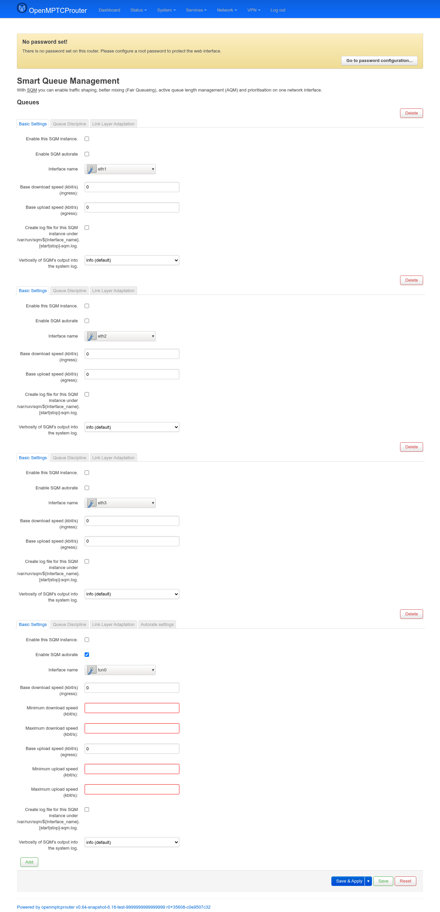
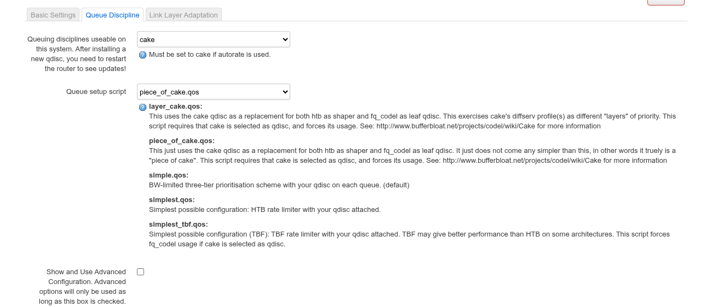
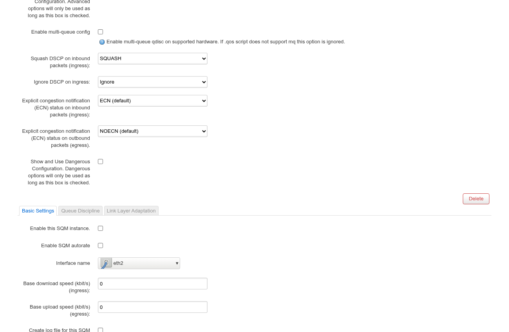
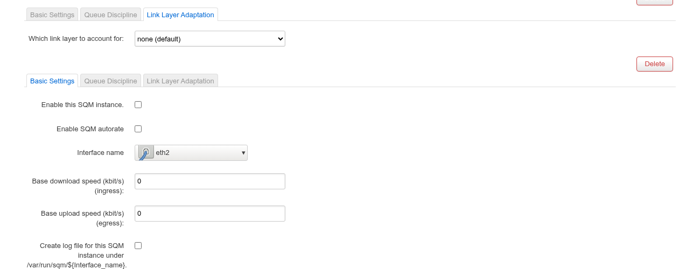
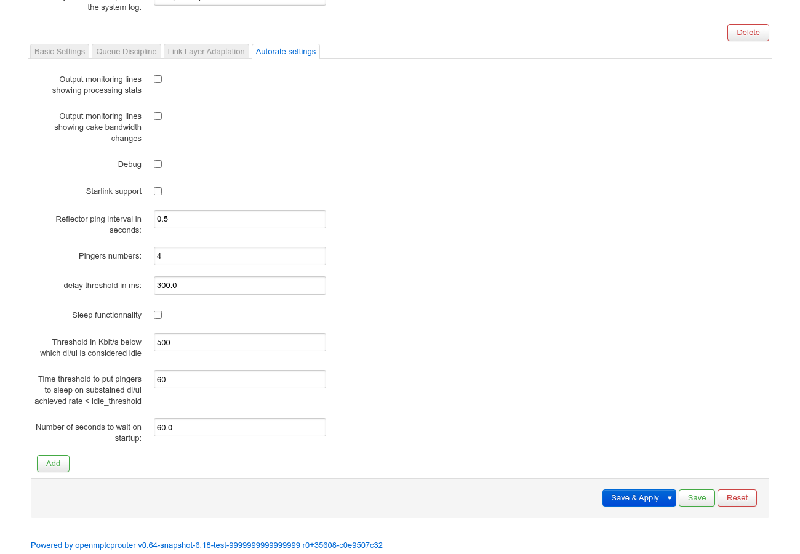

# SQM QoS — User Guide

`luci-app-sqm-autorate` is OpenWrt's standard SQM (Smart Queue Management)
LuCI app, packaged for OMR with an added **Autorate settings** tab that
wires each queue into `sqm-autorate` — a userspace daemon that
continuously re-measures a link's real achievable bandwidth (by pinging
reflectors and watching for bufferbloat) and pushes updated `cake` rate
limits, instead of relying on the fixed **Base download/upload speed**
you'd otherwise have to guess. It's a single page — **SQM QoS** under
**Network** — with one instance per interface you want shaped.

Screenshots were taken on a test router (`v0.64-snapshot`) with four
queue instances already defined: `wan1`/`wan2`/`wan3` (plain, disabled)
and `omrvpn` (carries real autorate/reflector tuning from prior testing —
`delay_thr_ms=300.0`, `reflector_ping_interval_s=0.5`). All four are
currently **disabled**; the **Enable SQM autorate** checkbox on `omrvpn`
was turned on just for the Autorate-tab screenshot below, then reverted —
it does not reflect this bench's normal running config.

```
https://<router-ip>/cgi-bin/luci/admin/network/sqm
```



If `/var/run/sqm/available_qdiscs` comes back empty (the `sqm` init
script has never run), the page replaces the form with a notice and an
**Enable SQM** button instead — not pictured here since this bench
already has qdiscs available (`cake`, `codel`, `fq_codel`, `sfq`).

Each queue is a `TypedSection` instance (add more with the **Add** button
at the bottom, remove one with its own **Delete**), with 3 tabs always
present plus a 4th that only appears once autorate is turned on for that
instance:

### Basic Settings

| Field | Meaning |
|---|---|
| **Enable this SQM instance** | Per-queue on/off. Checking it on any instance auto-enables the `sqm` init script itself (with a one-time notification reminding you to disable it manually in System Startup if that wasn't intended). |
| **Enable SQM autorate** | Turns this queue over to `sqm-autorate` instead of the fixed Base speeds — reveals the **Autorate settings** tab (see below) and makes **Minimum**/**Maximum download/upload speed** required. |
| **Interface name** | The underlying device (e.g. `eth1`, `tun0`) — a live device picker, not the OMR interface alias. |
| **Base download/upload speed (kbit/s)** | The fixed shaping rate when autorate is off; the *starting* rate autorate adjusts from when it's on. |
| **Minimum/Maximum download/upload speed** *(autorate only)* | The floor/ceiling autorate is allowed to move the rate between. |
| **Debug logging** / **Verbosity** | Per-instance log file under `/var/run/sqm/${interface}.[start\|stop]-sqm.log`, and syslog verbosity (silent → trace). |

**A validation gotcha caught live**: ticking **Enable SQM autorate**
immediately makes the four Min/Max speed fields required — if they were
never filled in (as on this bench's `omrvpn`, which normally runs with
autorate off), they show up red/invalid right away, as in the screenshot
above. Fill in all four before Save & Apply once autorate is on.

### Queue Discipline



| Field | Meaning |
|---|---|
| **Queuing disciplines useable on this system** | Populated from `/var/run/sqm/available_qdiscs`; must be `cake` if autorate is used. Installing a new qdisc kernel module needs a router restart before it shows up here. |
| **Queue setup script** | Which `/usr/lib/sqm/*.qos` script builds the actual tc/qdisc hierarchy — each option's help text (read from that script's `.help` file) is shown live under the dropdown, as in the screenshot: `piece_of_cake` (simplest cake-only setup, this bench's default), `layer_cake` (cake + diffserv layering), `simple`/`simplest`/`simplest_tbf` (non-cake, HTB/TBF-based alternatives). |

Checking **Show and Use Advanced Configuration** reveals more fields —
DSCP squashing/ignoring and ECN behavior on ingress/egress:



A further **Show and Use Dangerous Configuration** checkbox (bottom of
that screenshot) reveals raw hard limits and latency targets
(**ilimit**/**elimit**, **itarget**/**etarget**) plus free-form
**iqdisc_opts**/**eqdisc_opts** strings passed straight to the qdisc with
no validation — this is where this bench's `wan1`/`wan2`/`wan3` actually
carry real tuning already (`iqdisc_opts: autorate-ingress dual-dsthost`,
`eqdisc_opts: dual-srchost`), enabling cake's dual-hashing so autorate's
ingress shaping and per-host fairness cooperate — not shown expanded here
since both checkboxes reset on every page load and only one could be
captured cleanly per screenshot.

### Link Layer Adaptation



| Field | Meaning |
|---|---|
| **Which link layer to account for** | `none` (default — plain Ethernet WAN, this bench's setting), `ethernet` (VDSL2-style overhead accounting), or `atm` (ADSL1/2/2+ cell overhead). |
| **Per Packet Overhead (byte)** *(ethernet/atm only)* | Bytes to add per packet before rate-limiting, to account for lower-layer framing your ISP's link adds. |
| **Show Advanced Linklayer Options** *(ethernet/atm only)* | Reveals `tcMTU`/`tcTSIZE`/`tcMPU` size-table tuning and a linklayer adaptation mechanism override (`cake`/`htb_private`/`tc_stab`) — only relevant if your MTU exceeds 1500. |

### Autorate settings

Only present as a 4th tab once **Enable SQM autorate** is checked for
that instance — LuCI omits the tab entirely (not just its fields) when
every option inside it is hidden by that same dependency.



| Field | Meaning |
|---|---|
| **Output monitoring lines showing processing stats / cake bandwidth changes** | Verbose per-cycle log lines from the autorate daemon, for tuning/debugging. |
| **Debug** | Even more verbose daemon logging. |
| **Starlink support** | Adjusts autorate's compensation for Starlink's own periodic latency spikes (dish reposition/satellite handoff). |
| **Reflector ping interval in seconds** | How often autorate pings its reflector set to sample latency (`0.5`s here). |
| **Pingers numbers** | How many concurrent reflectors to ping each cycle (`4` here). |
| **delay threshold in ms** | Latency increase over baseline that autorate treats as bufferbloat and reacts to (`300.0` here) — **must be written as a float string** (`300.0`, not `300`); the field has no datatype validation to catch a plain integer, but `cake-autorate.sh` fails to start on one. |
| **Sleep functionality** | Let the daemon idle its pingers when the link itself is idle (off on this bench). |
| **Threshold in Kbit/s below which dl/ul is considered idle** | The idle-detection cutoff feeding the Sleep functionality above (`500` here). |
| **Time threshold to put pingers to sleep on sustained idle** | How long the link has to stay under that threshold before pingers actually sleep (`60`s here). |
| **Number of seconds to wait on startup** | Delay before autorate starts adjusting rates after boot/service start, to let the link settle first (`60.0`s here). |
